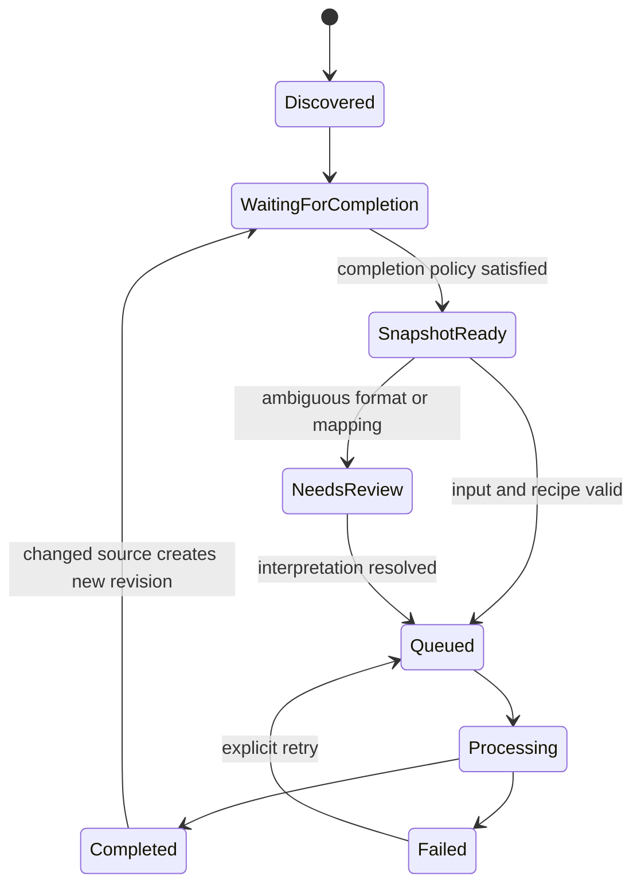
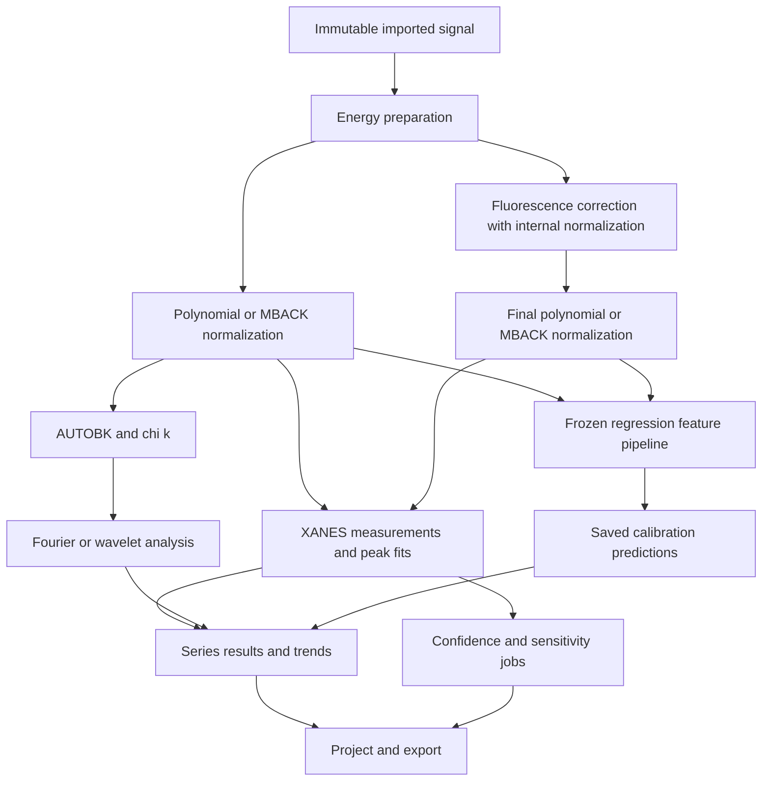

# Rexafs complete analysis design and implementation plan

Date: 2026-09-16. Status: proposed product and technical design; this document does not describe released features.

**Scope:** custom full-frame trends → live acquisition → peak fitting, followed by MBACK normalization, fluorescence over-absorption correction, wavelet analysis, regression, and richer confidence analysis. These eight capabilities are all included in the implementation roadmap. The first three retain the order requested by the project owner.

This is the consolidated, self-contained specification. It supersedes the scope and backlog classification in the earlier three-feature plan; the earlier research documents remain historical evidence. No application implementation or numerical validation was performed while writing this document. Proposed types, paths, defaults and milestone identifiers below are design decisions, not claims that those APIs already exist.

The source audit used Rexafs 0.2.9 at `97f8557f37ba8040707e61f62ef8a720e6c8ff06`. The inspected worktree subsequently advanced to `f4af0f23393b3660f3c08da5d0fd57df81819efc`; its Rust/Python/TypeScript source trees are unchanged from that baseline. The Larch source reference is `e3c93284fed358c2c8979cba4c139430527433c6`; its online documentation is labeled 2026.3.1. Source behavior and documentation can differ, so numerical compatibility fixtures must pin source, dependencies and reference data separately.

## Contents

1. [Purpose and intended outcome](#1-purpose-and-intended-outcome)
2. [Existing capabilities and reuse](#2-what-to-reuse-and-what-to-add)
3. [Shared architecture and records](#3-shared-design-identities-definitions-and-runs)
4. [A: Custom full-frame trends](#4-phase-a-custom-full-frame-trends)
5. [B: Live acquisition](#5-phase-b-live-acquisition)
6. [C: Peak fitting](#6-phase-c-xanes-peak-fitting)
7. [D: Atomic reference data and MBACK](#7-phase-d-atomic-reference-data-and-mback-normalization)
8. [E: Fluorescence over-absorption correction](#8-phase-e-fluorescence-over-absorption-correction)
9. [F: Wavelet analysis](#9-phase-f-wavelet-analysis)
10. [G: Regression](#10-phase-g-regression)
11. [H: Richer confidence analysis](#11-phase-h-richer-confidence-analysis)
12. [Integrated workflow, APIs and persistence](#12-integrated-workflow-apis-and-persistence)
13. [Implementation sequence](#13-implementation-sequence)
14. [Validation and release requirements](#14-validation-and-release-requirements)
15. [Evidence and references](#15-evidence-and-references)

## 1. Purpose and intended outcome

The intended workflow is to define what matters in an experiment once, measure it across all scans, update it as data arrives, and subsequently replace simple measurements with an explicit peak model where needed.

| Phase | Scientific/user question | Result for the user |
| --- | --- | --- |
| A. Full-frame trends | “How does this spectral feature change across my complete experiment?” | A persistent definition and complete, exportable series of values, with missing/failed scans visible. |
| B. Live acquisition | “Can I see those changes while the experiment is running?” | New completed scans enter the same series and run the selected processing/measurement recipe automatically. |
| C. Peak fitting | “Which modeled peaks account for that change, and how certain are their parameters?” | Baseline-aware fits, components/residuals, parameter uncertainties and peak-parameter trends. |
| D. MBACK | “How sensitive is my result to conventional normalization?” | A traceable alternative based on tabulated atomic scattering data. |
| E. Over-absorption | “How much does fluorescence geometry distort this XANES measurement?” | An explicit, reversible correction with its assumptions and sensitivity visible. |
| F. Wavelets | “Where do EXAFS contributions occur jointly in k and R?” | A reproducible two-dimensional transform and comparable series summaries. |
| G. Regression | “Can labeled spectra predict an independently measured property?” | A saved calibration model with held-out validation and traceable predictions. |
| H. Confidence | “How strongly do the data constrain this result?” | Asymmetric intervals, objective maps and resampling diagnostics with stated assumptions. |

Phase A is useful on existing folders without Live. Phase B does not depend on a new fitting engine. Phase C uses the same series identities, execution records and exports, avoiding a separate batch-results system.

The immediate scope is the Rust core and desktop. Core calculation APIs must be usable without the GUI. Python/TypeScript bindings and recipe replay are scheduled after each core contract stabilizes and receive their own completion gates. The desktop will not require a Python/Larch runtime. Instrument control, growing HDF5/SWMR streams, XRF/XRD applications, deconvolution, diffkk and full editable conversion of foreign sessions are outside this design. Detector dead-time correction is a distinct future operation; sample over-absorption correction does not replace it.

## 2. What to reuse and what to add

| Existing Rexafs code | Reuse | Required extension |
| --- | --- | --- |
| `xafs/io/reader/*`, GUI import/repair/recipe modules | Format detection, scan/channel selection, mappings, diagnostics | Immutable read snapshots and stable record/channel references for arrivals and reruns. |
| `group_identity.rs` and `project.rs` | Durable groups, stored analysis inputs, project history | Explicit series/frame identity, input revisions and retained scalar runs. Catalog indices must remain runtime locators. |
| `params.rs` and core spectrum stages | Existing scientific algorithms and effective settings | A stage-selective preparation route; normalized XANES metrics must not require AUTOBK/FFT/IFFT success. |
| `app.rs`, `shell/series.rs` | Heatmaps, frame navigation, existing E₀/white-line/fit/LCF trends | Metric editor, complete result rows, coverage/status and user-defined series coordinates. |
| Background jobs and generation checks | Asynchronous execution and rejection of obsolete callbacks | A bounded series-run coordinator with per-frame outcomes, cancellation and resume. |
| `xafs/mathutils.rs`, `xafs/fitting/expression.rs`, `variables.rs` | Line profiles, parameter-expression parsing and dependency validation | A peak-specific model/residual/result. Existing EXAFS residuals and independent-point statistics do not apply directly. |
| Project storage and publication modules | Atomic saving, raw embedding, CSV/JSON/figures and compatibility fixtures | New series, metric, Live and peak-model/result records and export tables. |

Existing normalization, AUTOBK, FFT/IFFT, FEFF fitting, LCF, PCA, MCR-ALS, project saving and exports remain the foundation. MBACK is currently a `NotImplemented` placeholder; basic trends already exist, but E₀/white-line calculations in the overview sample at most 192 frames. General Live ingestion, composite peak fitting and the five advanced workflows specified here require implementation. Existing local covariance/correlations mean uncertainty support is being extended, not started from nothing.

These reuse claims are grounded in the pinned source map in section 15. Reusing a component's concept does not require a broad refactor of all existing analysis code. In particular, preserve existing FEFF-fit behavior while adding the peak residual.

## 3. Shared design: identities, definitions and runs


### 3.1 Proposed records

These names describe proposed types, not existing public APIs.

| Record | Required content |
| --- | --- |
| `SeriesDefinition` | Stable ID/name, revision, ordered frame membership, selected signal/quantity and element/edge compatibility, coordinate definition. |
| `SeriesFrame` | Stable frame ID, append sequence, durable group reference, source record/channel identity, source revision, optional acquisition metadata. |
| `SourceRevision` | Source identity/locator, byte digest or materialized-array digest, parser/record/mapping identity, relevant metadata. A path or file timestamp alone is insufficient. |
| `MetricDefinition` | Stable ID/revision, representation, required processing stage, point/region or fit-output specification, axis origin, unit and coverage rules. |
| `AnalysisRecipe` | Schema/revision, import interpretation, processing settings, reference input revisions, metrics and optional supported fitting steps. Store requested automatic settings and per-frame resolved values. |
| `SeriesRun` | Run ID, frozen series revision and inputs, recipe/model revisions, intended membership, lifecycle, result rows and failures. |
| `MetricResult` | Frame/input/definition revisions, value and unit or explicit missing reason, coverage, resolved coordinates and processing, optional uncertainty with its basis. |
| `LiveSession` | Folder/filter/readiness policy, series target, active recipe revision, arrival ledger, queue/checkpoint state and diagnostics. |
| `PeakModel` / `PeakFitResult` | Components/roles, parameter constraints, fit/mask intervals, noise policy, input/preparation snapshot, results and numerical diagnostics. |

A scientific frame belongs to a selected signal: transmission and fluorescence from one source are separate series members or separate series, not interchangeable frames. A multi-record file retains record identity; file path alone cannot identify its spectra. Where a parser only provides an ordinal, bind that ordinal to the particular source revision and do not infer correspondence across rewritten record layouts.

### 3.2 Invariants

1. **Definitions are versioned.** Editing a range, model, mapping or processing setting creates a new revision; old results keep their original meaning.
2. **Offline runs freeze membership.** Newly imported files do not silently join an in-progress batch. Live schedules subsequent inputs against explicitly recorded definitions.
3. **Results refer to identities and revisions.** Display sorting and catalog rebuilding cannot reassign values to different spectra.
4. **Historical results survive input changes.** Mark them “Inputs changed” and offer recomputation into a new run. A linked source that was overwritten may be unavailable for exact replay; retained scalar results remain historical evidence, and embedded input mode enables replay.
5. **Every requested frame has an outcome.** `pending`, `running`, `succeeded`, `failed`, `unavailable` or `cancelled`; a missing number is never stored as zero. Staleness is a separate revision comparison, not a numerical value.
6. **Plot sampling is presentation only.** Full calculations use original/prepared arrays. Downsampling must not alter exported values, counts or scientific membership.
7. **No automatic quantity relabeling.** Normalized/flattened spectra, differences, χ(k), Fourier magnitude and scalar results retain distinct types.

Stable groups already exist, but the current directory-derived scan indices do not satisfy this entire contract. Add the minimum explicit series model in A1; do not treat older roadmap entries as already implemented.

### 3.3 Processing and storage

Add a `RequiredStage` concept: `Raw`, `Normalized`, `Background`, `Fourier`, or a referenced fit result. Reuse core stage methods and current parameter semantics. Raw means the selected μ(E) signal after the recorded detector/axis mapping and any explicit alignment, not unprocessed detector counts. Section 12 expands this stage model into an explicit processing graph for corrections and the new analyses. For a normalized-only input, preserve its typed arrays instead of normalizing again.

The runner processes bounded chunks, shares preparation among metrics requiring the same stage, writes compact results, then releases arrays. It must not load every frame into the display cache. Cache identity includes source revision, mapping/alignment, settings, quantity and computed stage; the current full-pipeline cache cannot represent a partially prepared spectrum as if all stages had succeeded.

Use a single coordinator to publish result batches into the UI; worker threads do not mutate project state. Generation/revision checks prevent late results from replacing the current view. Display existing complete runs while a new run is calculated.

Persist new collections through additive `.rxs` fields with defaults and retained fixtures, following the existing project compatibility policy. Keep unavailable values as null plus reason, not nonfinite JSON numbers. Store exact peak-fit input/uncertainty arrays and fit outputs, deduplicating identical arrays where practical. Full-frame metric runs retain scalar values and provenance; they need not retain every processed spectrum. Portable replay still requires embedded raw inputs or matching linked sources.

For lengthy runs and Live, add an application recovery journal separate from the user-requested project save. It records committed results/ledger updates and referenced input digests; reopening offers recover or discard. A saved Live session opens paused. This is part of the work, not an assumption that current project recovery already provides it.

## 4. Phase A: custom full-frame trends

### A purpose and user flow

Allow a scientist to follow a chosen feature across every selected scan without exporting spectra and writing a separate script.

1. In Series, choose an existing scan or selected groups, then **Create series**. Preview members, signal, edge, ordering and missing metadata. Initially offer explicit filename/numeric-token/acquisition-time ordering and manual correction; retain the chosen sequence.
2. Choose **Add measurement**, or **Track this point/region** from a spectrum plot. The plot action fills a proposed definition; the editor displays the exact representation, coordinate and units before saving it.
3. Preview one named frame with a point marker or shaded interval. Show “Calculate all N frames”; an optional sampled preview is explicitly labeled and never presented as complete.
4. Calculate with progress and cancel controls. The table shows each outcome and the plot shows gaps. Selecting a result opens its source spectrum and the same point/region.
5. Save and export the definition, values, units, coordinate provenance, processing and completion information together.

The existing E₀ and white-line trends remain accessible. In this phase, introduce accurately labeled definitions for absolute E₀, optional E₀ minus a named reference value, and white-line maximum with explicit representation/range. Preserve the current legacy definition when opening old projects; do not silently change its flattened-versus-normalized behavior.

### A calculation contract

| Measurement | Definition | Output |
| --- | --- | --- |
| Point | Linear interpolation on the native selected axis at one covered coordinate | Same units as the selected signal. |
| Region maximum | Largest value of the piecewise-linear curve inside the complete interval, including interpolated boundaries | Signal units; optionally return its coordinate as a separate metric. Resolve exact ties to the lowest coordinate. |
| Region integral | Area under the piecewise-linear signal over the complete interval | Signal units × axis units. |
| Region mean | Region integral divided by interval width | Signal units; not the arithmetic mean of unevenly spaced samples. |
| Finite-region centroid | First moment divided by region integral, optionally after an explicitly defined baseline subtraction | Axis units; unavailable when denominator is zero/ill-conditioned, with a diagnostic for sign-changing signals. |
| Existing fit output | Named variable or LCF coefficient from a specific retained fit/model and input revision | The variable's documented unit and uncertainty basis. |

First ship point, region maximum/integral/mean and full-frame E₀/white-line equivalents. The finite-region centroid can follow in A3 alongside explicit baseline definitions; fitted peak metrics arrive in Phase C. Support raw, normalized and flattened μ(E), unweighted or explicitly k-weighted χ(k), and Fourier magnitude. Initial metric operators return real scalars; arbitrary complex-valued formulas are outside this release.

**Axis and unit rules:** energy is eV, k is Å⁻¹, and R is Å. Energy coordinates may be absolute or relative to each frame's resolved E₀. Store the actual energy interval used for every frame. Optional fixed-reference-relative energy uses a named, frozen reference value. An R interval refers to the uncorrected Fourier coordinate, not automatically a bond length. χ/FT units depend on the recorded k weight and transform convention. A Fourier-magnitude integral is a signal summary, not a coordination number.

**Coverage rules:** require finite, strictly increasing axes and adequate points. Reject zero/reversed interval widths. Do not extrapolate, zero-pad metric input, bridge masked gaps or silently clip an interval. An uncovered point/interval returns a typed reason. Deliberate partial-coverage integration is deferred, so successful values remain directly comparable. For nonuniform grids, integrate each linear segment exactly; calculate its first moment consistently rather than summing equally weighted samples.

**Baseline rules:** default region integrals describe the selected signal as it stands. “Peak area” must name a baseline or fitted component. Do not treat normalization's pre-edge line as a universal local peak baseline.

**Uncertainty rules:** no error bars unless a defined source exists. Where independent point uncertainties are supplied, interpolation/integration may propagate them with recorded assumptions; correlated processing errors are not inferred. A3 can add this propagation. Initial results may explicitly report uncertainty unavailable.

### A coordinates and ordering

Default to frame sequence. Add elapsed acquisition time only when a timestamp and its meaning/timezone are available. Record start/midpoint/end semantics where known; otherwise retain the source's declared timestamp without claiming an exposure midpoint. File modification time and application arrival time are separate optional coordinates and never automatically labeled acquisition time.

Missing coordinates remain visible in the table but create plot gaps. Duplicate coordinates remain distinct frames. Changing the plot's x coordinate does not alter membership or erase repeats. Temperature/potential can later come from an explicit per-frame metadata field or an ID-keyed sidecar table with units; automatic interpolation of an external sensor log is deferred.

### A acceptance

- A transient in a frame omitted from the 192-frame overview appears in the full result and export.
- Irregular-grid analytic examples verify point, integral and mean values, boundaries and missing coverage. Results are independent of heatmap resolution and worker scheduling.
- A short XANES-only scan produces normalized metrics without a valid EXAFS range.
- Reorder/rename/save/reopen preserves frame-to-result identity. Changing one input or setting marks affected results stale without rewriting history.
- Cancellation retains committed rows and explicit unfinished outcomes; resume calculates only compatible missing outcomes.
- Qualify a documented large fixture workload, including a 100,000-frame synthetic case. Record hardware, spectrum length, throughput, peak memory, cancellation latency and UI behavior; memory for spectra must remain bounded by worker/cache limits, while scalar metadata naturally grows with frame count. No speed claim is made in advance.

## 5. Phase B: live acquisition

### B purpose and user flow

Convert the same processing and measurements into timely experimental feedback, with recoverable results when acquisition is interrupted.

Open **Live** within Series, choose a folder/filter and series, select an import interpretation and recipe, preview a representative file, and choose whether to include existing files. Show the resulting initial count before Start. The running view shows the newest completed spectrum, full trend history, queue state and separate waiting/failed counts. **Follow latest** is optional so inspection of an older frame is not interrupted.

Offer **Pause**, **Resume**, **Stop**, **Retry failed** and **Review input**. Pause stops new processing while keeping a record of discoverable arrivals; Stop closes the session but retains results. Reconciliation on resume finds arrivals missed while the watcher or application was inactive.

### B readiness and input revisions



Provide two explicit policies:

| Policy | Completion evidence | Behavior |
| --- | --- | --- |
| Producer completion | Agreed atomic rename, ready marker, or format-specific completion record | Preferred when the acquisition software can provide it. A rename counts only under the documented producer contract. |
| Quiet file | Size/mtime stable across configurable checks, stable before/after the read, and successful structural parse | Best-effort mode for legacy producers; mark readiness as inferred. A long pause during writing can still look complete. |

A proposed starting value for quiet mode is three checks at one-second intervals, configurable per acquisition profile. This is an engineering default to qualify on real beamlines, not proof of completeness. Snapshot the accepted bytes and digest once for parsing/processing. If the file changes, discard uncommitted work or retain a separately labeled historical revision and schedule the new revision. Never silently mix arrays read at different times.

Use filesystem events as hints plus periodic reconciliation; deduplicate by source identity, record/channel, content revision and recipe/run identity. Different acquisitions with identical bytes are not collapsed across distinct sources. Reused filenames require a producer acquisition ID or an explicit policy; absent that, record a revision of the existing input rather than inventing a new acquisition time. Late arrivals retain distinct IDs and do not renumber existing frames.

Initial formats are completed files supported by existing readers, qualified first with 9809, XDI, unambiguous text and a multi-record fixture. Do not infer support for in-place growing NeXus/HDF5/SWMR streams from successful import of a completed HDF5 file. Those require separate readiness/read adapters.

### B recipe, queue and recovery

Freeze an `AnalysisRecipe` at Start. It contains import mapping, explicit alignment/reference choices, processing settings and Phase A metrics. Existing automatic per-spectrum settings remain automatic, and their resolved values are recorded. Optional LCF or independent EXAFS fitting can join after the basic stream passes qualification; pin reference/path/model revisions too.

Editing the recipe creates a new version with an effective frame boundary. Existing rows retain their previous recipe; “Recalculate earlier frames” starts a separate run. Unknown layouts and changed units go to Needs review without blocking unrelated compatible files. Respect existing excluded/locked groups and interpretation decisions.

Use a bounded pending queue and worker count. Queue pressure coalesces discovery hints and relies on reconciliation; it must not silently discard scientific frames. Parse and processing errors are per-input. Do not rescan/reprocess the whole collection on every event. Append results and update only affected plot tiles/decimated display points; throttle UI updates independently of scientific execution.

Commit the result and its processed-ledger entry in one recoverable transaction. After interruption, replay committed entries and reschedule incomplete work. The guarantee is idempotent published results, not that a computation can never execute twice after a crash. A separate run generation prevents old workers from writing into a reopened project.

Keep generated output outside watched inputs, or explicitly exclude it. Live does not overwrite raw acquisition files. Export and project-save destinations are user-selected configuration; the recovery journal belongs in application storage. On project reopen show the saved Live configuration and last status, paused until Resume.

### B acceptance

- Exercise incremental writes, writer pauses, truncated files, atomic renames, duplicate/out-of-order events, identical filenames in different directories and multirecord inputs.
- A successfully parsed partial file in quiet mode remains labeled inferred and is superseded visibly when more data arrives.
- Restart between calculation and ledger commit cannot create duplicate active result rows or lose a committed result.
- Missing/remounted folders, parser failures and one invalid frame do not corrupt other results. Resume discovers missed files and respects exclusions.
- Burst tests verify bounded work queues, visible backlog, cancellation and responsive frame inspection on macOS, Windows and Linux. Also qualify a representative network-share producer; do not assume local-filesystem event behavior applies.
- Editing a recipe, reference or mapping during acquisition creates a visible revision boundary, and exported rows identify the actual configuration used.

## 6. Phase C: XANES peak fitting

### C purpose and user flow

Provide a reproducible model of pre-edge/white-line features, including the contribution of the absorption edge under them. Larch's [pre-edge fitting workflow](https://xraypy.github.io/xraylarch/larix/preedge.html) supplies a useful interaction reference; XTUNES supplies the peak-plus-step comparison.

1. Choose **Peak fit** for a current or series spectrum, with normalized μ(E) as the suggested representation and flattened μ(E) an explicit alternative. The selected representation is stored.
2. Define a fit interval. Optionally choose a peak-exclusion interval and initialize a local baseline from the remaining data.
3. Add peaks/steps from the component list or a plot gesture. Preview initial components, their sum and residual. User-selected component identity is stable across edits and batches.
4. Set free/fixed/bounded parameters and supported ties. Run **Fit current**; inspect numerical status, parameters, component areas, residuals and correlation/uncertainty availability.
5. Save the model revision, then **Fit series** or attach it to a Live recipe. Choose a component/parameter to add a Phase A trend. Export the model, curves, inputs, fit statistics and batch results.

The baseline initialization is optional. The final fit normally refines baseline and peak parameters jointly on the original chosen representation, so baseline covariance can contribute to peak uncertainty. Fixing a baseline is explicit. A sequential subtract-then-fit mode, if later added, must not imply that baseline uncertainty has disappeared.

### C model and parameter conventions

Use the composite model `signal(E) = baseline(E) + sum(peak components) + sum(edge steps)`, where E is energy in eV. A component's role is recorded separately from its shape: a broad Lorentzian used as baseline must not be counted as a pre-edge peak.

| Component | Canonical parameters | Units / interpretation |
| --- | --- | --- |
| Gaussian, Lorentzian | Center, integrated area, full width at half maximum (FWHM) | Center/FWHM in eV; area in selected-signal units × eV. |
| Pseudo-Voigt | Center, area, common FWHM, Lorentzian fraction | Fraction in [0,1]; unit-area Gaussian/Lorentzian mixture. |
| True Voigt | Center, area, Gaussian FWHM, Lorentzian FWHM | Two width contributions in eV; combined FWHM is derived, not a third independently fitted width. |
| Arctangent/error-function step | Center, step height, positive scale | Center/scale in eV; height in signal units. A monotonic step has no peak area or FWHM. Define scale by the exact model, not a generic “width” label. |
| Constant/linear baseline | Offset and optional slope around a recorded reference energy | Offset in signal units; slope in signal units/eV. |

Unit-area peak conventions and separate Gaussian/Lorentzian Voigt widths follow the definitions in [lmfit's model documentation](https://lmfit.github.io/lmfit-py/builtin_models.html). Rexafs should expose FWHM-based widths and convert internally to the standard deviation/half-width parameters required by its existing evaluators. Report peak height as a derived quantity. Validate true-Voigt combined FWHM numerically or label any approximation explicitly.

For implementation, let x=E−c, where c is the center, w is FWHM, Q is integrated area, σ=w/[2·sqrt(2·ln 2)] and γ=w/2. The exact initial definitions are:

```text
Gaussian:      Q * exp(-x²/(2*sigma²)) / (sigma*sqrt(2*pi))
Lorentzian:    Q * gamma / [pi*(x² + gamma²)]
Pseudo-Voigt:  Q * [(1-eta)*G_unit_area(x,w) + eta*L_unit_area(x,w)]
True Voigt:    Q * convolution(G_unit_area(sigma), L_unit_area(gamma))(x)
Arctan step:  h * [1/2 + atan(x/tau)/pi]
Erf step:     h * [1 + erf(x/tau)] / 2
Linear base:  b0 + b1*(E-E_ref)
```

η is the Lorentzian fraction, h the signed step height, and τ a positive step scale in eV under the displayed formula. True Voigt uses separate Gaussian/Lorentzian FWHM conversions; numerical zero-width limits are validated explicitly. Steps approach 0 and h at opposite infinities, so neither has a finite whole-axis peak area. A constant baseline sets b₁=0. Report peak height by evaluating its peak component at c, excluding baseline and other components. The finite-interval component integral is computed separately from Q. This fixes the meaning of every UI parameter rather than relying on another program's generic “width” or “height” label.

Bounds default to nonnegative peak areas, positive widths, and peak centers within the chosen fit interval; baseline components have separately appropriate bounds. Allow explicit signed areas for a future difference-spectrum mode, not by silently applying an absorption model to a difference. Do not automatically choose the number of peaks or assign chemical identities.

Support fixed parameters, finite bounds and expression ties using the existing restricted expression parser. Validate missing references, cycles, nonfinite values and component deletion before fitting. Simple UI actions such as “share width” and “tie step center to peak” generate the corresponding typed relationship. Arbitrary Python expressions and imported executable model objects are outside the first version.

### C numerical contract

Fit only the requested native energy interval and mask. Input energies must be finite and strictly increasing; data and any supplied standard-deviation arrays must match. No hidden smoothing or deconvolution. Initial baseline exclusion does not automatically become a mask in the final composite fit.

Minimize the sum of squared residuals. With supplied standard deviations, each residual is `(data - model) / standard_deviation`; otherwise use unweighted residuals and label the objective accordingly. Standard deviations must be finite and positive. Normalized-space uncertainties must be supplied in that space or obtained through a documented conversion; fitting does not infer detector statistics from μ alone.

Use the existing Rust least-squares dependencies with a peak-specific residual and validated bound handling. Start with one deterministic solver; do not expose unsupported solver choices. Compare parameter recovery, active-bound behavior and rank-deficient cases before deciding whether any common solver/parameter code needs extraction from FEFF fitting. The FEFF independent-point count and R-space residual conventions must not be reused for peak statistics.

Store optimizer termination, objective, point and free-parameter counts, degrees of freedom, covariance rank and bound warnings. Local covariance/correlations are conditional estimates under the recorded residual/noise model. For unweighted fits, record residual-based variance scaling; for known standard deviations, distinguish absolute-error covariance. Report unavailable uncertainty as absent with a reason for rank deficiency, nonconvergence or unsupported active-bound cases. Derived-parameter errors use full covariance, including baseline correlations when jointly refined.

Component area is a model integral, and may extend beyond the measured fit interval. Also offer the model's integral over the measured interval. Distinguish an area-weighted average of fitted component centers from the finite-region data centroid in Phase A. Report both by their definitions, excluding baseline/steps from the peak-center average. Low total area and unresolved overlapping components require diagnostics rather than precise-looking values.

Residuals and parameter correlations are required in the first release. AIC/BIC are optional diagnostics limited to comparisons with the same data/mask and likelihood assumptions. Profile intervals and bootstrap are included in Phase H of this roadmap. Automatic model selection remains outside scope. Larch's [confidence documentation](https://xraypy.github.io/xraylarch/fitting_confidence.html) motivates the distinction between local errors and more extensive uncertainty exploration.

### C batch and Live behavior

Default each frame to the same frozen initial model so execution order does not change the starting problem. An optional “start from previous successful fit” mode is later work: it requires explicit ordering, retained starting values and a documented fallback after failed frames. Joint temporal constraints are also later work.

Maintain component IDs and meaningful center bounds across scans; a sorted list of peak centers is not enough to establish that components represent the same feature. Missing/failed/ambiguous results appear as gaps and flags. Live adds this fit as a versioned recipe step, using the existing queue and revision handling.

### C acceptance

- Analytic profile evaluation/integral tests cover Gaussian/Lorentzian/pseudo-Voigt limits and true-Voigt behavior, conversions, narrow/large widths and steps.
- Synthetic recovery covers isolated and overlapping peaks, sloping/broad baselines, irregular grids, masks, heteroscedastic noise, ties, fixed parameters, active bounds and deliberately unidentifiable models.
- Generate reference cases with pinned Larch/lmfit versions, matching profile conventions, constraints, data and noise. Compare arrays/objectives and identifiable parameters within predeclared tolerances; do not require bit-for-bit equality of optimizers or treat agreement as physical validation.
- A real attributed pre-edge dataset demonstrates baseline sensitivity, residuals and export. Publish the chosen interval/model and limitations; model fit alone does not establish oxidation state.
- Fit current, fit batch and Live evaluate the same model definition. Save/reopen preserves initial and fitted values, masks, inputs, uncertainties, components and source revisions.
- Changing a model definition or input cannot overwrite a historical fit or silently update an old parameter trend.

## 7. Phase D: atomic reference data and MBACK normalization

### D purpose and user workflow

MBACK fits a scale and smooth background against tabulated atomic absorption/scattering data, excluding the near-edge structure from that fit. It offers a second normalization method for assessing the sensitivity of XANES measurements to background and edge-step choices. The original method is described by [Weng, Waldo and Penner-Hahn (2005)](https://doi.org/10.1107/S0909049504034193). It does not repair detector saturation, energy calibration errors or sample over-absorption.

In **Processing → Normalization**, keep the current polynomial method as the default and add **MBACK**. The editor requires absorber and edge, previews the tabulated edge, and shows the pre-edge/post-edge fit ranges plus the excluded near-edge interval. Users inspect measured/scaled data, the fitted background, tabulated reference, residual and normalized result. **Compare methods** overlays independent saved results; switching methods must not overwrite the earlier result. Apply to current, selected series, or a Live recipe through the same core operation.

An element/edge suggestion from import metadata is editable and its origin is shown. Missing identity requires selection. Do not infer the sample's composition from its absorber: MBACK needs the absorber, whereas Phase E needs the complete sample formula.

### D atomic-data service

Introduce a pure Rust-facing `AtomicDataProvider` with these capabilities:

| Capability | Contract |
| --- | --- |
| Edges and emission lines | Element/edge/line IDs, energies in eV and source version. A line family and an individual line are distinct choices. |
| Anomalous scattering factor | `f2(element, energies)` on supported energies with explicit interpolation and discontinuity handling. |
| Element attenuation | Mass attenuation coefficient in cm²/g, with its physical contribution/table identified. |
| Compound attenuation | Parse a supported stoichiometric formula, calculate mass fractions and combine compatible elemental coefficients. Return composition and coefficient provenance. |
| Identity and coverage | Dataset version/checksum, supported energy/element ranges, source attribution and units. No extrapolation beyond support. |

Use a pinned, redistributable reference dataset; XrayDB is the reference implementation for initial qualification. Its `f2_chantler`, edge/line and material attenuation operations provide the needed categories, but they need not all use the same underlying table. Preserve table identity per operation and match it during comparisons. [XrayDB documentation](https://xraypy.github.io/XrayDB/python.html).

The proposed production approach is an offline resource packaged with the application and a versioned Rust provider, avoiding runtime network calls and Python. Before adding the resource, record its exact license/attribution, redistribution terms, artifact size, checksum and interpolation behavior. Reuse an existing repository provider if implementation-time inspection finds an adequate one. Table updates are explicit processing-version changes, never silent project updates. A missing requested data version blocks exact recomputation while leaving historical results readable.

MBACK needs Chantler f₂ values for the first supported profile. Phase E needs total compound attenuation at a few named energies; record that provider separately. Use explicit mass-fraction arithmetic and reject unsupported formula syntax with a location-specific message. Density is not an input to the initial dimensionless thick-sample correction because a common density factor cancels; do not invent a density field with an arbitrary default.

### D numerical specification

Implement full MBACK as the first named method, rather than exposing the simplified Larch `mback_norm` routine under an indistinguishable label. The [pinned Larch implementation][la-mback] is a compatibility reference. The initial Rexafs method is `mback_chantler_v1`; the simplified method and Lee–Xiang extension are deferred.

For included data point i, define the residual

```text
r_i = [f2(E_i) + B(E_i) - s * mu(E_i)] / sqrt(N_region)
B(E) = sum(c_j * t(E)^j, j=0..p) + A * erfc((E - E_em) / xi)
t(E) = (E - E0) / E_scale
```

Here E, E₀, E_em, E_scale and ξ are in eV; μ is the selected measured signal; f₂ is the tabulated scattering factor; s converts μ into that scale. B, c_j and A have f₂ units. N_region is the number of included samples in the pre-edge or post-edge region containing i. The objective is the sum of r_i²; separate region counts balance the two regions. Polynomial degree p, erfc use, bounds and resolved intervals are saved. The complementary error function erfc supplies an optional smooth fluorescence-background term. This is the MBACK structure; using the dimensionless t coordinate is a Rexafs numerical-conditioning choice, with E_scale recorded and coefficients converted for reference comparison.

Initial settings: degree 2, erfc disabled, positive scale s, and the existing explicit pre/post range workflow. Degree 0–5 is supported only when the fit is identifiable. The erfc option adds amplitude and positive width, using a recorded compatible emission-line energy for E_em; it is part of D2 qualification. Higher polynomial degree increases flexibility and can absorb real structure. No universal energy interval is hard-coded for every edge. Automatic range suggestions must show and save the resolved bounds; insufficient coverage fails instead of silently shrinking the scientific interval.

For erfc disabled, use a numerically stable constrained linear least-squares solve for scale/background, including rank/conditioning diagnostics. With erfc enabled, use a bounded nonlinear solve and retain the same objective. Do not label the region-balancing weights as measured inverse variances. E₀ is resolved before fitting, is fixed for this operation, and does not silently shift the atomic table's energy axis. Calibration belongs upstream.

Return both matched scattering data `fpp = s*mu - B` and normalized μ(E). For the initial normalization convention, evaluate a recorded pre/post-edge operation on `f2 + B` to obtain its pre-edge curve P and edge step Δ. Then store `edge_step = Δ/s` in μ units and `norm = (s*mu - P)/Δ`. Store all settings of that auxiliary operation. This follows the pinned full-MBACK output convention; `fpp` and `norm` are different quantities. Require finite positive scale and edge step. Flattening is a separately labeled derived result, using a documented version of the existing flattening convention on the normalized result.

Errors include unknown element/edge, missing table version, unsupported energies, overlapping/empty fit regions, rank deficiency, nonconvergence and nonpositive step. Neighbouring absorption edges inside a fitting region require a diagnostic and revised range. Retain failed-fit diagnostics without advertising a normalized result as valid. MBACK parameter covariance is conditional fit information; it is not automatically a full per-energy experimental covariance.

### D output and acceptance

`MbackResult` stores source/recipe/table revisions, requested and resolved settings, coefficients and units, scale, background, reference and matched curves, edge step, norm, residual and conditioning/convergence diagnostics. The result is an ordinary preparation node, so normalized trends, peaks and regression can consume it. Changing a range or table invalidates descendants, leaving historical runs intact.

- Recover known scale/background from synthetic reference curves, including irregular grids and unbalanced region sizes.
- Compare reference arrays and objectives against pinned Larch with identical input, E₀, table/interpolation, regions, polynomial space and erfc settings. Match conventions before selecting tolerances.
- Verify input-unit scaling: scaling raw μ changes the recovered scale/step appropriately while the normalized output remains invariant within tolerance.
- Exercise adjacent edges, short scans, out-of-table energies, high polynomial degree and deliberately nonidentifiable fits.
- Compare conventional and MBACK normalization on attributed real spectra without claiming either is universally more accurate. Require save/reopen, series and Live equivalence.

## 8. Phase E: fluorescence over-absorption correction

### E purpose, applicability and workflow

Fluorescence intensity can cease to be proportional to the absorber's absorption coefficient when the sample substantially attenuates the incident and emitted beams. The initial operation implements the FLUO-style XANES correction represented by Larch `fluo_corr`. Larch describes that routine as suitable for XANES and questionable for EXAFS. [Official applicability note](https://xraypy.github.io/xraylarch/xafs_preedge.html#over-absorption-corrections).

In **Processing → Fluorescence correction**, select a fluorescence signal, sample formula, absorber/edge, detected fluorescence line, incidence angle and exit angle. A simple diagram labels both angles **from the sample surface**, with normal incidence at 90°. Preview the original/corrected spectra, correction factor and normalization settings. Save as a processing step; raw detector data and the original μ(E) remain available. A 45°/45° example may illustrate geometry but must not be silently accepted as measured geometry.

The first model assumes a homogeneous, optically thick sample and a specified line/geometry. Thin films, depth gradients, finite-thickness corrections, roughness, angular distributions and broad mixed-line detection require a different validated model. Show this domain next to the model selector. Transmission data cannot select this operation. Unknown provenance or already corrected input requires an explicit interpretation; the recipe validator prevents applying the same correction twice to one lineage.

Detector dead time acts earlier on detector channels and is independent of this sample correction. The absence of a new dead-time feature does not block qualified data already corrected upstream; record that external processing when known.

### E calculation and preparation order

The compatibility target is the [pinned Larch FLUO routine][la-fluo]. For this named profile, calculate

```text
g = sin(theta_in) / sin(theta_out)
alpha = [a(E_f) * g + a(E_edge - 10 eV)]
        / [a(E_edge + 10 eV) - a(E_edge - 10 eV)]
d(E) = alpha + 1 - n0(E)
mu_corrected(E) = mu(E) * alpha / d(E)
```

a is the compound mass attenuation coefficient in a consistent unit; E_f is the selected emission energy, E_edge the tabulated absorber edge, and n₀ the internally normalized uncorrected spectrum. Both α and g are dimensionless; θ angles are entered in degrees and converted to radians. The ±10 eV samples and constant α identify this compatibility profile, rather than a general finite-thickness model. Record the three attenuation values and all corresponding data sources.

Use an explicit conventional pre/post-edge normalization to obtain n₀ for the correction; freeze its resolved settings. The processing graph is:

```text
imported fluorescence mu → energy preparation
                        → internal conventional normalization n0
                        → FLUO correction of mu
                        → final selected normalization (polynomial or MBACK)
                        → XANES metrics / peak fitting / regression
```

Internal normalization is part of the correction node and is distinct from final presentation normalization. This avoids a circular “normalize using corrected data to compute the correction” dependency. Initially prohibit MBACK as the internal n₀ estimator; allow it as the final method after the combined workflow is validated. Save internal and final settings separately. The first release does not qualify this corrected branch for AUTOBK/EXAFS fitting or wavelets; those operations can use the retained uncorrected branch.

Require formula containing the absorber, a supported line below the excitation edge, positive attenuation jump, and physically valid nonzero angles up to 90°. Reject nonpositive or numerically singular d(E). Never clip a large correction factor or use an epsilon denominator to turn a failed correction into a plausible spectrum. Report the minimum denominator and maximum amplification; select a separate near-singularity diagnostic threshold from qualification data and retain it with the algorithm version. In near-grazing geometry, show strong angle sensitivity even if the calculation remains finite.

Input noise and composition/angle uncertainty can be amplified. Conditional array-error propagation must include the dependence of n₀ on the input rather than pretending it is independent. Until that propagation is implemented, mark corrected-array uncertainty unavailable. Phase H sensitivity runs can vary explicitly supplied geometry/composition assumptions; do not silently assign distributions to them.

### E outputs and acceptance

`FluorescenceCorrectionResult` retains formula and interpreted stoichiometry, edge/line, angles and convention, table identities, internal normalization, α, denominator and factor arrays, corrected μ, final normalized result reference, and domain/conditioning diagnostics. Export all correction inputs alongside results. Series recipes require constant sample assumptions or explicit per-frame metadata; changes create visible revision boundaries.

- Exact comparisons with pinned Larch on valid cases, matching formula parsing, line-family energy, tables and internal normalization.
- Dilute/weak-correction limit approaches the input; synthetic forward/inverse examples recover the assumed model where invertible.
- Invalid geometry, missing absorber, vanishing attenuation jump, negative denominator and near-singularity cases return actionable results without silent clipping.
- Matched transmission/fluorescence measurements provide a real-data comparison when suitable attributed data are available; agreement alone does not prove the assumed geometry/composition.
- Demonstrate final polynomial and MBACK normalization, provenance, Live recipe boundaries, and prevention of accidental repeated correction.

## 9. Phase F: wavelet analysis

### F purpose and interaction

Add a Cauchy wavelet view of χ(k), showing contributions jointly in photoelectron wave number k and Fourier-like distance R. The scientific reference is [Muñoz, Argoul and Farges (2003)](https://doi.org/10.2138/am-2003-0423). This is a qualitative structural diagnostic: an R feature is not automatically a phase-corrected bond length, and color intensity is not an elemental concentration or coordination number.

In **Analysis → Wavelet**, show a k–R magnitude map linked to χ(k) and the ordinary Fourier transform. Users select k weight, usable k interval, wavelet resolution/order, R extent and display scale. Cursor readout reports exact coordinates and value; slices inspect fixed k/R. Comparison mode locks processing, kernel and color scale across frames. Individual auto-scaled maps remain available but visibly indicate that amplitudes cannot be compared by color alone.

Offer real/imaginary views and phase only with a low-magnitude mask. Choose **Track region** to save the integral or maximum of wavelet magnitude over an explicit k–R rectangle as a Phase A metric. These are descriptive transform metrics, not peak areas. Do not pool maps made with different conventions into one unqualified trend.

### F transform contract

Input is dimensionless χ(k) on a finite uniform k grid, prepared by existing background removal or a typed imported χ(k) source. Require and store the grid spacing, supported interval, k-weight and any resampling/windowing. A spectrum without usable EXAFS coverage cannot produce a wavelet. Imported nonuniform data require an explicit uniform-grid preparation step; interpolation cannot extend measured coverage or bridge unexplained gaps.

Larch provides the same transform family and expects a uniform k grid starting at zero. Its inspected implementation couples kernel order to the requested R output size and includes fixed grid assumptions. Therefore a bare port would make seemingly visual settings affect the transform. Rexafs will use an explicit, versioned kernel order independent of display cropping. [Larch guide](https://xraypy.github.io/xraylarch/xafs_wavelets.html), [pinned source][la-wavelet].

Define the proposed `cauchy_v1` convention as follows:

```text
u_j = k_j^w * chi_j * window_j
U_l = sum_j u_j * exp(-2*pi*i*j*l/L)
omega_l = 2*pi*l / (L*delta_k)
a_R = m / (2*R)
H_l(R) = (2*pi / Gamma(m+1)) * (a_R*omega_l)^m * exp(-a_R*omega_l)
W_j(R) = IFFT(U_l * H_l(R))_j
```

Set H to zero at zero and nonpositive Fourier frequencies. The forward discrete Fourier transform is unnormalized and the inverse has factor 1/L. k and δk use Å⁻¹; ω and R use Å; a_R uses Å⁻¹; m is a positive integer; i is the imaginary unit; Γ(m+1)=m!. W has the numerical units of kʷχ under this dimensionless discrete-filter convention. Store this convention rather than borrowing the units or scaling label of the ordinary XAFS Fourier transform. Evaluate the kernel in the log domain to avoid overflow.

This Rexafs choice makes the filter peak at angular frequency 2R, matching EXAFS's oscillatory 2kR coordinate. A larger m narrows the frequency response and broadens localization in k. It does not add information. Suggested initial m is 100, an engineering starting value to qualify and explain with synthetic packets, not a universal scientific optimum.

Build an origin-at-zero grid with an explicit support/window mask; values outside the chosen measured support are padding, not inferred measurements. Use an FFT length L that is a power of two at least twice the prepared grid length, with a documented memory limit and no silent truncation. Exclude R=0, where this parameterization is singular. An automatic R sampling interval can be π/(L·δk); report that this is numerical sampling, not independent spatial resolution. The default taper is none for reference comparisons; optional named tapers and intervals are explicit scientific settings. Cropping an already calculated R range must not change retained values.

Compute complex W, then derive magnitude/real/imaginary arrays. Fix exported orientation as rows=R, columns=k, and retain both axes. Use immutable arrays for calculations and a separately downsampled texture for display. Reference qualification matches kernel order, grid, FFT normalization, support and R coordinates; do not claim default-for-default identity with Larch where those choices differ.

### F memory, series and acceptance

Compute R rows in chunks with cancellation between chunks. Preview has a labeled grid; **Calculate full map** and exports use the chosen scientific grid. Full series runs can retain only scalar wavelet metrics and recompute individual maps from preserved inputs. Saving all maps is explicit and shows the estimated size. Use tiled/chunked storage and a bounded map cache; never put every series map in GPU memory.

The region integral uses the full retained map with an explicitly defined bilinear surface and complete rectangle coverage. Output units multiply W units by k and R units. Complex phase has no direct integral metric in the initial release. Display interpolation never supplies the metric input.

- A damped synthetic `sin(2*k*R0)` packet peaks near its known R₀ and localized k interval; use several packets to demonstrate resolution tradeoffs.
- Independent direct-DFT calculations verify sign, axes, amplitude scaling, limits and kernel evaluation. Matched-setting Larch cases provide an additional reference, not the only oracle.
- Changing display crop, color scale or texture resolution leaves scientific values unchanged; fixed-order R extension retains overlapping values.
- Qualify padding, truncation rejection, support-edge artifacts, irregular-input preparation, high weights and chunked/full equivalence.
- Series/Live region trends process every requested frame with bounded map memory and retain all settings in project/export records.

## 10. Phase G: regression

### G purpose and workflow

Train a calibration that predicts an externally measured scalar property from spectra. Initial methods are partial least squares with one target (PLS1) and LASSO, a linear regression with an L1 coefficient penalty. These complement existing LCF, PCA and MCR-ALS: reference mixture decomposition and unsupervised component analysis do not require the same labeled-target problem. Larch offers PLS/LASSO workflows; its [source][la-regress] is a feature reference, while numerical qualification will use explicit scikit-learn estimator configurations.

In **Analysis → Regression**, create a dataset from groups/series and join target labels by stable sample/frame ID. The label table requires target name, unit, value and independent sample/group identity; it may include timestamp, campaign, source and known measurement uncertainty. Preview missing labels, duplicate joins and conflicting labels before training. Display the intended prediction task: new independent samples, future points in one experiment, or another explicitly defined domain.

Choose spectral representation/range, preprocessing, method and validation split. Review training and validation membership, train, then inspect observed-versus-predicted plots, residuals, held-out metrics, coefficients and domain diagnostics. **Save calibration** freezes the complete trained pipeline. **Predict series** or **Use in Live** consumes that artifact without retraining. **Add prediction trend** creates a normal metric definition with target units and calibration revision.

Do not infer valence, concentration, temperature or another target from filenames, LCF coefficients or peak positions and call it independent ground truth. Derived labels can be used if explicitly identified, but validation then assesses reproduction of that derivation. Target-label uncertainty is retained; the initial estimators do not automatically implement errors-in-variables regression.

### G dataset and feature contract

Each training row contains a spectrum revision, sample/group identity and one scalar label. Choose a common energy grid and interval explicitly; prepare each spectrum through its recorded recipe, then interpolate onto the fixed grid with linear interpolation. Reject missing coverage and masked gaps rather than extrapolating or filling zeros. A normalization method, derivative or alignment change creates a new feature-pipeline revision.

Initial inputs are normalized μ(E), explicitly flattened μ(E), or a documented derivative of one of them. Derivative/smoothing parameters are fitted or chosen within the training procedure where applicable and stored. Do not automatically align every edge to its own E₀: that can remove the chemical shift the target depends on. Offer absolute calibrated energy as the starting representation and make any relative-energy transformation explicit.

Fit column means/scales only on each training fold; apply those same values to that fold's validation data. Drop constant columns using a saved mask learned from training, and reject nonfinite features. Include the training spectrum preparation, common grid, column mask, centering and scaling in the deployable artifact. Reuse exactly that pipeline for inference. Preprocessing learned from validation/test spectra would leak information. [scikit-learn's official guidance](https://scikit-learn.org/stable/common_pitfalls.html).

Do not independently z-score each incoming spectrum unless it is a named feature step used during training. Grid/resolution and normalization are part of calibration identity. A saved model cannot silently accept an incompatible absorber, edge, representation or energy coverage.

### G algorithms and tuning

PLS1 relates a spectral feature matrix X, with rows=samples and columns=energy features, to target vector y through a limited number of latent components. The proposed core solver uses centered data and optional feature standardization, with feature standardization enabled initially. Target centering and any target scaling are recorded. Fit components by a documented PLS1 deflation procedure; use stable linear algebra to obtain prediction coefficients and undo centering/scaling. Export weights, loadings and prediction coefficients under separate names: they are different matrices. Match predictions, not latent-component signs, in reference tests. [PLSRegression reference](https://scikit-learn.org/stable/modules/generated/sklearn.cross_decomposition.PLSRegression.html).

The initial PLS1 solver can use the following regression deflation on centered/scaled X and y. For each component, set w=Xᵀy/||Xᵀy||, t=Xw, p=Xᵀt/(tᵀt), and q=yᵀt/(tᵀt); then update X←X−tpᵀ and y←y−tq. Retain columns of W and P and the q values. Obtain prediction coefficients from W·(PᵀW)⁻¹·q using a stable linear solve, not an explicit matrix inverse. Detect near-zero norms/rank loss relative to input scale. The stored original training means/scales restore predictions to target units. This defines the proposed single-target solver; reference comparison must match this deflation and scaling policy.

Search component counts from 1 through a configured maximum, bounded in every training fold by feature rank and training-sample count minus one. Suggested maximum is 10; choose by training-only cross-validation. Terminate extraction if the remaining feature/target covariance vanishes. More components increase flexibility and overfitting risk; PCA explained variance alone does not select the supervised optimum.

For LASSO, use the explicit objective

```text
minimize over intercept b0 and coefficients beta:
    ||y - b0 - X*beta||² / (2*n) + lambda * sum(abs(beta_j))
```

n is the number of training samples; X is the prepared feature matrix; y and b₀ have target units. λ is the regularization parameter in the recorded scaled objective, so its numerical value depends on feature/target scaling. Do not penalize the intercept. Larger λ shrinks more coefficients to zero. A native coordinate-descent implementation must expose convergence and dual-gap/KKT diagnostics; an unfinished solve is not a valid calibration. This objective matches the [scikit-learn Lasso definition](https://scikit-learn.org/stable/modules/generated/sklearn.linear_model.Lasso.html).

An automatic search can use 30 log-spaced penalties from λ_max to 10⁻⁴·λ_max, where λ_max is the largest absolute feature/centered-target inner product divided by n on the training subset. These are engineering defaults to validate. Compute the path within each tuning fold and record selection/tie-breaking; a fixed user-entered penalty is also valid. A constant target or wholly uninformative feature matrix produces a diagnostic and mean baseline, not a misleading fitted-property claim.

For both methods, save candidate values and validation scores. If scores tie under the chosen rule, prefer fewer PLS components or stronger LASSO regularization. Changing this rule changes the training recipe. Initial estimators support one continuous target; classification, multitarget fitting, online learning and automatic chemical assignments are outside this release.

### G validation and domain controls

Repeated scans of one sample and adjacent frames in one acquisition are not automatically independent examples. Make split strategy a visible scientific choice:

| Intended use | Default split policy | Required record |
| --- | --- | --- |
| New independent samples | Grouped folds by physical sample/specimen; campaign holdout when relevant | Group IDs and exact train/validation membership. |
| Future acquisition frames | Chronological holdout or forward-chaining splits with an explicit gap | Timestamp semantics, ordering, train horizon and gap. |
| Independent shuffled samples | Seeded random split only after independence is declared | Seed and membership, not just split percentage. |

Five grouped folds is a starting suggestion when enough groups exist. Use a smaller valid count for smaller datasets and report it; never split replicates merely to reach five. Each fold needs enough training rank for its candidates. If independent validation is impossible, allow an exploratory training fit with training-only metrics and an explicit unvalidated status; it cannot be advertised as a qualified calibration.

Hyperparameter selection occurs inside training folds. Use either an untouched outer test set or nested validation to estimate performance after tuning. A single tuning-CV score must be labeled a tuning score. Save out-of-fold predictions and which fitted fold model produced each one. Report sample and independent-group counts, RMSE and MAE in target units, mean error, R² where target variance permits it, and a training-mean prediction baseline. For repeated/grouped datasets also report a group-balanced summary so sample-rich specimens do not dominate silently. [Official validation guidance](https://scikit-learn.org/stable/modules/cross_validation.html).

Training diagnostics include leverage/latent distance or another defined feature-space distance, feature reconstruction residual where applicable, and target range. Fit thresholds only using training/calibration data and save their definition. A distance flag is not a probability that a prediction is wrong. Predictions outside the labeled target range remain numeric with an extrapolation flag when inputs are compatible; incompatible feature coverage fails. Do not clip a predicted concentration or oxidation state into an attractive range.

### G artifacts, Live and acceptance

`RegressionDataset` records labels, group IDs and input revisions. `TrainingRecipe` stores preparation, method, candidate search and split strategy. `RegressionModel` contains numeric model parameters and all learned preprocessing; `ValidationResult` contains fold identities, predictions, metrics and diagnostics. `PredictionResult` points to an immutable model and source revision. Store a documented numeric schema, not pickled executable objects or an implicit Python environment.

Training runs as a cancellable analysis job. Predictions are lightweight jobs attached to series/Live; training is never triggered by each arriving frame. Editing labels creates a new dataset revision; training a replacement model does not retroactively alter historical predictions. A model change in Live has an effective frame boundary and an optional separate historical rerun.

- Recover synthetic latent-factor and sparse linear targets, comparing held-out predictions with pinned scikit-learn under matching centering, scaling, solver and objective choices.
- Include an adversarial replicate/time-series fixture: grouped/chronological splitting must prevent the optimistic leakage of a naive split.
- Verify fold-only preprocessing and tuning, saved-model inference equivalence, constant columns/targets, rank loss, missing labels and deterministic seeded splits.
- A real labeled dataset must identify target measurement provenance and the unit of independent sampling. Do not reuse the same test set repeatedly to tune the published example.
- Current, series and Live predictions from identical inputs/model agree; exports include target units, validation status and domain flags.

## 11. Phase H: richer confidence analysis

### H purpose and scope

Provide evidence about parameter identifiability, nonlinear/asymmetric uncertainty and sensitivity to preparation assumptions. Existing local standard errors and correlations remain the inexpensive first view. The expanded workspace adds one-parameter profiles, two-parameter objective maps, bootstrap/resampling and explicit preparation-sensitivity runs.

Larch's confidence routines refit nuisance parameters as a selected parameter moves, and its default probability comparison uses an F-test. That supplies an interaction reference, not a rule to apply to every objective. [Larch confidence guide](https://xraypy.github.io/xraylarch/fitting_confidence.html), [lmfit confidence methods](https://lmfit.github.io/lmfit-py/confidence.html).

In a retained **Fit result → Confidence** view, show the input/model revision and the existing residual/noise assumptions. Select parameters, interval level and method; preview workload, start, cancel or resume. Present asymmetric bounds, parameter-profile curves, correlation matrices or contour maps. Keep incomplete, failed, boundary-limited and unbounded directions visible. A profile is attached to a saved fit, not to whatever editable model happens to be on screen later.

Initial default confidence level is 95%; 68.27% is an optional approximately one-standard-deviation level under a Gaussian model. Never relabel a local one-standard-error bar as a 95% interval. Computation cost and statistical assumptions belong next to the method choice.

### H residual and statistical adapters

Add a `FitObjective` interface with immutable input snapshot, free-parameter vector, ties/bounds, residual evaluation, nuisance refitting and a statistical descriptor. The descriptor identifies whether the objective has a justified likelihood/noise scale and what degrees of freedom are being assumed. Sharing optimization infrastructure does not make peak fitting, FEFF fitting and LCF statistically identical.

| Consumer | First supported confidence behavior | Statistical boundary |
| --- | --- | --- |
| Peak fit | Covariance/correlations, profiles, 2-D maps and noise-based bootstrap | Conditional on chosen components, baseline, mask and supplied/estimated error model. |
| Existing FEFF fit | Objective profiles/maps and a dedicated noise/independent-information adapter | Preserve its transform/weight conventions; do not count oversampled k/R values as independent measurements. |
| LCF | Coefficient/shift sensitivity, conditional objective profiles and bootstrap | Simplex/box boundaries and nearly duplicate standards invalidate routine interior Gaussian assumptions. |
| Regression | Group-aware resampling of training and model predictions; validated prediction intervals when eligible | Training-coefficient variability differs from uncertainty for a new measurement. |
| MBACK/correction/derived metrics | Scenario sensitivity and rerunning the full graph under an explicit input-error model | Unknown systematic errors are not converted into probabilistic intervals. |

For an interior, identifiable peak fit with independent Gaussian errors of known standard deviations, the profile may use the increase in weighted sum of squares relative to a χ² threshold for q fixed parameters. For an unknown common error scale, the approximate F comparison is:

```text
F = [(S_restricted - S_best) / q] / [S_best / nu]
nu = N_independent - p_free
```

S is the same residual sum of squares used in the fit, p_free counts independent fitted parameters after ties, and N_independent is justified by the error model. q=1 for a single profile and q=2 for a joint contour. This is exact only under the applicable linear Gaussian assumptions and approximate for regular nonlinear models. Known-variance likelihood thresholds and estimated-variance F thresholds are distinct choices. Store method, q, ν and level with the result. A raw objective map needs no probability claim when those assumptions are unavailable.

Correlation from resampling, smoothing and normalization can make N_independent smaller than the number of energy samples. Initially require a declared independent-error model for probabilistic peak thresholds; otherwise show objective exploration or an explicit qualified resampling result. FEFF's existing independent-point estimate and multiple-weight residual construction need a separate tested adapter; until qualified, its richer maps remain objective diagnostics without confidence contours. Do not copy peak-fit N−p formulas into the FEFF path.

### H profiles and objective maps

For each requested profile coordinate, fix that parameter and re-optimize all other free parameters with the original constraints. Evaluate from the retained best solution plus a deterministic alternative starting strategy if needed; store starting values and convergence for each point. A conditional scan that leaves nuisance parameters fixed is available only under the name **Fixed-nuisance scan**, not a profile interval.

Bracket the threshold independently on each side, refine it to a saved tolerance, and stop at configured evaluation/range budgets. Return separate lower/upper status: found, parameter bound reached, search limit reached, solver failed or apparently unbounded. Do not reflect a one-sided bound to invent symmetry. If a restricted solve finds a better minimum than the saved fit beyond tolerance, stop interval reporting and show **Better minimum found**; create a new fit result before rerunning confidence.

For 2-D maps, choose two independent free parameters, fix both on a saved grid and re-optimize nuisance parameters. Retain raw objectives and convergence masks; do not interpolate failed cells into valid contours. A contour's joint q=2 level is not the pair of q=1 marginal intervals. Save calculation grids separately from plot interpolation. Tied/derived quantities receive propagated or resampled uncertainty; arbitrary derived-quantity constrained profiling is deferred unless a dedicated adapter exists.

Nonnegative peak areas, active width/center bounds and boundary LCF fractions may violate ordinary threshold assumptions. Show objective maps and boundary flags; use a specifically validated bootstrap-calibrated procedure if reporting coverage there. Solver convergence alone does not establish identifiability or a valid confidence level.

### H resampling and sensitivity

Support the following explicit procedures, each with a saved seed, sampling unit, number of requested/successful replicates, solver settings and failure reasons:

- **Parametric fit bootstrap:** simulate observations from the saved model plus a specified noise distribution/covariance, then refit. The simplest qualified case is independent Gaussian noise with positive known standard deviations. Keep baseline refinement and all parameter ties in each replicate.
- **Residual bootstrap:** offered only when residual exchangeability is justified. Correlated spectra require a validated block or covariance-based scheme with recorded scale; random shuffling of transformed EXAFS residual components is not a generic noise model.
- **Grouped calibration bootstrap:** resample independent physical samples, keeping their replicates together. Refit training-only preprocessing and, when requested, repeat tuning. Record whether hyperparameters were held fixed or reselected. Predict a retained input with every successful calibration.
- **Preparation sensitivity:** vary normalization ranges, E₀, correction angles, composition or baseline choices over named scenarios and rerun affected descendants. Report a scenario envelope. It becomes a probabilistic interval only if distributions and the sampling model are explicitly supplied and justified.

Start with percentile bootstrap intervals and display the method. Offer 200 replicates for a labeled diagnostic preview and 2,000 as a starting full-run setting; these are computational defaults, not coverage guarantees. Report Monte Carlo stability and failures. If failures are material or depend on parameter values, withhold a nominal interval pending review rather than silently conditioning on the easiest replicates. Do not automatically apply expensive resampling to every Live frame. Users select retained frames/runs for background analysis while normal acquisition continues.

For derived quantities, propagate the full covariance when valid or evaluate the quantity for each bootstrap realization. Preserve covariance between jointly fitted peak and baseline parameters. An area-weighted center is unavailable when its denominator is effectively zero. For corrections and MBACK, rerun preparation within resampling if uncertainty is meant to include preparation; otherwise label results conditional on fixed preparation.

### H regression prediction uncertainty

The spread of fitted coefficients or mean predictions is not by itself a prediction interval for a new observed target. The first regression release may show validation error summaries without per-prediction intervals. Phase H adds an explicit interval artifact when sufficient independent calibration data exist.

A proposed initial method is split conformal calibration for independent new samples: fit/tune only on the training partition, compute absolute prediction errors on a separate untouched calibration partition, and retain their finite-sample quantile. For miscoverage α and n calibration observations, use order `ceil((n+1)*(1-alpha))`; a rank beyond n gives an unbounded interval rather than an invented quantile. Return prediction ± this threshold in target units. This gives marginal coverage under exchangeability, not conditional certainty for every spectrum. Calibration samples must not serve as the final reported test set. See [the methodological reference](https://arxiv.org/abs/2107.07511).

Replicate groups require a declared independent unit and an appropriate group-level calibration score. Chronological drift, domain change and adaptive Live data selection may break exchangeability, so disable nominal coverage claims for those workflows unless a separately qualified method applies. Out-of-domain diagnostics accompany intervals. Group bootstrap remains available as model-stability information without being relabeled as new-observation coverage.

### H records and acceptance

`ConfidenceRequest` names fit/model/input revision, method, parameters, level, noise descriptor, budgets and seed. `ConfidenceResult` contains endpoints/status, profile/map arrays, diagnostics, assumptions and replicate summaries. `SensitivityStudy` records named scenarios and their descendant results. Results remain inspectable if inputs disappear; replay requires the saved input/model/reference artifacts.

- Linear Gaussian examples recover analytic intervals; regular nonlinear examples agree with pinned lmfit when objective and threshold choices match.
- Deliberately asymmetric, correlated, bound-limited and nonidentifiable fits produce correct statuses rather than symmetric finite errors.
- Synthetic repeated-experiment coverage studies assess claimed nominal intervals, with binomial Monte Carlo uncertainty and fixed designs/seeds stated in advance.
- FEFF tests preserve its fit-space conventions and do not multiply independent information by extra weights or denser transform grids.
- Bootstrap checkpoint/resume reproduces replicate identity and results independently of worker scheduling. Failed refits remain recorded.
- Regression interval tests enforce train/calibration/test separation, exercise insufficient calibration size, and distinguish marginal coverage from extrapolation.
- Confidence for a saved result never changes that result or blocks Live ingestion; exports retain method, level, assumptions and unfinished status.

## 12. Integrated workflow, APIs and persistence

### 12.1 One processing graph

Extend the Phase A stage request into a directed acyclic graph. Each node declares required input quantities, parameters, algorithm version, external references and produced quantities. The execution layer resolves prerequisites; numerical code never discovers files or changes project selection.



The diagram intentionally leaves the initial FLUO-corrected branch outside EXAFS processing. That is the first correction model's scientific domain. Later correction models may declare other supported descendants after validation.

An operation must reject the wrong quantity rather than accepting any array named `mu`. At minimum distinguish detector counts, mapped μ(E), externally normalized input, normalized/flattened μ(E), corrected μ(E), χ(k), Fourier complex output, wavelet complex output, and scalar analysis output. Record measurement mode and unknown provenance. Automatic prerequisite execution is visible in the job preview; it does not silently switch normalization or apply a correction.

Cache identity contains node kind/version, source and upstream result digests, parameter revision, effective settings, atomic table/reference/model revisions, units and any randomized seed. Changes invalidate descendants only. If a correction changes, all dependent peak/regression results become stale; unrelated transmission runs remain valid. Display settings never invalidate scientific calculations.

### 12.2 Proposed core interfaces

The following signatures show responsibility boundaries, not final Rust syntax:

```text
evaluate_metrics(prepared_spectrum, definitions) -> metric outcomes
fit_peaks(spectrum, peak_model, noise_model, solve_options) -> peak result
normalize_mback(spectrum, mback_config, atomic_provider) -> normalization result
correct_fluorescence(spectrum, correction_config, atomic_provider) -> correction result
cauchy_wavelet(prepared_chi, wavelet_config, job_control) -> wavelet result
train_regression(dataset, training_recipe, job_control) -> model + validation
predict_regression(prepared_features, saved_model) -> prediction result
analyze_confidence(saved_fit, request, objective_adapter, job_control) -> confidence result
```

Core calls treat input arrays/configurations as immutable and return owned results or typed errors. Caller-owned inputs are not overwritten. Shared immutable buffers may reduce copies within a process; serialized artifacts retain explicit shape/type/units. Long operations accept cancellation/progress through an interface that has no GUI dependency. A future synchronous binding can omit progress while using the same calculation.

Desktop modules own file watching, source snapshots, project revisions, job scheduling and UI updates. Core modules own quantities, math, validation and results. Python/TypeScript expose these stable operations with explicit settings/result schemas; their APIs do not require a running desktop. Never export a proposed method as available until its backend and installed-package tests pass.

### 12.3 Additional records and file schema

Extend the records in section 3 with:

| Record | Essential persisted fields |
| --- | --- |
| `ProcessingNode` | ID/revision, algorithm ID/version, ordered upstream references, requested/resolved settings, quantity and unit contract. |
| `AtomicDataManifest` | Provider/table versions, resource checksum, coverage, attribution and interpolation version. |
| `NormalizationResult` | Method, E₀/step, curves, residuals, numerical status and upstream revisions. |
| `CorrectionResult` | Physical inputs, model domain, factors/conditioning and internal/final normalization references. |
| `WaveletResult` | Both axes, complex array or regenerable reference, kernel/order, support, weight, FFT/grid conventions. |
| `RegressionModel` | Training dataset/revision, numeric coefficients/latent arrays, learned preprocessing, target unit, validation and optional interval artifact. |
| `ConfidenceResult` | Parent fit/model, statistical assumptions, level, profiles/maps/replicates, endpoint status and job checkpoint. |
| `ArtifactManifest` | Array dtype/shape/units, byte lengths/checksums, producer algorithm/build, linked or embedded availability. |

Use explicit schema versions and migrations. Additive optional fields can preserve older projects where the existing policy permits them; changing meaning requires a migration, not just an extra default. Opening an old project must retain its historical normalization/trend definitions. A newer unsupported calculation may remain viewable as stored arrays/metadata, but recomputation is disabled with a reason. Do not promise that an older application can round-trip fields it does not understand; offer a copy before any downgrade save that would lose them.

Use binary array members for large maps/replicate arrays and JSON-compatible metadata for discoverability, adapting to the existing `.rxs` container. Validate shape, declared lengths, finite-value rules and checksums on load. Unavailable scalar values use null plus status, not NaN. Compress/deduplicate arrays by content where appropriate. Do not serialize native pointers, Python objects, arbitrary code or an optimizer's opaque process memory.

Project save is atomic: write a complete candidate, verify its manifest, then replace the destination. The recovery journal commits a result and its ledger update together. Retain only necessary raw snapshots while processing; exact future replay requires embedded inputs or matching linked sources and references. Show a **Replay readiness** summary identifying missing inputs, tables or models. Historical numeric output remains readable even when replay is unavailable.

### 12.4 Jobs, progress and resource limits

Use one scheduler with separately bounded acquisition and expensive-analysis queues. Confidence/training jobs cannot monopolize all workers needed for Live ingestion. Disable nested BLAS/solver oversubscription when a batch already owns parallelism. Start with conservative limits and qualify them on target hardware; persist user-selected limits but do not make worker count part of scientific identity unless a method is demonstrably order-dependent.

Progress reports include completed/total units, active phase, backlog, failures and elapsed time. Estimate remaining time only from measured progress. Cancellation checks occur between frames, wavelet row chunks, validation folds, profile points and bootstrap replicates, with additional solver interruption where supported. An interrupted fit is not a converged result. Restart/resume uses stable task/replicate identities and only reuses compatible committed work.

Queue overflow spills durable pending identities or pauses scheduling while reconciliation preserves discoveries; it does not drop spectra. Disk-space errors pause safely before losing the recovery contract. Plot rendering uses decimation/textures and throttled updates. Large result tables use pagination/virtualization; full CSV export traverses the retained results rather than the visible rows.

### 12.5 Common UX and export

Use the existing Processing, Analysis and Series workspaces. Add MBACK/correction to Processing; peak fitting, wavelets, regression and confidence to Analysis; custom metrics and Live to Series. Each has **Preview**, **Run**, **Cancel**, **Save definition**, **Apply to series**, and applicable **Use in Live** actions. Live supports saved inference/processing definitions; training and expensive confidence remain explicit jobs.

Every result view shows the source, preparation/model revision, completed coverage and validity. Scientific warnings stay near affected outputs. Use distinct language for **Calculation failed**, **Uncertainty unavailable**, **Outside calibration domain**, and **Inputs changed**; these are not interchangeable states. Keyboard navigation and non-color status markers are required. Plots label axes, units, representation and error-bar meaning.

Export a standalone metadata manifest plus requested CSV/array/figure files:

- Trend CSV: frame/source/record/channel IDs, coordinate/value/units, definition/recipe revision, status and uncertainty method/level.
- Peak CSV and curves: initial/final parameters, roles, constraints, component/model/residual curves, fit statistics and uncertainty availability.
- Processing export: original and resulting arrays plus MBACK/correction parameters, atomic references and resolved ranges.
- Wavelet export: explicit k/R axes, complex real/imaginary values, kernel convention and display-independent metadata; large arrays use a documented binary format.
- Regression export: dataset/label provenance, split membership, held-out predictions, metrics, numeric model and input preparation contract.
- Confidence export: profile/map coordinates, objectives, refit status, endpoints, replicates or summaries, seed and statistical assumptions.

Include software build and algorithm versions. Figures alone are insufficient replay artifacts; accompany them with numeric data and metadata. CSV status rows preserve failures/gaps instead of excluding them. Exporting a partially complete run labels that state and includes unfinished membership.

## 13. Implementation sequence

Implement on feature branches from the current Rexafs `dev` branch and target `dev`. Recheck integration points against that branch before coding; the paths below are proposals where new. Each increment includes user/API documentation, units/defaults/errors, persistence/export and focused tests. No calendar estimates are asserted before implementation spikes and profiling.

| ID | Reviewable deliverable | Main integration area | Completion gate |
| --- | --- | --- | --- |
| A1 | Series/frame/input revisions and stage-selective preparation | GUI `project.rs`, `group_identity.rs`, `params.rs`; new series state | Old projects open; short XANES works without EXAFS prerequisites. |
| A2 | Pure metrics and bounded all-frame runner | Proposed core `xafs/analysis/metrics.rs`, GUI `series_jobs.rs` | Native-grid correctness; complete per-frame outcomes and cancel/resume. |
| A3 | Metric editor, coordinates, linked plots and export | Series shell and publication | **Milestone 1: complete offline full-frame trends.** |
| B1 | Readiness, immutable snapshots, discovery/ledger | Proposed GUI `live/`, existing import modules | Partial writes, revisions, duplicate events and multirecord identities qualified. |
| B2 | Queue/recovery, frozen recipes, Live UI | Live coordinator, Series and project recovery | **Milestone 2: qualified continuous completed-file intake.** |
| C1 | Peak models, constraints, residual/noise/result contracts | Proposed core `xafs/analysis/peakfit/` | Profile evaluation and synthetic/reference fitting pass. |
| C2 | Baseline/peak workspace, batch fitting, saved diagnostics | Peak shell, project, publication | Offline peak fit → saved parameter trend is complete. |
| C3 | Peak fits in Live and cross-workflow verification | Common runner/Live dispatcher | **Milestone 3: peak fitting integrated with trends and Live.** |
| D1 | Atomic provider/data manifest and reference fixtures | Proposed core atomic-data module and packaged resource | Licenses/coverage/interpolation recorded; offline providers qualified. |
| D2 | Full MBACK, erfc option, output convention and diagnostics | `xafs/normalization.rs`, proposed MBACK module | Synthetic and matching-source references pass; placeholder replaced in supported backends. |
| D3 | Normalization editor/comparison and recipe integration | Processing UI, cache/project/publication | **Milestone 4: MBACK usable in current, series and Live paths.** |
| E1 | FLUO-compatible correction and graph domain checks | Proposed core `xafs/corrections/fluorescence.rs` | Geometry/composition/singularity cases and independent references pass. |
| E2 | Geometry editor, correction preview and descendants | Processing UI, recipes and persistence | **Milestone 5: traceable XANES over-absorption correction.** |
| F1 | Explicit Cauchy kernel/grid API and chunked calculation | Proposed core `xafs/wavelet.rs` | Direct-DFT and wave-packet tests pass; crop independence verified. |
| F2 | Map/slices, locked comparison, region trends and exports | Wavelet shell, textures, metrics | **Milestone 6: wavelets usable on full series with bounded map memory.** |
| G1 | Labels, grouping, feature pipelines and split records | Proposed core `analysis/regression/`, GUI dataset editor | Join/split/coverage rules pass, including leakage fixtures. |
| G2 | Native PLS1/LASSO, nested tuning and model serialization | Regression core and job runner | Pinned-estimator predictions and saved inference agree. |
| G3 | Training/validation UI and frozen Live predictions | Regression shell, Series/Live, publication | **Milestone 7: qualified calibration and prediction workflow.** |
| H1 | Statistical descriptors, peak profiles and objective maps | Proposed core `analysis/confidence/`, peak adapter | Analytic/regular nonlinear references; incomplete/bound statuses pass. |
| H2 | Bootstrap, preparation sensitivity, checkpointing | Confidence job runner and graph replay | Sampling assumptions, coverage fixtures and deterministic resume pass. |
| H3 | FEFF/LCF adapters with method-specific qualification | Existing fitting/LCF modules and confidence UI | Preserve objective conventions; statistical labels only where validated. |
| H4 | Regression resampling and calibrated prediction intervals | Regression/confidence core and artifacts | Group/train/calibration/test separation and coverage tests pass. |
| H5 | Unified confidence UI, trend intervals and export | Analysis/Series/project/publication | **Milestone 8: richer confidence integrated across supported consumers.** |
| API | Bindings and replay, following each stable core milestone | Python and Wasm/TypeScript | Installed-package runtime, typing and editor-help checks pass. |
| Q | End-to-end compatibility, resource and platform qualification | Fixtures and release validation | All supported combinations and migration scenarios pass before stable promotion. |

The main delivery path is A → B → C → D → E → F → G → H. Shared result/noise contracts start in A/C so later confidence work does not require discarding earlier fit history. D1 supplies both MBACK and correction. F consumes existing background removal; G does not require wavelets. These dependencies allow implementation scheduling flexibility without changing the first three product milestones. Stable releases may ship completed milestones separately; incomplete controls remain unavailable rather than implying support.

## 14. Validation and release requirements

### 14.1 Reference and numerical policy

Maintain a manifest for every scientific reference case: input checksums and license, source software/commit, dependency versions, atomic table version, exact parameters, expected arrays/scalars, tolerance and rationale. Generate reference artifacts in a reproducible offline test environment. The released desktop has no Larch/scikit-learn dependency. Separate pure formula tests, cross-implementation comparisons, synthetic statistical coverage and experimental demonstrations; agreement with another program is not proof of physical validity.

Set tolerances per quantity before reviewing results: array values, objectives, identifiable parameters, rank decisions and interval endpoints need different criteria. Use absolute-plus-relative tolerances with a stated scale near zero. Fix optimizer tolerances and initial conditions for comparisons. Compare equivalent mathematical parameterizations; unit-area versus height peaks, full versus simplified MBACK, and differing wavelet kernels are not equivalent just because their function names match.

### 14.2 Required integration scenarios

| Scenario | Expected behavior |
| --- | --- |
| Short XANES series with a narrow transient | All frames contribute; no AUTOBK requirement; the transient survives display decimation. |
| Live producer pauses mid-file, then finishes | Readiness state and inferred status remain accurate; changed bytes create a revision without mixed arrays. |
| Fluorescence series with correction then MBACK then peak fitting | Exact ordered graph and two normalization roles are saved; parameter trends preserve correction/model revisions. |
| EXAFS series with wavelet region tracking | Same kernel/grid conventions across comparisons; no silent truncation or cache-driven sampling. |
| Labeled replicate series used for regression | Group/temporal split survives save/reopen; Live applies a frozen compatible model. |
| Confidence analysis runs during acquisition | Foreground ingestion progresses; cancelled/failed profile points remain explicit and recoverable. |
| Normalization/model/table changes during Live | New recipe boundary; previous results remain historical; rerun creates a separate run. |
| Linked source moves, disappears or is overwritten | Identity/availability diagnostics; no silent association with another file; saved results remain readable. |
| Crash/disk failure near publication checkpoint | Committed rows retained, incomplete work rescheduled, duplicate publication prevented. |
| Old `.rxs`, new `.rxs`, embedded/linked variants | Defined migrations preserve original meanings and results; unsupported calculation is explicit. |

Exercise Linux, macOS and Windows filesystem behavior and at least one qualified network-share producer. Benchmark spectrum count/length, map size, model complexity and resampling workload separately. Record machine, worker limits, memory, disk use, throughput, UI latency and cancellation latency. The 100,000-frame synthetic trend benchmark establishes bounded spectrum handling; it does not imply that storing 100,000 full wavelet maps is inexpensive.

### 14.3 Definition of done

A milestone is complete when its numerical contract, current/series/applicable-Live workflow, save/reopen, export, failure/cancellation behavior and documentation all pass the stated gates. New science must have units, assumptions and citations in core API documentation and relevant user guidance. Binding additions need installed-package tests. Release documentation must distinguish stable and unreleased behavior and retain historical examples with their versions.

Before each feature implementation, resolve only its material engineering prerequisites: the first real Live producer's completion semantics, atomic-data artifact licensing/interpolation, native solver dependencies, representative peak/regression datasets, and justified noise models for claimed confidence. Record decisions with evidence in the implementation change. These qualification tasks are part of this roadmap; none changes the requested eight-feature scope.

## 15. Evidence and references

### 15.1 Existing implementation anchors

The following links are pinned to the audit baseline, so subsequent upstream changes do not alter this document's evidence. Proposed modules elsewhere in this document are not represented as existing files.

| Claim/integration point | Inspected source |
| --- | --- |
| Sampled E₀/white-line overview and existing fit/LCF trends | [Rexafs app][rx-app], [Series shell][rx-series] |
| Desktop preparation currently invokes a full pipeline | [Rexafs parameters/preparation][rx-params] |
| Durable group identities and project result state | [Group identities][rx-identity], [project state][rx-project] |
| Existing import interpretation recipes | [Import recipes][rx-recipes] |
| Existing LCF/PCA/MCR and FEFF fitting | [Analysis module][rx-analysis], [LCF][rx-lcf], [fitting][rx-fitting] |
| MBACK placeholder | [Normalization source][rx-normalization] |
| Current scripting exposure | [Python entry point][rx-python], [Wasm entry point][rx-wasm] |
| Larch full versus simplified MBACK | [MBACK source][la-mback] |
| Fluorescence correction computation | [FLUO source][la-fluo] |
| Cauchy grid/order conventions | [Wavelet source][la-wavelet] |
| Larch pre-edge peak workflow and batch UI | [Peak engine][la-prepeaks], [peak panel][la-peak-ui] |
| Larch regression feature reference | [PLS/LASSO source][la-regress] |
| Specialized live XRF map watcher | [Map viewer][la-watch] |

Larch's specialized XRF watcher was verified; a general XTUNES-like arriving-XAS-file workflow was not found in the inspected Larix surface. This design therefore treats Live readiness, recovery and result identity as Rexafs product requirements. It does not describe all of Larch as lacking live data support.

### 15.2 Scientific and API references

- Weng, T.-C., Waldo, G. S., and Penner-Hahn, J. E. (2005), [A method for normalization of X-ray absorption spectra](https://doi.org/10.1107/S0909049504034193), *Journal of Synchrotron Radiation* 12, 506–510. Use this verified DOI; an older inline MBACK docstring contains a different DOI.
- [Larch normalization and correction documentation](https://xraypy.github.io/xraylarch/xafs_preedge.html) and [XrayDB reference operations](https://xraypy.github.io/XrayDB/python.html). Algorithm versions and actual tables must still be pinned for numerical comparison.
- Muñoz, M., Argoul, P., and Farges, F. (2003), [Continuous Cauchy wavelet transform analyses of EXAFS spectra: A qualitative approach](https://doi.org/10.2138/am-2003-0423), *American Mineralogist* 88, 694–700.
- [Larix pre-edge peak-fitting workflow](https://xraypy.github.io/xraylarch/larix/preedge.html) and [lmfit component definitions](https://lmfit.github.io/lmfit-py/builtin_models.html).
- [scikit-learn PLSRegression](https://scikit-learn.org/stable/modules/generated/sklearn.cross_decomposition.PLSRegression.html), [Lasso](https://scikit-learn.org/stable/modules/generated/sklearn.linear_model.Lasso.html), [validation](https://scikit-learn.org/stable/modules/cross_validation.html) and [preprocessing pitfalls](https://scikit-learn.org/stable/common_pitfalls.html). These are reference definitions, not a proposed Python runtime dependency.
- [Larch confidence methods](https://xraypy.github.io/xraylarch/fitting_confidence.html) and [lmfit confidence calculations](https://lmfit.github.io/lmfit-py/confidence.html).
- Angelopoulos, A. N., and Bates, S., [A Gentle Introduction to Conformal Prediction and Distribution-Free Uncertainty Quantification](https://arxiv.org/abs/2107.07511), for the optional calibrated-prediction-interval design and its assumptions.

Historical supporting audits are the XTUNES feature comparison (`xtunes-rexafs-feature-gap-analysis.md`) and the Larch comparison (`larch-rexafs-feature-comparison.md`) retained in the source design repository; they are not packaged with this checkout. They explain the research history; all requested feature designs and implementation gates are included above, so this file can be reviewed independently.

[la-mback]: https://github.com/xraypy/xraylarch/blob/e3c93284fed358c2c8979cba4c139430527433c6/larch/xafs/mback.py
[la-fluo]: https://github.com/xraypy/xraylarch/blob/e3c93284fed358c2c8979cba4c139430527433c6/larch/xafs/fluo.py
[la-wavelet]: https://github.com/xraypy/xraylarch/blob/e3c93284fed358c2c8979cba4c139430527433c6/larch/xafs/cauchy_wavelet.py
[la-regress]: https://github.com/xraypy/xraylarch/blob/e3c93284fed358c2c8979cba4c139430527433c6/larch/math/learn_regress.py
[la-prepeaks]: https://github.com/xraypy/xraylarch/blob/e3c93284fed358c2c8979cba4c139430527433c6/larch/xafs/prepeaks.py
[la-peak-ui]: https://github.com/xraypy/xraylarch/blob/e3c93284fed358c2c8979cba4c139430527433c6/larch/wxxas/prepeak_panel.py
[la-watch]: https://github.com/xraypy/xraylarch/blob/e3c93284fed358c2c8979cba4c139430527433c6/larch/wxmap/mapviewer.py#L2226
[rx-app]: https://github.com/Ameyanagi/rexafs/blob/97f8557f37ba8040707e61f62ef8a720e6c8ff06/crates/rexafs-gui/src/app.rs#L600
[rx-series]: https://github.com/Ameyanagi/rexafs/blob/97f8557f37ba8040707e61f62ef8a720e6c8ff06/crates/rexafs-gui/src/app/shell/series.rs
[rx-params]: https://github.com/Ameyanagi/rexafs/blob/97f8557f37ba8040707e61f62ef8a720e6c8ff06/crates/rexafs-gui/src/params.rs#L1430
[rx-identity]: https://github.com/Ameyanagi/rexafs/blob/97f8557f37ba8040707e61f62ef8a720e6c8ff06/crates/rexafs-gui/src/group_identity.rs
[rx-project]: https://github.com/Ameyanagi/rexafs/blob/97f8557f37ba8040707e61f62ef8a720e6c8ff06/crates/rexafs-gui/src/project.rs
[rx-recipes]: https://github.com/Ameyanagi/rexafs/blob/97f8557f37ba8040707e61f62ef8a720e6c8ff06/crates/rexafs-gui/src/import_recipes.rs
[rx-analysis]: https://github.com/Ameyanagi/rexafs/blob/97f8557f37ba8040707e61f62ef8a720e6c8ff06/crates/rexafs/src/xafs/analysis/mod.rs
[rx-lcf]: https://github.com/Ameyanagi/rexafs/blob/97f8557f37ba8040707e61f62ef8a720e6c8ff06/crates/rexafs/src/xafs/analysis/lcf.rs
[rx-fitting]: https://github.com/Ameyanagi/rexafs/blob/97f8557f37ba8040707e61f62ef8a720e6c8ff06/crates/rexafs/src/xafs/fitting/mod.rs
[rx-normalization]: https://github.com/Ameyanagi/rexafs/blob/97f8557f37ba8040707e61f62ef8a720e6c8ff06/crates/rexafs/src/xafs/normalization.rs#L732
[rx-python]: https://github.com/Ameyanagi/rexafs/blob/97f8557f37ba8040707e61f62ef8a720e6c8ff06/py-rexafs/src/lib.rs
[rx-wasm]: https://github.com/Ameyanagi/rexafs/blob/97f8557f37ba8040707e61f62ef8a720e6c8ff06/crates/rexafs-wasm/src/lib.rs
