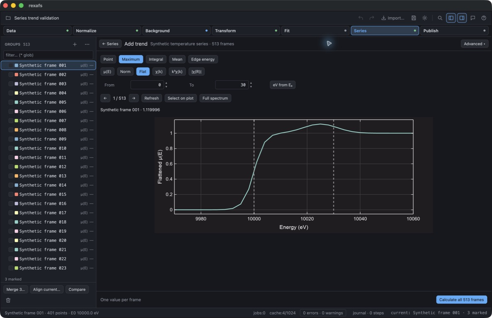
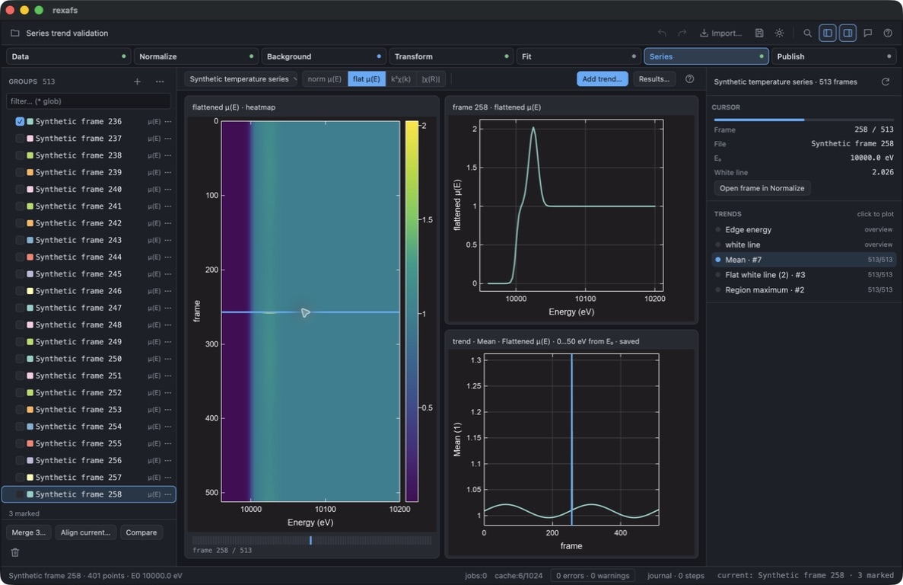

# Full-frame measurements (development version)

This increment is newer than 0.2.9. It starts Phase A of the
[complete analysis design](complete-analysis-design.md); it does not implement
the later Live, peak-fit, MBACK, correction, wavelet, regression or confidence
milestones. Rust, Python and TypeScript expose the same native scalar measurement
contract in this development checkout.

## Simple Rust API

```rust
use rexafs::prelude::Measurement;

// Normalized absorption, −20 to +30 eV relative to the resolved E₀.
let result = spectrum.measure(&Measurement::mean(-20.0..=30.0))?;
println!("{} {}", result.value, result.unit);

// Choose flattened absorption explicitly.
let height = spectrum.measure(&Measurement::maximum(0.0..=30.0).flat())?;
// Absolute energy; retain the input's original absorption units.
let point = spectrum.measure(&Measurement::point(9000.0).raw_mu().absolute())?;
// Absolute k in Å⁻¹, weight 2. No Fourier transform is required.
let chi = spectrum.measure(&Measurement::mean(3.0..=10.0).chi(2))?;
// Absolute uncorrected R in Å, using the spectrum's FFT settings.
let ft = spectrum.measure(&Measurement::integral(1.0..=3.0).fourier())?;
```

`Measurement::point`, `mean`, `maximum` and `integral` take coordinates; their
default representation is **Norm** and their default origin is **E₀-relative**.
`absolute()` changes energy coordinates to eV on the absolute energy axis.
`chi(weight)` and `fourier()` select their own absolute axes. The result records
the definition, finite scalar, units, actual bounds and resolved E₀. Maximum
also returns its absolute position; ties choose the lowest coordinate.

The operation borrows the input, reuses available stages, and calculates missing
prerequisites on a copy. It does not alter settings or create a project, worker,
cache, file or desktop session. Prepared Norm/Flat components retain their
scientific type. Raw, normalized and Fourier inputs cannot be freely relabeled.
Configured core normalization defaults still apply; provide suitable pre/post
intervals for a short XANES scan. No automatic fallback to EXAFS processing is used.

For already prepared arrays, use
`rexafs::xafs::analysis::metrics::measure(x, y, Metric::Mean { start, end })`.
`measure_masked` additionally accepts excluded intervals; intersecting any one
returns a typed missing-data error. Neither route sorts, extrapolates, clips,
fills gaps or drops nonfinite rows. Axes must increase strictly, lengths must
match and every input value must be finite. A region requires positive width.

## Numerical meaning

Between native samples the signal is linear. A point is linear interpolation;
a region integral sums trapezoids after interpolating its exact boundaries.
For a segment of width Δx with endpoint signals y₀ and y₁, its contribution is
Δx(y₀+y₁)/2. Δx uses axis units and y uses the selected signal units. This is
exact for the linear interpolant, not necessarily for an unknown continuous
experimental signal. The [SciPy trapezoid reference](https://docs.scipy.org/doc/scipy/reference/generated/scipy.integrate.trapezoid.html)
documents the composite rule; strict coverage and increasing axes are rexafs
choices implemented in `xafs/analysis/metrics.rs`.

The mean is the integral divided by region width, rather than the arithmetic
mean of unevenly spaced samples. No baseline is subtracted. An integral of
absorption therefore is not automatically a peak area or chemical concentration.
The advanced array operator also supports a nonnegative finite-region centroid,
integrating x·y(x) analytically and rejecting a zero area or negative samples.
No uncertainty is inferred; `standard_error` is absent unless you supply errors
under the independent-point model described below.

Energy uses eV, k uses Å⁻¹ and R uses Å. Norm/Flat are dimensionless. For χ(k)
weighted by kᵖ, signal units are Å⁻ᵖ. Forward-transform magnitude has units
Å⁻⁽ᵖ⁺¹⁾ under the existing `kstep / sqrt(pi)` convention. Integrals multiply the
signal unit by axis units. R is not a phase-corrected bond length.

## Desktop workflow

Open **Series** to browse the heatmap, selected spectrum and trend together.
The source selector accepts folder scans and named series of imported groups,
including project-stored spectra. **Use loaded groups** starts a series from an
existing project. The selector also offers **Use marked groups** and **Use all
groups**. Membership is explicit; later imports do not silently enter a series.

To calculate a trend:

1. Choose **Add trend…**.
2. Choose Maximum, Mean, Integral, Point or Edge energy. New trends start with
   **Flat**, 0–30 eV from each frame's E₀. These are desktop starting values;
   the core API still defaults to Norm.
3. Set the range or use **Select on plot**. The preview updates after a committed
   edit, with dashed lines marking the resolved boundaries. It zooms around the
   selected interval; **Full spectrum** restores the complete axis.
4. Choose **Calculate all N frames**. A completed trend returns to the overview.

The trend is a saved result; changing the overview's signal selector does not
recalculate it. Its title records the representation and range. Select saved
trends in the inspector. **Results…** opens history, individual rows and CSV/JSON
exports, including failed or cancelled frames. A row opens a preview using the
run's retained settings. **Show in Series** returns a compatible result to the
overview. Changed membership/order cannot attach an old result to new frames.





These development screenshots were captured through computer use on 2026-09-16.
They show generated spectra from `scripts/generate-series-metric-example.py`,
including the deliberately larger signal at frame 258. No experimental data are
included. See [the validation record](validation/2026-09-16-series-ux.md).

**Advanced** contains series editing, presets, recipes and recovery copies.
**Edit series** supports natural label ordering, acquisition-time ordering,
manual moves, adding marked groups and removing members. Each edit creates a
series revision; saved runs retain their original membership and coordinates.

Declare a physical coordinate's name, unit and source (for example Temperature,
K, thermocouple). Enter a frame value or export the coordinates CSV for bulk
editing and import it again. Keep the frame/group IDs; row order in this CSV
does not change series membership. Blank values remain missing. A repeated
coordinate belongs to each distinct frame. Imports validate the whole file
before applying any changes.

Acquisition timestamps must use RFC 3339 with a UTC offset, for example
`2026-09-16T12:00:00+09:00`. Record their start/midpoint/end meaning separately.
Acquisition ordering places missing timestamps last. **Acquisition time** plots
seconds from the earliest retained timestamp, while **Physical coordinate**
uses the declared value/unit. Missing coordinates produce gaps. File modification
time and application arrival time are never presented as acquisition time.

The preview uses the selected representation and coordinate origin. Arrow
buttons browse frames without changing the series membership. **Select on plot** accepts one click for
a point, or two clicks for interval boundaries. It converts the displayed
absolute coordinates to the selected origin; review the numerical fields
before calculating. Outside-plot clicks do not define a coordinate.

Name a measurement and choose **Save preset** to reuse it. Selecting a preset
restores its operation, representation, origin and bounds. Edits create a new
revision; existing runs keep their original definitions. **Export preset** and
**Import preset** move the definition between projects as versioned JSON,
without carrying spectra. Imports retain existing presets with the same name
and assign a distinct name/identity to the imported copy. Presets do not copy
normalization settings: each frame's processing settings remain explicit.

Use **Save recipe from preview** when another series should use the same
processing as well as the same measurement. Enter a name in **Preset or recipe
name**, review a representative frame, and save. The recipe records its import
interpretation, source quantity, processing settings and measurement. Select it
before calculating another series. **Group settings** returns to each group's
own processing; saving or choosing a measurement-only preset also returns to
that mode. Recipe replay works on copies and does not edit the source groups.

**Export recipe** and **Import recipe** move these choices between projects as
versioned JSON, without spectra or executable code. File inputs must match the
recorded column names/order, units and conversion metadata. Materialized groups
must have the same confirmed quantity (for example raw μ or flattened μ).
Incompatible or unavailable frames retain explicit errors; remaining compatible
frames can finish. This is a compatibility check, not evidence that the selected
processing is scientifically suitable for another sample or absorption edge.

Automatic processing values remain automatic for each frame. Explicit values,
including E₀ or normalization ranges, stay fixed. A same-file reference channel
is read from the same source snapshot; reference-channel alignment cannot be
captured from a materialized group without that channel. Each saved recipe
revision is immutable. To change processing, select **Group settings**, edit the
representative group's parameters, then save a recipe. To change only its
measurement, edit the fields and save a new recipe revision before calculating.
Earlier runs, resumed calculations and retained previews use their saved version.
For recipe runs, source checks use frozen recipe settings rather than unrelated
changes to the group editor.

**Calculate all N frames** calculates
every member, independently of the sampled overview. The initial maximum uses
Flat over 0…+30 eV from E₀; review this interval for the sample and energy coverage.

The worker first records input revisions, then prepares one spectrum at a time.
Normalized metrics stop after normalization; k metrics stop after background
subtraction and R metrics after the forward FFT. Unrelated invalid later-stage
settings do not block an earlier measurement. Each row has an explicit outcome;
missing numbers are not zero. The display cache is not used as the scientific
input and the result table displays 50 rows at a time without limiting export.

**Cancel** retains finished rows. **Resume unfinished** uses the saved definition
and checks input/settings revisions before calculating unfinished rows. Changed
inputs fail with a reason; start a new run to analyze the new data. Earlier runs
remain available. **Check inputs** compares current sources/settings
without changing historical values. Opening Series starts background
checks of the selected run every ten seconds, without overlapping checks.
Source digests and processing settings are compared; changed or missing inputs
are marked stale. This polling is separate from the future Live ingestion system.

Saving a project retains series, frame/group identities, definitions, settings,
resolved preparation, source digests, outcomes and run history. Portable replay
still requires embedded inputs or unchanged linked sources. **Export CSV**
includes all statuses and values; **Export JSON** writes the
full JSON metadata, including the frozen recipe. Recipe identity, revision and
name are also included in CSV. A figure alone is not a replay record. Old projects still
open and the overview keeps its historical sampled definitions.

### Open the heatmap and frame browser

Choose **Series** to open the earlier heatmap, cursor spectrum,
and trend layout, including spectra stored directly in a project. The selector
above the plots lists named series and imported directory scans. If groups are
loaded but no series exists yet, **Use loaded groups** creates one; reimporting
the spectra is unnecessary.

Named series keep their recorded order and resolve members by their saved group
identities. Missing or removed members keep their positions as gaps. The heatmap
and built-in trends sample at most 192 available frames; selecting a frame loads
that exact group's processed spectrum. The overview uses each group's current
processing settings, independently of saved recipe runs. Return to
**Results…** for complete scalar results, or **Add trend… → Advanced** for recipe replay. The older
overview's batch-fit and LCF-trend controls remain specific to directory scans.

## Recovery

Each run freezes its definition and input revisions before calculation. A private
checkpoint stores the workspace, run and append-only result chunks; a chunk is
flushed before it appears as completed in the GUI. After an interruption, open
**Series → Recovery…** and choose **Open recovery copy**. This replaces the current workspace
with an unsaved copy; save other work first. It does not overwrite the original
project or automatically restart calculation. Review the retained results and
choose **Resume unfinished**. Changed unfinished inputs fail explicitly.

A torn final journal line is ignored; corruption in a complete record is an error.
Active checkpoints are locked against recovery or deletion. Saving a completed
run removes its recovery copy; **Discard recovery copy** is also explicit. Linked
source files must still exist at their recorded revisions. The checkpoint is not
a substitute for portable embedded-input project storage. An interruption before
the initial snapshot is complete has no recoverable rows. Unpublished source
content is never uploaded by these local recovery operations.

## Python and TypeScript

```python
result = spectrum.measure("mean", (-20.0, 30.0))
height = spectrum.measure("maximum", (0.0, 30.0), space="flat")
point = spectrum.measure("point", 9000.0, space="mu", origin="absolute")
print(result.value, result.unit)
record = result.to_json()
```

```typescript
const result = spectrum.measure("mean", [-20, 30]);
const height = spectrum.measure("maximum", [0, 30], { space: "flat" });
const chi = spectrum.measure("mean", [3, 10], { space: "chi", kweight: 2 });
console.log(result.value, result.unit);
const record = JSON.stringify(result);
```

Both bindings default to Norm and E₀-relative energy, automatically selecting
absolute coordinates for Chi/Fourier. `kweight` defaults to zero for Chi.
Results own their scalar, unit, absolute bounds and optional position/E₀/error.
The original spectrum and its cached arrays are unchanged. Python releases the
GIL during calculation. JavaScript calculation is synchronous; use a worker for
long loops. Invalid input, uncovered ranges and failed prerequisites raise an
exception. The desktop E₀ trend and named series/preset management remain desktop
features, not part of these scalar binding calls.

## Supplied point errors

Use `spectrum.measure_with_errors(&definition, &errors)` in Rust, `errors=errors`
in Python, or `{ errors: float64Array }` in TypeScript. The errors must be finite,
nonnegative standard deviations of the **selected representation on its native
grid**, in its signal units. Raw detector-count uncertainties are not automatically
propagated through normalization, background subtraction or Fourier transforms.
For an already processed array, `metrics::measure_with_errors` avoids preparation.

Point, integral and mean are linear combinations of native samples. If the
measurement is m = Σᵢ wᵢ yᵢ, its standard error is
σₘ = √[Σᵢ (wᵢ σᵢ)²] for independent sample errors σᵢ. Here yᵢ is signal sample i
and wᵢ is its interpolation/integration weight (axis units for integral,
dimensionless for point/mean). Weights of the same native sample are combined
before squaring, including shared segment endpoints. This is the independent
case of the [NIST law of propagation of uncertainty](https://www.nist.gov/pml/nist-technical-note-1297/nist-tn-1297-appendix-law-propagation-uncertainty),
implemented with rexafs's linear-interpolant weights in
[`metrics/uncertainty.rs`](../crates/rexafs/src/xafs/analysis/metrics/uncertainty.rs).
Axis, range boundaries, E₀ and processing settings are treated as exact. Maximum
and centroid reject this error model; no correlations or confidence intervals
are inferred. The GUI currently has no point-error-array input and labels its
uncertainty unavailable.

## Qualification and remaining gates

Computer use verified 513-frame organization/preset/recovery workflows and a
100,000-path synthetic linked-file run, complete export, cancellation/resume and
automatic staleness. See the [qualification record](validation/2026-09-16-full-frame-measurements/README.md)
for memory, timing boundaries and limitations. Native Windows/Linux GUI and
network-share behavior remain unqualified locally; recipe replay and the later
roadmap milestones are still future work. This is not a released feature.

## Result storage

Completed runs share immutable history in memory. Identical requested processing
settings are stored once per run. JSON `rows` uses a versioned object with
`schema: 1`, a `settings` dictionary, and `values`; each row's numeric `settings`
field indexes that dictionary. The earlier development array of inline rows
remains readable and is converted to shared settings on load. The source and
result numbers are unchanged. This is an unreleased format for new measurement
records, not a rewrite of historical scientific data.

CSV and result JSON exports stream into a temporary destination file and replace
the requested output only after a successful write. Project saving avoids making
generic JSON object-tree copies of the full measurement archive. Scalar metadata
still grows with frame count; spectrum preparation remains one frame at a time.
