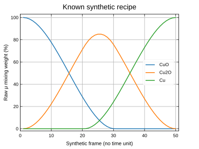
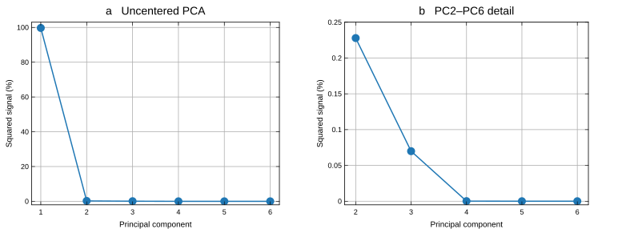
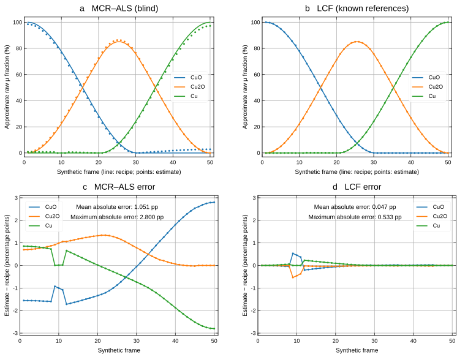

# Synthetic copper reduction: PCA, MCR-ALS and LCF

This tutorial uses an **unreleased desktop preview** with 50 deterministic
synthetic spectra and three measured references: CuO, Cu₂O and Cu. The example
starts with CuO, passes through a Cu₂O-rich region and ends with Cu. It is a
teaching sequence with known fractions, not a measured reaction or kinetic model.
It is not included in the published 0.2.12 installer.

The spectra were mixed in **raw absorption μ(E)** before normalization. No random
fractions or additional noise were generated. The original measurements retain
their noise and calibration. The desktop opens this example with its normal
automatic processing settings and no per-spectrum overrides.

## Open the example

1. Choose **Synthetic copper reduction…** on the start screen or in **Help**.
   Alternatively, open `crates/rexafs-gui/data/examples/cu-reduction.rxs` from this
   source checkout. All input spectra are embedded in the project.
2. Check that there are **53 groups**: three references and 50 groups beginning
   with **Synthetic**. Only the 50 mixtures should be marked.
3. Keep the automatic normalization settings. Select **Data** to inspect the
   measured or processed spectra. Changing a plot's viewing range does not change
   an analysis calculation's range.
4. Save your work under a new project name. Group labels contain the known raw
   mixing percentages rounded to one decimal place; full-precision truth is
   retained in the project metadata and companion fraction table.

[](../website/public/figures/synthetic-copper/recipe.svg)

*Generated with ruviz. Frame 1 is 100% CuO; frame 50 is 100% Cu. Cu₂O reaches
85.07% at frames 25 and 26. Frame number has no experimental time unit. The
legend identifies CuO, Cu₂O and Cu using ruviz's default color sequence.*

Download: [vector PDF](../website/public/figures/synthetic-copper/recipe.pdf),
[editable SVG](../website/public/figures/synthetic-copper/recipe.svg), or
[600 dpi PNG](../website/public/figures/synthetic-copper/recipe.png).

## Use PCA to inspect the component count

Principal component analysis (PCA) describes independent spectral directions.
It helps choose a component count, but its directions are not automatically
pure chemical species.

1. Leave only the **50 mixtures marked**; leave the references unmarked.
2. Open the command palette, find **Principal components**, and open that tool.
   In Data, the same tool is available in the analysis controls.
3. Keep **flat**, **Subtract mean off**, and the default calculation range
   (**Auto**, −20 to +30 eV relative to the first spectrum's E₀).
4. Run the calculation. Inspect **Scree**, **Cumulative**, and **Error vs count**.
   The preview starts with **Y axis → Linear**. Log remains an optional display.
5. Inspect three retained components in Reconstruction. The reconstruction count
   does not limit how many principal components the training calculation finds.

The first three components retain **99.9998568% of the squared signal** in this
run. Their contributions are 99.70213%, 0.22785% and 0.06987%; the fourth contributes
0.0001431%. These are uncentered squared-signal percentages, not centered variance.
Automatic preprocessing adds small extra directions, so the reported numerical
rank can exceed three. Three dominant components are consistent with the known
recipe; numerical rank alone does not establish chemical identity.

[](../website/public/figures/synthetic-copper/pca.svg)

*Both panels use linear axes. The detail panel makes the small contributions
visible without changing the calculation or replacing the default scale.
Symbols show the calculated components; connecting lines guide the eye.*

Download: [vector PDF](../website/public/figures/synthetic-copper/pca.pdf),
[editable SVG](../website/public/figures/synthetic-copper/pca.svg), or
[600 dpi PNG](../website/public/figures/synthetic-copper/pca.png).

With **Subtract mean** enabled, an exactly linear, sum-to-one mixture of three
independent references has two varying directions plus its mean. Automatic
preprocessing can add further small directions. Do not interpret two dominant
centered directions as evidence that only two species are present.

## Recover spectra and fractions with MCR-ALS

Multivariate curve resolution by alternating least squares (MCR-ALS) estimates
component spectra and their weights together. This run is blind: neither the
reference spectra nor the known fractions enter the fit.

1. Keep the **50 mixtures marked**, with all references unmarked.
2. Open **Resolve components (MCR-ALS)** from the command palette or Data tools.
3. Keep the desktop defaults: **flat**, **3 components**, **Fractions sum to 1**
   enabled, **Nonnegative spectra** disabled, **500 maximum iterations**, and
   **initialization seed 0**. Signed spectra allow small baseline-subtracted
   negative values; the coefficients remain nonnegative.
4. Leave both range endpoints **Auto**, with **Common full range** selected.
   The preview resolves the measured overlap after loading the selected spectra.
   Here this uses all **517 points from 8780.206 to 9768.204 eV**.
5. Choose **Resolve components**. Inspect **Spectra**, **Fractions**,
   **Convergence**, and **Residuals**. This run converged in **110 iterations**.
6. To identify the estimated spectra afterward, use **Group actions → Clear
   marks**, mark only the three **Reference** groups, and choose **Compare marked
   standards** in the MCR result. This compares the saved components without
   supplying references to the completed fit.
7. Save the project to retain the result arrays and settings.

Component numbers are arbitrary. In this run, components 1, 3 and 2 matched CuO,
Cu₂O and Cu, respectively. Matching is a comparison with known references, not
independent proof of identity. MCR can reconstruct spectra very accurately while
its component spectra and fractions still differ from the generating recipe.

## Compare with known-reference LCF

Linear combination fitting (LCF) holds the reference spectra fixed and estimates
their weights. Use the three measured references supplied with the example.

For a single spectrum:

1. Clear the mixture marks and **mark only the three Reference groups**. Select a
   synthetic spectrum as the current group without marking it.
2. Open **Linear combination fit**. Choose **flat**, keep **Σ = 1** (sum to one) enabled,
   and leave **E₀ shifts** disabled.
3. After the target and references load, choose **Common full range**, then
   **Fit**. Inspect the coefficients, fitted curve and residual.
4. When selecting another target, choose **Common full range** again: LCF stores
   energy offsets relative to that target's E₀, which can change between frames.

For an interactive trend across the series, keep just the references marked,
set the LCF range in Data, then choose **Series → series → All frames → Run LCF
trend**. The Series display representation does not change the LCF fitting space.
Check completion and failed rows before exporting. The saved series includes one
weight per reference and a spectral R-factor for each successful frame.

**Range distinction:** Series LCF currently reuses one pair of offsets relative
to each frame's E₀. With automatic E₀, that is not one fixed absolute energy
interval. A default XANES Series trend therefore does not reproduce the
full-range table below. The reproducible native command below calculates the
full-range offsets separately for every target and verifies identical LCF/MCR
input arrays. Do not copy one target's full-range offsets into the whole series.

## Read the comparison correctly

The labels give **raw μ mixing weights**, while MCR and LCF here fit flattened,
edge-step-normalized spectra. Comparing those two kinds of coefficients directly
can be misleading. For this validation, each fitted weight was divided by the
corresponding pure-reference edge step, then the three weights were rescaled to
sum to one. The automatically determined reference steps were:

| Reference | Edge step in source absorption units |
| --- | ---: |
| CuO | 0.637679294 |
| Cu₂O | 1.120257832 |
| Cu | 1.050925701 |

This is an **approximate conversion** with automatic preprocessing: the baseline
fits and E₀ can vary between spectra. It is performed by the comparison helper,
not automatically by the desktop Fractions view. The resulting numbers remain
raw-signal multipliers, not calibrated mass or atomic fractions.

The local optimized macOS preview was checked on 2026-09-22. The full-range LCF
calculation used the native rexafs engine with the same 50 processed spectra,
517-point energy grid, nonnegative sum-to-one coefficients and no fitted energy
shifts. References were supplied to LCF and withheld from MCR.

| Check against the known raw recipe | Blind MCR | Known-reference LCF |
| --- | ---: | ---: |
| Mean absolute error across all 150 coefficients | 1.051 percentage points | **0.047 percentage points** |
| Maximum absolute error | 2.800 percentage points | **0.533 percentage points** |
| Cu estimate at the 100% Cu endpoint | 97.200% | **100.000%** |
| Relative squared spectral residual | 2.95608 × 10⁻⁷ | 3.22965 × 10⁻⁷ |

[](../website/public/figures/synthetic-copper/comparison.svg)

*Generated with ruviz's default styling from the retained numerical results.
In panels a–b, lines connect the raw recipe values; filled circles show the
recovered fractions at all 50 frames after the approximate edge-step conversion.
The legend colors identify CuO, Cu₂O and Cu consistently across panels. Panels
c–d show estimate minus recipe on identical vertical scales; connecting lines
guide the eye. Summary errors cover all 150 coefficients. A percentage point
(pp) is an absolute difference between percentages: 97.2% versus 100% differs
by 2.8 points.*

Download the publication figure: [vector PDF](../website/public/figures/synthetic-copper/comparison.pdf),
[editable SVG](../website/public/figures/synthetic-copper/comparison.svg), or
[600 dpi PNG](../website/public/figures/synthetic-copper/comparison.png).
The figure is 274.32 × 205.74 mm; the PNG is 6480 × 4860 pixels. The PDF embeds
its fonts. All formats preserve the same data and panel scales.

LCF recovered the fractions more closely in this example because it used the
known reference spectra. MCR had a slightly lower spectral residual while its
fraction errors were larger. The residual is the sum of squared spectral errors
divided by the sum of squared input values across all 50 frames; it measures
reconstruction, not composition accuracy or statistical confidence.

At frame 25, the raw recipe is **8.882% CuO, 85.069% Cu₂O and 6.049% Cu**.
After conversion, LCF gives **8.872%, 85.052% and 6.077%**, while MCR gives
**8.009%, 86.295% and 5.695%**. These are measured results for this teaching
example, not general error guarantees.

The [retained result data](../website/public/figures/synthetic-copper/results.json)
include every raw truth value, normalized fit weight, converted estimate,
reference step and PCA contribution used in the figures. An independent
constrained least-squares check agreed with native LCF weights within
1.9 × 10⁻¹². The native reproduction also matches the earlier desktop results.

## Browse the evolution and differences in Series

1. Open **Series → Select series or scan → series**. This selects the 50-frame
   mixture scan; the separate `references` scan contains the three standards.
2. Choose **flat μ(E)** for absorption, **k²χ(k)** for weighted EXAFS, or
   **|χ(R)|** for Fourier magnitude. Click a heatmap row, use Previous/Next, or
   enter **Frame** and press Enter to move through the sequence.
3. Turn on **Difference** and leave **Ref: 1** selected to subtract the pure-CuO
   starting frame. Frame 1 becomes zero; frame 50 shows the Cu endpoint minus CuO.
   With the automatic palette, red is positive and blue is negative.
4. Use **Add trend…** to define a metric, such as a maximum or integral, and
   **Calculate all 50 frames** to evaluate it. Review saved runs in **Results…**.

For **|χ(R)|**, Difference subtracts the two magnitudes; it is not the magnitude
of a complex Fourier difference. The lower edge-energy or saved measurement
trend keeps its original definition. Frame number has no assigned time unit,
and white-line height is a signal metric rather than a concentration.

## Reproduce the calculations and ruviz figures

From this source checkout, use a new output folder. Extraction uses only Python's
standard library, verifies all embedded SHA-256 checksums, and copies the stored
raw inputs without modifying or regenerating them. The original Athena file is
not needed. Cargo uses the dependency versions in `Cargo.lock`.

```sh
python3 scripts/extract-cu-reduction.py \
  crates/rexafs-gui/data/examples/cu-reduction.rxs /tmp/cu-tutorial
cargo run --locked --release -p rexafs --example cu_reduction_check -- \
  /tmp/cu-tutorial --desktop-defaults
cargo run --locked --release -p rexafs --features plotting \
  --example cu_reduction_figures -- \
  /tmp/cu-tutorial/tutorial-results.json /tmp/cu-tutorial/figures
```

The checker's `--desktop-defaults` mode resolves the desktop automatic settings,
runs PCA and blind MCR, then fits every spectrum against the known references.
It writes `native-default-analysis.json`, `native-default-lcf.json`, and compact
`tutorial-results.json`. Only that compact record and the selected ruviz assets
are retained with this tutorial; large spectral matrices remain local.

The figure example uses **ruviz 0.14.2** and renders `recipe`, `pca`, and
`comparison` as SVG and 600 dpi PNG. It reads retained numerical arrays and does
not refit or smooth them. All panels use `Plot::new()` styling: default fonts,
colors, lines, markers, grids, spines and margins. Ruviz places legends
automatically. Each panel has a 5.4 × 4.05 inch export canvas; the code sets labels,
scientific axis ranges, panel arrangement and resolution. The website displays
the smaller SVG files; vector PDFs and high-resolution PNGs are available for
download.

The export helper converts the SVGs to PDFs with CairoSVG 2.8.2 and losslessly
compresses the PNGs. It preserves every pixel and the physical-resolution
metadata. Cairo must be installed on the system:

```sh
uv run --no-project --python 3.12 scripts/export-cu-figures.py \
  /tmp/cu-tutorial/figures
```

On macOS with Homebrew Cairo, prefix the command with
`DYLD_FALLBACK_LIBRARY_PATH="$(brew --prefix)/lib"` if Cairo is not found.
All three retained PDFs were checked for embedded fonts and absence of raster
images. Recipe is 137.16 × 102.87 mm (3240 × 2430 pixels); PCA is
274.32 × 102.87 mm (6480 × 2430 pixels); comparison is 274.32 × 205.74 mm
(6480 × 4860 pixels).

To compare your own saved default desktop run, replace the calculation command
with the following. The checker verifies the fitted input arrays and energy grid
against the saved MCR result before reporting LCF errors.

```sh
cargo run --locked --release -p rexafs --example cu_reduction_check -- \
  /tmp/cu-tutorial --compare-defaults '/path/to/saved-desktop-analysis.rxs'
```

The implementation and plotting sources are
[`cu_reduction_check.rs`](../crates/rexafs/examples/cu_reduction_check.rs),
[`cu_reduction_figures.rs`](../crates/rexafs/examples/cu_reduction_figures.rs),
[`export-cu-figures.py`](../scripts/export-cu-figures.py), and
[`extract-cu-reduction.py`](../scripts/extract-cu-reduction.py).

## Generate raw absorption mixtures

[`generate-cu-reduction.py`](../scripts/generate-cu-reduction.py) reads the original
Athena absorption arrays for CuO, Cu₂O and Cu foil. Their energy grids differ, so
it linearly interpolates the raw absorption onto the foil's 517 energy samples
within the shared measured coverage, 8780.206–9768.204 eV. It applies no additional
energy shifts, normalization, smoothing or random noise before mixing. Existing
measurement noise and the source's historical energy calibration remain present.

For frame number n from 1 to 50, define dimensionless progress t = (n − 1)/49.
Let H(x) = z²(3 − 2z), where z is x limited to the interval [0, 1]. The two
overlapping transitions are A = H(t/0.6) and B = H((t − 0.4)/0.6). The generating
fractions, in CuO, Cu₂O, Cu order, are (1 − A, A − B, B). These are nonnegative
and sum to one. CuO decreases, Cu₂O rises and falls, and Cu increases; the first
frame is pure CuO and the last is pure Cu. All three contribute during the
overlap. This is a rexafs teaching construction, not a fitted kinetic model;
frame number has no assigned experimental time unit.

At every energy E, in eV, the generator calculates:

    μ_frame(E) = f_CuO μ_CuO(E) + f_Cu₂O μ_Cu₂O(E) + f_Cu μ_Cu(E).

Here μ is the original absorption signal in its retained source units, and f
is its dimensionless multiplier. The coefficients are **raw absorption mixing
weights**, not independently calibrated mass or atomic fractions. The source
measurements have different edge steps and baseline levels.

Frame labels begin with **Synthetic** and show all three percentages rounded to
one decimal place. `fractions.csv` and `manifest.json` retain the full-precision
values. The original source checksum, preparation choices and synthetic truth
also travel with the portable `.rxs` project. References and mixtures occupy
separate scans; only the 50 mixtures are marked initially. References and truth
are withheld from blind PCA and MCR calculations.

## Interpret normalization correctly

Normalization subtracts a fitted pre-edge baseline and divides by the edge step;
see the [Larch normalization documentation](https://xraypy.github.io/xraylarch/xafs_preedge.html)
and rexafs's [`PrePostEdge`](../crates/rexafs/src/xafs/normalization.rs).
The separate numerical validation uses common settings: E₀ = 8979 eV, pre-edge offsets
−150 to −75 eV, post-edge offsets +150 to +650 eV, polynomial order 2 and
Victoreen exponent 0. The edge step is fitted separately for each raw spectrum.
Setting E₀ here does not translate any measured energy axis.

With the shared grid and these fixed linear baseline fits, normalized mixtures
remain linear combinations of normalized references, but with new coefficients:

    g_j = f_j Δ_j / Σ_k(f_k Δ_k).

The index j selects a reference; Δ_j is its fitted edge step in source absorption
units, f_j is its raw mixing coefficient and g_j is its normalized coefficient.
This equation follows by distributing the common linear baseline operation over
the raw mixture; it is the example's algebraic consequence, not a new fitting
algorithm. The same relation holds for rexafs's flattened outputs under these
shared settings. Changing grids, baseline intervals, polynomial order or E₀
independently can break it. Recover the raw weights from a normalized fit with:

    f_j = (g_j / Δ_j) / Σ_k(g_k / Δ_k).

These settings are a controlled mathematical check, not the example's startup
settings. Automatic processing may choose different edge energies and fitting
intervals for each spectrum, so the exact linear relation is not guaranteed
for its processed outputs.

The companion table contains raw coefficients and explicitly labeled
`fixed_validation_normalized_*` coefficients for the controlled check.
The fixed validation reference steps are approximately 0.644178 (CuO), 1.108004 (Cu₂O)
and 1.058809 (Cu). Compare LCF on **Norm** or **Flat** with the normalized columns,
or apply the inverse relation before comparing with the raw percentages in the
group labels, when using those same fixed validation settings. The default
desktop example uses automatic E₀; its raw generating percentages remain exact.


## Methods and provenance

The user supplied the measured `Cu oxides.prj` and identified it as their group's
data. Its SHA-256 is
`18684eb2c4776d5d3661f6ad6fdfae6fb81d91571bda00611ec33bd686c67dc6`.
The source labels are `cuo_abs`, `cu2o_abs`, and `cufoil_abs`. The original project
is unchanged and not copied into the documentation. No additional acquisition
conditions or data license are inferred. The historical 100 random-mixture
fixtures and their attribution remain unchanged; this tutorial uses the newer
50-frame raw-absorption construction.

PCA, constrained LCF and MCR are implemented in the
[native analysis module](../crates/rexafs/src/xafs/analysis/mod.rs).
The MCR bilinear model and alternating least-squares approach are described by
[Camp (2019)](https://doi.org/10.6028/jres.124.018) and the
[official pyMCR documentation](https://pages.nist.gov/pyMCR/). Initialization,
constraints and stopping defaults here are rexafs choices; the desktop uses the
Rust implementation, not a Python runtime. The automatic preprocessing defaults
are in [`params.rs`](../crates/rexafs-gui/src/params.rs), the full-range MCR policy
in the [MCR worker](../crates/rexafs-gui/src/app/shell/tools/mcr.rs), and Series
subtraction in [`series_display.rs`](../crates/rexafs-gui/src/app/series_display.rs).

The separate [`check-cu-reduction.py`](../scripts/check-cu-reduction.py) and the
native checker's mode without a flag retain the older fixed-normalization
mathematical check. Their controlled E₀ and baseline intervals are not the
startup settings or the automatic results reported in this tutorial.
