# Copper mixture analysis validation

This unreleased source-checkout validation was performed on macOS on
16 September 2026. Branch `test/cu-mixture-recovery` starts from `dev` commit
`44c6bc45817dad5df0f928d30a12f1e865d8cb0b`. Results below come from a saved
project produced through the native release GUI. They are separate from the
historical teaching notebooks; see the [notebook review](notebook-review.md).

The later [component-processing check](#recovered-components-through-exafs)
uses a separate full-range calculation. It does not replace the narrow-range
reference-recovery measurements below.

## Inputs and settings

The [fixture manifest](../../../crates/rexafs/tests/fixtures/analysis/cu-mixtures/manifest.json)
records preparation, generator settings and all 103 XDI checksums. The original
Athena project was read without modification. Its SHA-256 remains
`18684eb2c4776d5d3661f6ad6fdfae6fb81d91571bda00611ec33bd686c67dc6`.
Historical attribution and redistribution limitations are in the
[fixture README](../../../crates/rexafs/tests/fixtures/analysis/cu-mixtures/README.md).

The experiment has 100 noise-free Dirichlet mixtures of Cu foil, Cu₂O and CuO,
generated with NumPy PCG64 seed 20260916. There are no pure endmembers among the
100 mixture inputs. The generating standards are separate LCF references and
were not supplied to the blind MCR fit.

All 103 spectra use the shared preparation in the
[desktop guide](../../cu-mixture-analysis.md): E₀ = 8979 eV, fixed edge step 1,
pre-edge interval −150 to −75 eV, post-edge interval +150 to +650 eV, polynomial
order 2 and Victoreen exponent 0. Desktop analyses use flattened absorption over
−29 to +171 eV relative to E₀: 190 common measured points from 8950.205 to
9148.198 eV. No extra energy alignment is applied.

## Measured results

The [numerical summary](flat-summary.json) records values and reference software
versions. These measurements use **Flat**; earlier normalized-space development
comparisons are a separate experiment.

| Check | Measured result |
| --- | --- |
| Batch LCF | 100 of 100 frames completed, no errors |
| Largest absolute LCF coefficient error | 1.353 × 10⁻¹³ |
| Largest LCF relative squared residual | 1.622 × 10⁻²⁸ |
| Centered PCA contributions | 75.91447434% and 24.08552566% |
| Blind MCR-ALS | 776 iterations, converged |
| MCR relative squared residual | 9.781 × 10⁻²⁵ |
| Relative spectral errors: foil, Cu₂O, CuO | 0.2394%, 0.03425%, 0.2506% |
| Largest absolute MCR coefficient error | 0.02387 |
| Native versus pyMCR maximum component-array difference | 2.621 × 10⁻¹¹ |

Relative squared residual is Σ(D − CS)² / ΣD²: rows of D are input spectra,
C contains coefficients, and rows of S are component spectra. Relative spectral
error is the Euclidean distance from a matched generating reference divided by
that reference's Euclidean norm. Matching only permutes components; it does not
rescale, shift or refit them.

MCR uses three components, nonnegative coefficients summing to one, signed
component spectra, seed 0, tolerance 10⁻⁸ and a limit of 2000 iterations. Its
initial input indices are `[52, 54, 12]`, counted from zero. The independent
[pyMCR](https://pages.nist.gov/pyMCR/) comparison uses the same starting spectra
and an exact simplex-constrained coefficient solver. Python is a development
reference; the native calculation uses Rust and existing dependencies.

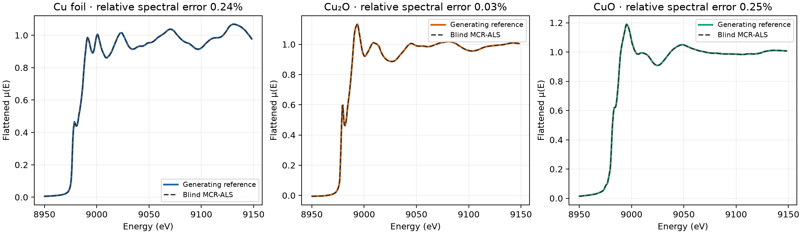

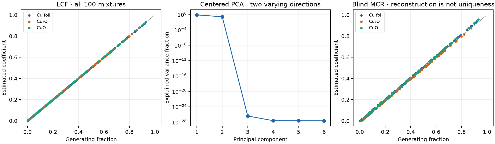

Near-exact reconstruction does not establish unique blind factors: the MCR
coefficient discrepancy above remains. Two centered PCA directions plus the
mean are consistent with three components whose fractions sum to one. These
noise-free checks do not establish robustness to experimental noise, omitted
standards or inconsistent preprocessing.

## Computer-use checks

- Reopened a portable project containing 100 mixtures, three standards and eight
  calculated groups: three MCR components, an LCF fit, a residual and three
  weighted contributions. Retained PCA, MCR and single-target LCF results
  survived reopening without rerunning them.
- Switched Scree, Error vs count and IND between Linear and Log. The saved PCA
  result and count suggestion remained unchanged. Cumulative contribution
  stayed linear from 0 to 100%.
- Selected **Series → Select scan → mixtures**. The picker showed the original
  directory names `mixtures` and `standards`, rather than cache hashes.
- Compared frames 13 and 55 in normalized absorption, k space and R space. Both
  title and curve changed. Flat and Norm were separate choices. This exercises
  fixes for a stale frame plot and for Norm previously preferring flat arrays.
- Ran LCF on all 100 flattened frames with the three marked standards. Saved
  coefficients, input identities, completion state and calculation settings.
- Compared calculated MCR groups with the standards through Groups. Calculated
  flat arrays were displayed directly, without another flattening operation.
  Groups without a Fourier transform no longer trigger a mixed Fourier-weight
  warning; the final build was checked with all six comparison curves.
- Exported an Analysis folder containing eight calculated arrays and provenance
  records, plus 100 batch LCF rows. Exported energy and signal values matched
  retained arrays exactly; every CSV fraction matched truth within the error
  above. The exported portable project retained all 103 source groups.

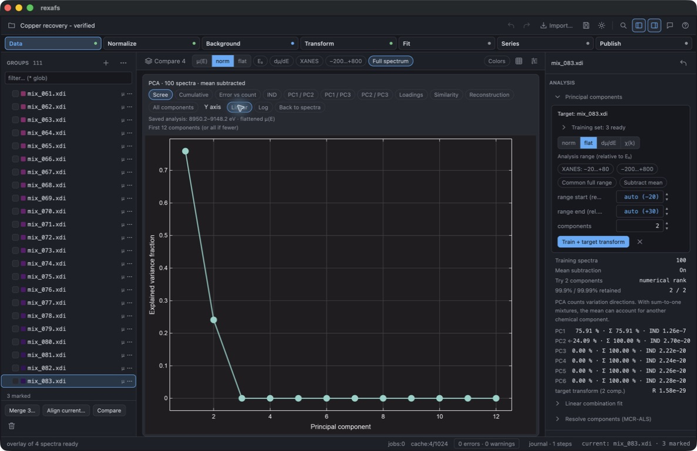

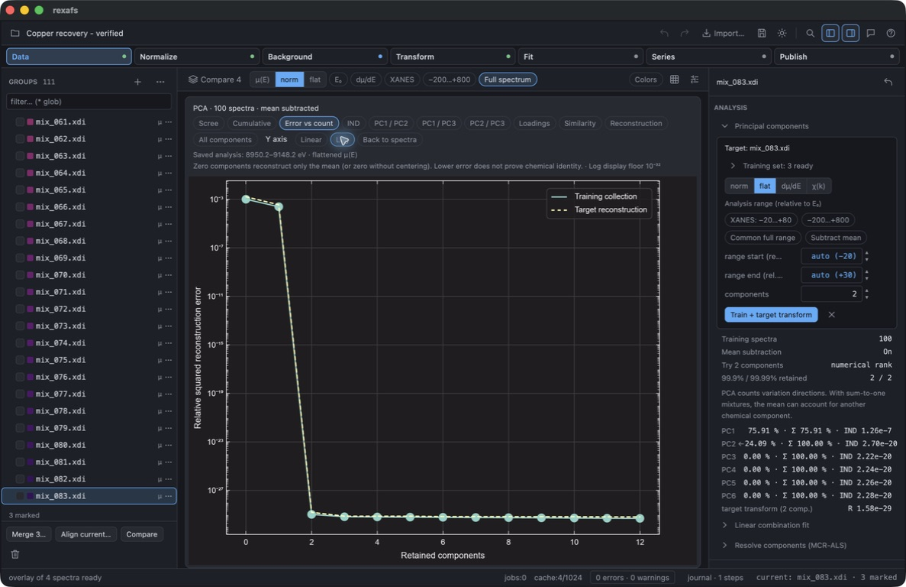

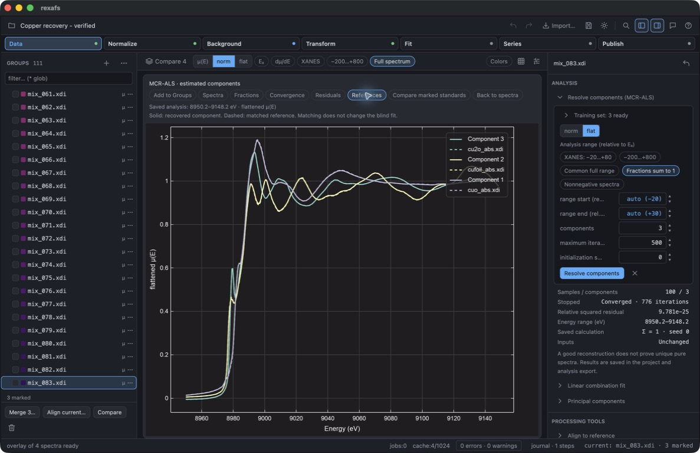

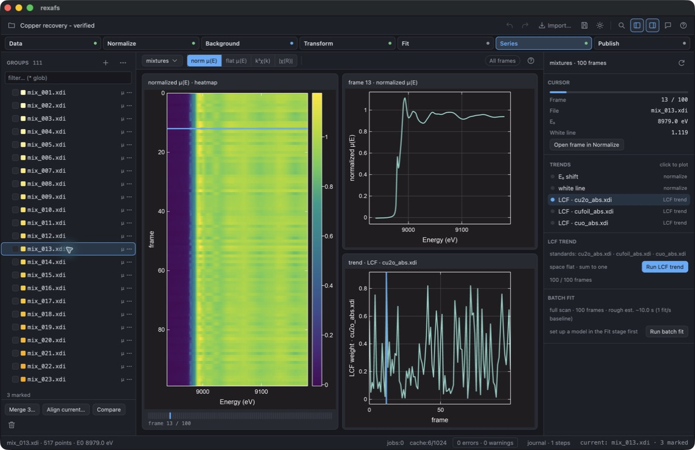


Local deliverables are `target/cu-mixture-experiment/Copper recovery - verified.rxs`
and `target/cu-mixture-experiment/Copper verified export/`. These working
artifacts are ignored by Git. The user's earlier copper project remained intact
while the separate Validation app was tested. Batch results persist as
historical records and exportable tables; reopening does not automatically
rerun or reconstruct the live Series trend display.

## Checks and reproduction

The GUI suite passed 510 tests with five ignored tests. The later PCA scale
change passed the existing PCA diagnostic check and release build, followed by
computer-use checks above. Five copper fixture/recovery integration tests and
four native MCR tests passed. The website check reported zero errors, warnings
or hints across 37 files. Cargo's actual package list excludes the copper
fixtures and their fixture-dependent integration test.
The final Fourier-weight display fix passed its existing comparison test and
another release build; the portable project was reopened in that build.

The script below checks the saved GUI result against synthetic truth, NumPy PCA
and pyMCR, then produces the numerical figures:

```sh
python scripts/check-cu-desktop-project.py \
  'target/cu-mixture-experiment/Copper recovery - verified.rxs' \
  crates/rexafs/tests/fixtures/analysis/cu-mixtures \
  target/cu-mixture-experiment/flat-report
```

Use a separate environment with the versions in
[`scripts/cu-mixtures-requirements.txt`](../../../scripts/cu-mixtures-requirements.txt).
Python/TypeScript MCR bindings and a separate Components workspace remain
outside this experiment's implementation scope.

## Recovered components through EXAFS

A separate, unreleased desktop run uses all 100 mixtures in Flat over their
common full range, 8780.206–9768.204 eV (517 points), with E₀ = 8979 eV. Three
components, closure, signed spectra, seed 0 and a 2000-iteration limit produced
convergence in 870 iterations, with relative squared residual
9.660622670192087 × 10⁻²⁵. See
[the saved summary](component-processing-summary.json). This run has not been
independently matched against references; its small residual is not a statement
of chemical uniqueness or structural accuracy.

Computer use exercised the native release GUI:

- Marked the 100-member mixture scan and ran full-range MCR; references were not
  included in the training selection.
- Added the three recovered components to Groups. Normalize exposed E₀ and
  described the retained flat input; the final build omitted inapplicable
  pre/post-edge ranges and draggable baseline handles.
- Viewed AUTOBK, changed Rbkg from its 1 Å default to 1.2 Å, and inspected χ(k)
  and its Fourier transform in the normal Transform stage.
- Imported the local `feffcu01.dat` fixture, applied a one-path model, and ran
  the ordinary EXAFS fitter on component 1 over k = 2–12 Å⁻¹ and R = 1.2–3 Å.
  The GUI correctly refused Rmin = 1 Å while Rbkg was 1.2 Å. This was a workflow
  smoke test, **not a validated structural fit**: the Cu path was not selected
  through chemical identification of this component. The fit reported
  R-factor ≈ 1.03644, an amplitude bound and a poor-fit warning. Its optimizer's
  convergence does not make this model acceptable.
- Saved and reopened `Copper components - EXAFS.rxs`, a separate portable local
  project with 103 original sources and 11 calculated groups. All three new
  component arrays matched the retained MCR rows exactly, and E₀/quantity and
  operation metadata survived. The preceding narrow-range project is intact.

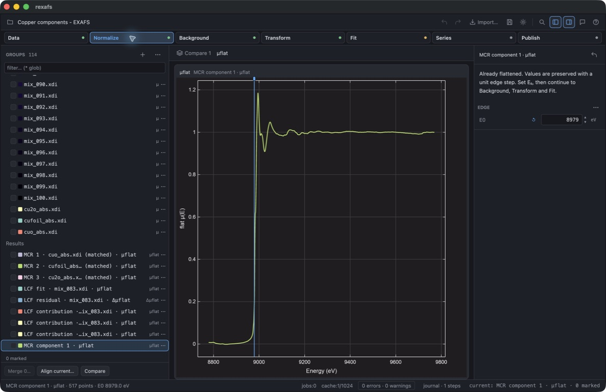

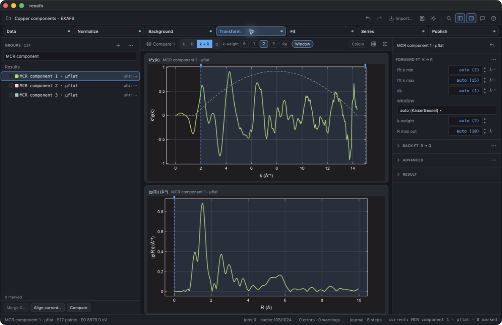

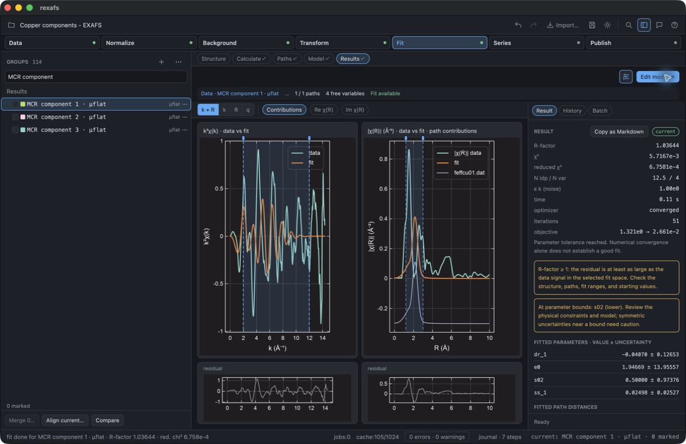

Automated validation added prepared-input tests for value preservation through
AUTOBK/FFT, E₀ edits, serialization, invalid inputs and historical MCR results
missing E₀. A Cu integration test passes a recovered component to the ordinary
FEFF fitter. Desktop tests check editable background settings without
renormalization, retained transform figures and calculated-data export even if
EXAFS cannot run on a short interval.

The core checks passed: 192 library tests, 10 analysis tests, four MCR contract
tests, three prepared-spectrum tests and six Cu-fixture tests. One external
Larch test remained ignored. The first desktop run passed 510 tests and found
one short-interval export regression; after its fix, all four publication tests
passed, followed by 507 passing desktop tests with five pre-existing ignored
tests and four slow FEFF integration tests filtered out. Those four had already
passed in the first run. Release compilation, ndarray compatibility, strict
Rustdoc, compiled API examples and the 37-file website check also passed.

The [API guide](../../analysis-api.md) separates implemented Rust behavior from
proposed simplifications and currently absent Python/TypeScript analysis bindings.

### Optional normalization of recovered flattened input

Following the user's clarification, **Refit pre/post-edge** was added to the
Normalize stage. The default still preserves recovered values. Enabling the
option exposes the ordinary pre-edge, post-edge polynomial and edge-step
controls; it is also available through `set_normalization_method` on a prepared
Rust spectrum. This explicitly corrects the supplied flat array rather than
attempting to reconstruct the original raw measurement.

Computer use verified enabling the option, editing pre-edge offsets to −150/−75
eV and post-edge end to +650 eV, viewing the fitted baselines, disabling the
option to restore the original curve, and reenabling it before Fourier
processing. The GUI-saved project retains `refit_prepared: true` and the edited
ranges for component 1. Comparing it with its preceding backup confirmed that
all original calculated arrays, Operation records and the complete MCR result
remained exactly unchanged. Old Operation descriptions are retained as historical
evidence; the new downstream choice is in the separate processing settings.

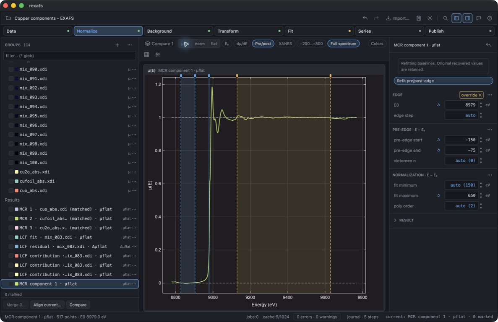

The updated core checks passed 192 unit tests, four MCR tests and four prepared
spectrum tests, including refit/reload equality against ordinary normalization.
The desktop checks passed 506 tests, with the new setting initially missing
from one test's expected Normalize-copy key list; after updating that expectation,
that test passed separately. Five existing ignored tests and four previously
passed slow FEFF tests were not rerun. The final release build, ndarray check,
strict Rustdoc, all four compiled API examples and website diagnostics passed.

## Shared core API validation

The later API refinement keeps Norm as the core default and energy ranges as
E₀-relative offsets. Missing normalization/background stages now run on copies
using the input settings. Tests compare these results with explicit processing
for Norm, Flat, Deriv and Chi, including an initially unset E₀, and verify that
input arrays, settings and caches remain unchanged. Existing prepared arrays are
reused. Norm-only recovered components require explicit refitting to obtain Flat.

LCF, PCA and MCR now share finite/increasing interval and coverage checks.
References in shifted LCF must cover the entire permitted shift margin. Batch
LCF retains ordered per-target failures and a completed prefix on cancellation.
PCA count suggestions, their diagnostic basis, and reconstruction-error curves
are core APIs used by the desktop. Python/TypeScript bindings remain on the
[API todo list](../../analysis-api.md#binding-todo-list-and-follow-up-work).

The final release GUI was checked in the separate Validation app:

- A reversed LCF interval, +30 to −20 eV, displayed an error and retained the
  previous result with its saved interval label.
- Restoring −29 to +171 eV allowed single LCF and all 100 Series LCF frames to
  finish. The saved project contained 100 rows, no errors and no cancellation.
- Centered PCA on all 100 Flat inputs suggested two varying directions by
  numerical rank. The error-versus-count plot used the core curve; Linear and
  Log display modes both worked.
- Results were saved to the ignored local file
  `target/cu-mixture-experiment/Copper shared API validation.rxs`, preserving
  the earlier component-processing project. The [saved summary](shared-api-summary.json)
  records a maximum coefficient error of 2.821 × 10⁻¹³ and maximum LCF R-factor
  of 3.871 × 10⁻²⁸. These are a new run, not replacements for the historical
  measurements above.

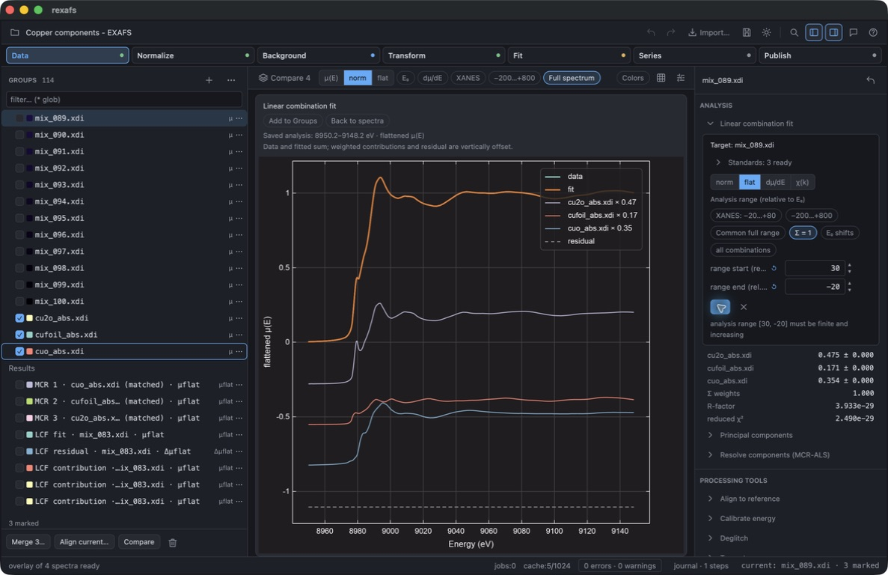

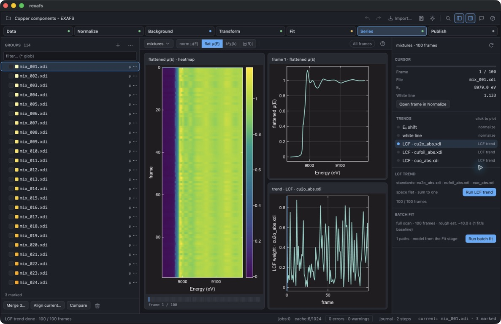

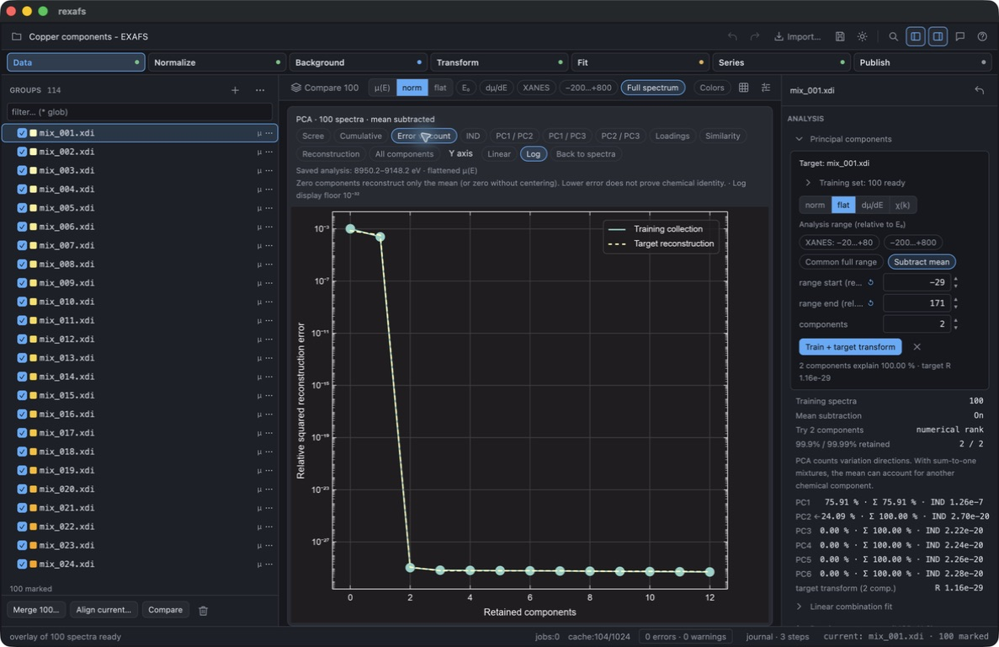

Local checks: 353 core tests passed (3 ignored), 373 with `ndarray-compat`
(3 ignored), and 512 desktop tests passed (5 ignored), including the slow FEFF
checks. These totals include Rust doc tests for the core. Strict core Clippy,
workspace formatting, strict Rustdoc, all four API-guide examples, website
checking, the release desktop build and crate-package exclusions passed. A
separate test also checked all 100 compositions through `lcf_batch` after the
fixture test was switched to that entry point. Cross-platform CI is separate
from these macOS results.
