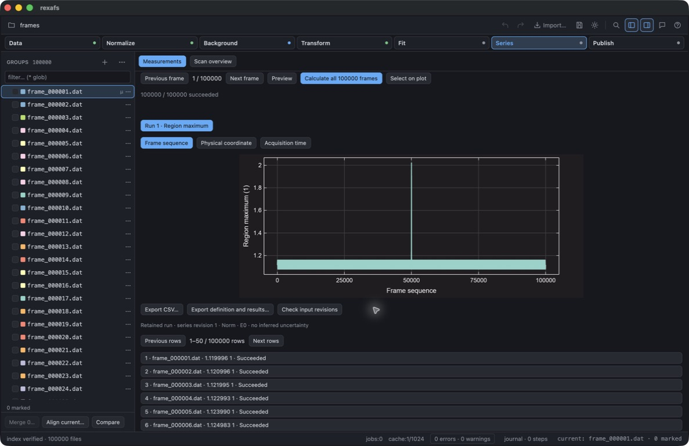
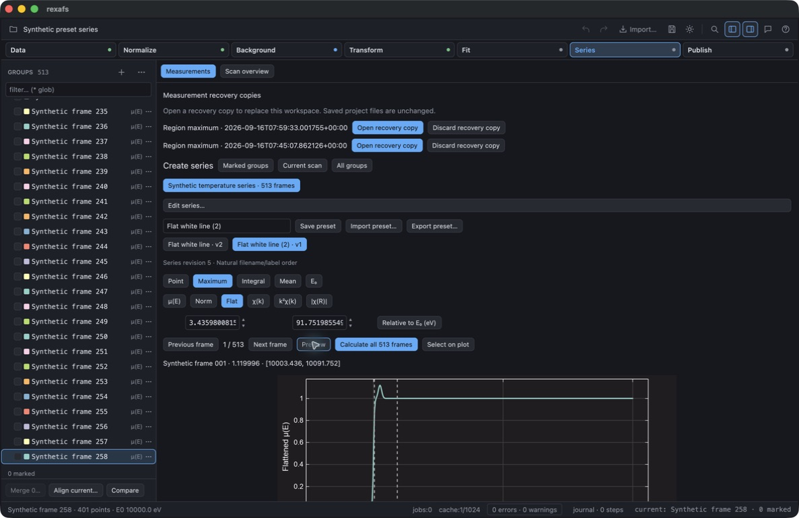
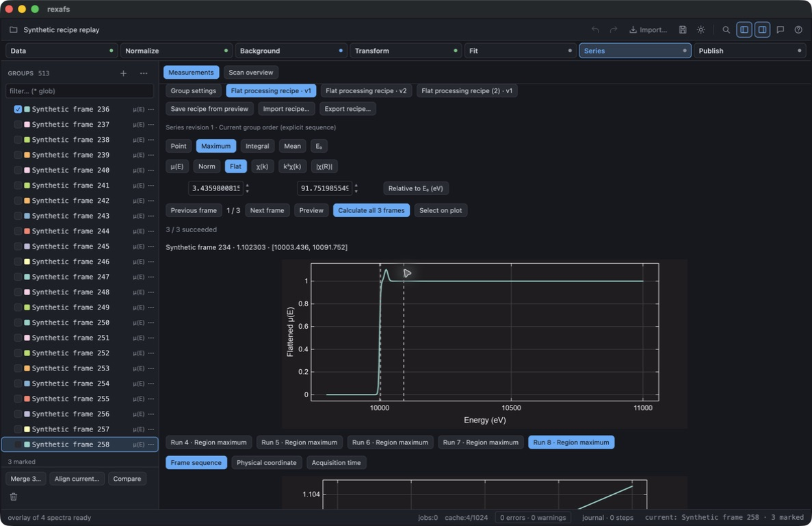

# Full-frame measurement development qualification

This record covers the first Phase A increment on `feature/complete-analysis`,
based on `dev` at `513cc1c`. It is newer than release 0.2.9 and does not qualify
the complete analysis roadmap. See the [progress record](../../complete-analysis-progress.md)
and [current API guide](../../full-frame-measurements.md).

## Synthetic input and numerical check

[`generate-series-metric-example.py`](../../../scripts/generate-series-metric-example.py)
generates 513 entirely synthetic spectra, with 401 energy points each. No
experimental or unpublished input is used. Run it with a destination outside
the checkout:

```sh
python3 scripts/generate-series-metric-example.py /tmp/series-example.rxs
```

The energy grid is 9800–11000 eV in 3 eV steps. The absorption is a linear
baseline, a unit logistic edge at 10000 eV with a 2 eV scale, and a Gaussian
feature centered at 10025 eV with a 9 eV scale. The feature amplitude in
zero-based frame i is `0.12 + 0.04 sin(i / 40)`, with an additional 0.9 at
i = 257. Frame 258 therefore has a deliberately exceptional maximum. These
functions define test truth; they are not a physical absorption model.

The recorded normalization uses E₀ = 10000 eV, pre-edge offsets −180…−35 eV,
post-edge offsets 150…990 eV and polynomial order 1. The measurement is the
maximum of normalized absorption from −20 to +50 eV relative to E₀. Its expected
value is `1 / (1 + exp(-12.5)) + amplitude`. The selected native grid contains
the peak center. All 513 exported results agreed with that expression within
6.74 × 10⁻¹⁰ absolute error, below the prespecified 10⁻⁷ check tolerance.

## Native desktop check

Computer use exercised the actual macOS GUI built with
`cargo build --locked --release -p rexafs-gui`. The development app had isolated
settings. The check opened the synthetic project, created a series from all
groups, calculated all 513 frames and paged to frame 258. Selecting that result
brought its matching retained spectrum preview into view, showing the larger
peak and measurement interval.

The GUI saved a new `.rxs` project and reopened it. Its CSV and JSON exports
each contained 513 successful rows, 513 distinct group identities, source
digests and input revisions. The reopened JSON export equaled the saved run
exactly. **Check input revisions** reported zero changed or unavailable inputs.
The largest result was frame 258. The table's 50-row pages do not limit the
calculation, plotted trend or export.


The generated projects, CSV/JSON exports and raw command logs were retained
locally outside the checkout. The generator, this record and this computer-use
screenshot are the committed evidence. The native check covers macOS only.

## Automated and resource checks

On 2026-09-16, using pinned Rust 1.98.1:

- `cargo test --locked -p rexafs`: 357 passed, 3 ignored across the core,
  integration and documentation test binaries.
- `cargo test --locked -p rexafs-gui`: 526 passed, 6 ignored.
- `cargo clippy --locked -p rexafs --all-targets -- -D warnings`: passed.
- The explicit ignored worker resource test also passed when run separately.

The worker resource test evaluated the same synthetic 256-point source 100,000
times serially and retained 100,000 scalars (800,000 bytes). The debug test
binary took 33.41 seconds elapsed; `/usr/bin/time -l` recorded a maximum resident
set of 23,773,184 bytes. Hardware was an Apple M4 MacBook Air, 10 CPU cores and
32 GB memory, running macOS 26.5.1. Other development checks were active, so this
is an observed qualification run rather than a controlled performance benchmark.

This test checks repeated worker preparation and release. It does **not** model
100,000 distinct files, all retained provenance rows, the full GUI, or materialized
input duplication. Those memory/storage and platform gates remain open. Tests
also cover short XANES without valid later EXAFS settings, changed/missing
sources, cancellation/resume, incomplete worker inputs, malformed source rows,
typed flattened components and project serialization.


## Organization, presets and recovery extension

A later build on this branch was exercised through computer use with the same
513-frame synthetic project. Manual and natural ordering, per-frame temperature
and timestamp editing, ID-keyed CSV import/export, repeated/missing coordinates,
and temperature/elapsed-time axes were checked. Historical runs kept their
original membership revision and values after edits. A named Flat preset was
saved, reselected after changing the controls, revised using two plot clicks,
and exported/imported as JSON. Its absolute plot coordinates were converted to
the correct E₀ offsets. Importing the same name created a separate preset.

The app was quit without saving a completed run. Reopening Series exposed the
recovery copy; opening it restored all 513 committed rows in an unsaved workspace.
Saving that workspace retained the results and removed the completed checkpoint.
The original saved project stayed unchanged. Automated tests additionally cover
active locks, torn final records, corrupt complete records and changed settings
before a resumed snapshot.

## 100,000 linked-file GUI workload

The additional generator [`generate-series-resource-example.py`](../../../scripts/generate-series-resource-example.py)
creates 100,000 distinct paths outside the checkout. Each has 401 energy points
with the same axis/baseline/edge model described above. One thousand periodic
prototype signals are reused through hard links where supported; frame 50,001
has feature amplitude 1.02. Distinct paths have distinct frame/group identities.
This workload checks reader/worker/provenance/UI behavior, not independent
experimental signals or remote-storage bandwidth.

```sh
python3 scripts/generate-series-resource-example.py /tmp/rexafs-series-100k
```

On the same Apple M4, 32 GB macOS machine, a release GUI build opened all files,
created an explicit series and calculated the normalized maximum −20…+50 eV.
Computer use exported 100,000 successful rows. The maximum was frame 50,001,
value 2.0199962740298623. A second run was cancelled after 16,592 successful rows
and resumed through the GUI. Its final 100,000 values and frame IDs equaled the
uninterrupted export exactly. Adding only a comment to one linked path using
atomic replacement caused the automatic check to report exactly one stale input;
retained values were unchanged. The other hard links were not modified.



The first buffered checkpoint's row-writing interval was 81.772 seconds (from
creation of `rows.jsonl` to its final footer), about 1,223 frames/s. This includes
calculation, durable chunk writes and GUI publication; it excludes initial input
hashing, snapshot creation, import and export. It is a single observed run, not
a repeated benchmark or a promised speed. The run's initial 163.82 MiB JSON
metadata file took about 0.28 seconds to write after buffering was introduced.
The earlier unbuffered prototype was much slower and is not the implementation
being qualified. Later code uses 128-row publication chunks above 10,000 frames
instead of the 16-row chunks used for these timings; it still checks cancellation
before each frame. No new throughput claim is inferred from that change.

One-second process RSS samples reached about 1.87 GiB during the first run and
6.59 GiB during the subsequent two-run/cancel/resume/export session. Spectra are
prepared one at a time, but frame settings, result history, recovery snapshots
and export copies grow with frame count. This is a significant memory cost, not
constant total memory. Recovery files occupied roughly 403 MiB for the first
run and 613 MiB for the resumed run's snapshot and journal. A long history may
reach project-size limits and needs further metadata deduplication. Full exports
and plots were usable through computer use; this run did not capture a rigorous
end-to-end cancellation-latency distribution.

The synthetic projects, 100,000-row exports, recovery journals and per-second
resource logs remain local outside Git. The generator and this GUI screenshot
are the reproducible public evidence. No private experimental data was used.
Native Windows/Linux GUI and network-share qualification remain open.


## Final automated extension checks

The expanded core suite passed 359 tests (3 ignored). The full desktop suite
passed 532 tests (6 ignored); targeted measurement tests were repeated after the
last UI changes. The installed Python wheel passed 15 runtime tests. The npm
package passed 26 tests, including Node/browser parity, packed-package TypeScript
checks and editor hover/signature checks. The installed Python package passed
Pyright/LSP checks, including the new measurement call and result type. Website
API generators were rerun for Next; Stable signatures remain release-derived.
Strict core Clippy, Rust reference generation (including missing-documentation
and link checks), the website build, all 22 website tests and Astro checks passed.


The final release build was also checked through computer use on 12,000 linked
synthetic frames, exercising the new 128-row publication chunks. Both retained
runs saved with 12,000 successful rows. Cancelling during checkpoint preparation
returned to the idle controls with **Resume unfinished** visible in an observed
1.144 seconds (click plus accessibility read; one observation, not a latency
percentile). It retained zero calculated rows in that attempt and resumed to
completion. The empty trend was hidden, and completed recovery copies were
removed after saving a separate project. Reopening the earlier 513-frame project
restored the selected Flat preset name, representation and numerical bounds;
Preview displayed the correct absolute interval.



## Memory and recipe replay follow-up

This follow-up retains the historical measurements above. It used the same
Apple M4/32 GB machine and synthetic 100,000-path workload. The modified build
shares immutable completed runs and identical processing settings, streams CSV
and JSON exports, and keeps measurement history out of the generic project
compactor's duplicate JSON object trees.

Computer use completed all 100,000 rows, started and cancelled a second run
during checkpoint preparation, resumed it, and exported CSV/JSON. Cancellation
click plus the immediate accessibility read took 0.840 seconds; checkpoint
completion followed asynchronously, so that number is not total cancellation
latency. Every exported source identity, value, unit, outcome, resolved range and
E₀ matched the earlier 100,000-row export exactly. New series/run identities
were intentionally different. The two-run/cancel/resume/export session peaked
at 4.49 GiB RSS, compared with 6.59 GiB in the earlier workflow. This is a workload
comparison with other development activity present, not a controlled speed test.

Saving both runs initially reached 6.21 GiB. After removing object-tree copies
of the archive from project compaction, a separate reload/save check peaked at
2.81 GiB. The two-run linked project was about 206 MiB. Each run stored 100,000
rows and one shared settings entry. Reopening and saving retained identical
records after accounting for newly added empty optional recipe fields. This
separate save check does not establish a lower peak for every possible workflow.
The 512 MiB project limit and naturally growing scalar metadata still apply.

The local evidence is under `/tmp/rexafs-series-100k`: the `resources-compact`
and `resources-streamed-save` JSONL logs, `compact-resumed.csv`/`.json`, and the
separately saved compact/streamed projects. These large synthetic outputs are
not committed. The public generators reproduce their inputs.

Computer use also captured a Flat processing/measurement recipe from the
513-frame project, applied it to a new three-frame series (three successful
results), and verified that edited bounds could not silently run under an old
recipe revision. Saving created version 2 while version 1 remained selectable.
Exporting/importing the recipe created an independent named copy; its three
results also succeeded. The project retained all versions and historical runs.

Automated checks: 535 desktop tests passed before the final save refinement;
31 project compatibility tests passed after it. The final focused suite passed
17 measurement tests, including recipe layout/quantity rejection, compact and
prototype row loading, locked recovery, Unicode paths and unchanged saved
projects. These tests are included in the existing release-build matrix on
macOS, Windows and Linux. CI outcomes are reported separately from this local
record. There is no claim of interactive Windows/Linux or network-share
qualification in this record.

Reopening the final recipe project restored the imported recipe name, Flat
representation and saved bounds. Replaying still succeeded on all three frames.
Selecting the earlier version restored its earlier end bound without changing
later versions or historical results.


