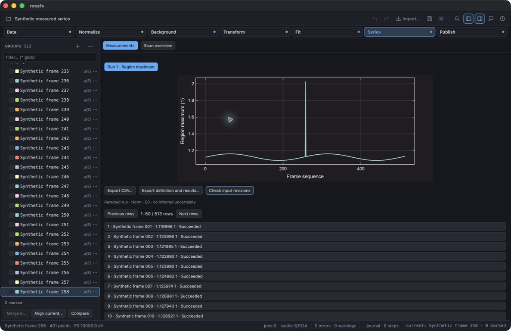

# Full-frame measurement development qualification

This record covers the first Phase A increment on `feature/complete-analysis`,
based on `dev` at `513cc1c`. It is newer than release 0.2.9 and does not qualify
the complete analysis roadmap. See the [progress record](../../complete-analysis-progress.md)
and [current API guide](../../full-frame-measurements.md).

## Synthetic input and numerical check

[`generate-series-metric-example.py`](../../../scripts/generate-series-metric-example.py)
generates 513 entirely synthetic spectra, with 401 energy points each. No
experimental or unpublished input is used. Run it with a destination outside
the checkout:

```sh
python3 scripts/generate-series-metric-example.py /tmp/series-example.rxs
```

The energy grid is 9800–11000 eV in 3 eV steps. The absorption is a linear
baseline, a unit logistic edge at 10000 eV with a 2 eV scale, and a Gaussian
feature centered at 10025 eV with a 9 eV scale. The feature amplitude in
zero-based frame i is `0.12 + 0.04 sin(i / 40)`, with an additional 0.9 at
i = 257. Frame 258 therefore has a deliberately exceptional maximum. These
functions define test truth; they are not a physical absorption model.

The recorded normalization uses E₀ = 10000 eV, pre-edge offsets −180…−35 eV,
post-edge offsets 150…990 eV and polynomial order 1. The measurement is the
maximum of normalized absorption from −20 to +50 eV relative to E₀. Its expected
value is `1 / (1 + exp(-12.5)) + amplitude`. The selected native grid contains
the peak center. All 513 exported results agreed with that expression within
6.74 × 10⁻¹⁰ absolute error, below the prespecified 10⁻⁷ check tolerance.

## Native desktop check

Computer use exercised the actual macOS GUI built with
`cargo build --locked --release -p rexafs-gui`. The development app had isolated
settings. The check opened the synthetic project, created a series from all
groups, calculated all 513 frames and paged to frame 258. Selecting that result
brought its matching retained spectrum preview into view, showing the larger
peak and measurement interval.

The GUI saved a new `.rxs` project and reopened it. Its CSV and JSON exports
each contained 513 successful rows, 513 distinct group identities, source
digests and input revisions. The reopened JSON export equaled the saved run
exactly. **Check input revisions** reported zero changed or unavailable inputs.
The largest result was frame 258. The table's 50-row pages do not limit the
calculation, plotted trend or export.



The generated projects, CSV/JSON exports and raw command logs were retained
locally outside the checkout. The generator, this record and this computer-use
screenshot are the committed evidence. The native check covers macOS only.

## Automated and resource checks

On 2026-09-16, using pinned Rust 1.98.1:

- `cargo test --locked -p rexafs`: 357 passed, 3 ignored across the core,
  integration and documentation test binaries.
- `cargo test --locked -p rexafs-gui`: 526 passed, 6 ignored.
- `cargo clippy --locked -p rexafs --all-targets -- -D warnings`: passed.
- The explicit ignored worker resource test also passed when run separately.

The worker resource test evaluated the same synthetic 256-point source 100,000
times serially and retained 100,000 scalars (800,000 bytes). The debug test
binary took 33.41 seconds elapsed; `/usr/bin/time -l` recorded a maximum resident
set of 23,773,184 bytes. Hardware was an Apple M4 MacBook Air, 10 CPU cores and
32 GB memory, running macOS 26.5.1. Other development checks were active, so this
is an observed qualification run rather than a controlled performance benchmark.

This test checks repeated worker preparation and release. It does **not** model
100,000 distinct files, all retained provenance rows, the full GUI, or materialized
input duplication. Those memory/storage and platform gates remain open. Tests
also cover short XANES without valid later EXAFS settings, changed/missing
sources, cancellation/resume, incomplete worker inputs, malformed source rows,
typed flattened components and project serialization.
