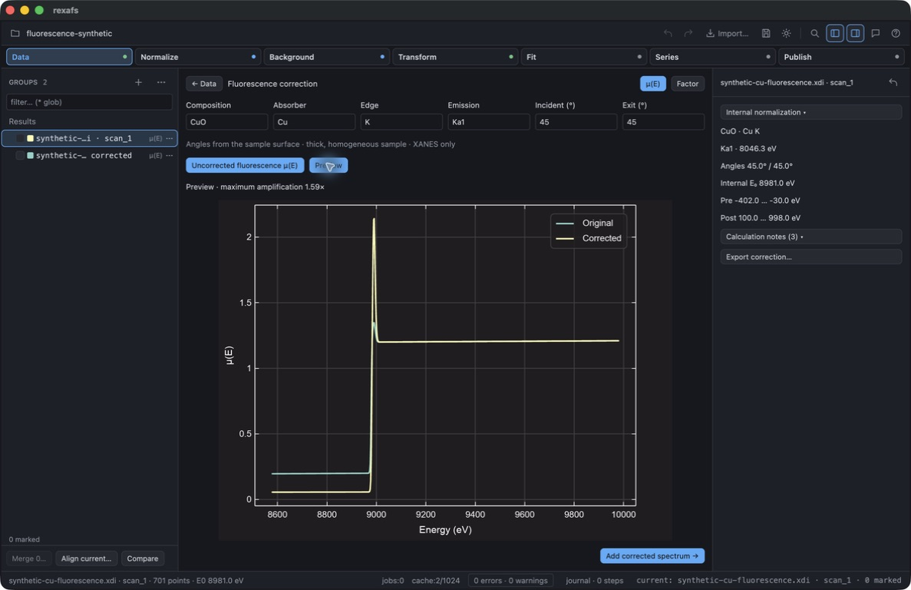
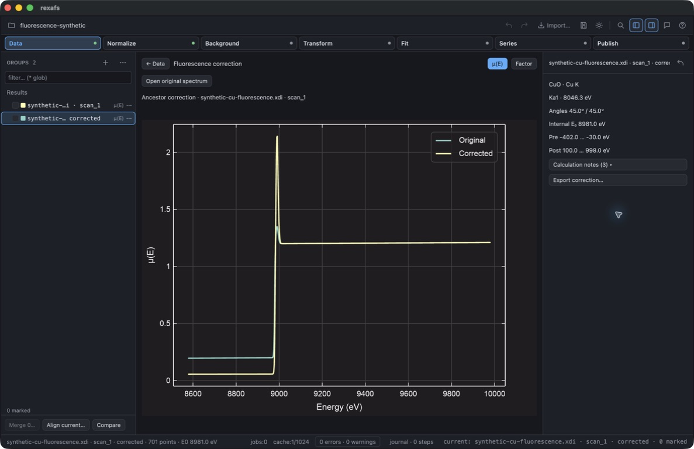

# Desktop fluorescence correction validation

Date: 2026-09-17. Platform: macOS on Apple Silicon, Rust 1.98.1, optimized
rexafs 0.2.9 development build from `feature/analysis-b-f`. This is local workflow
qualification, not a released feature or an experimental validation of the model.
The isolated `rexafs Fluorescence QA` application used its own settings and only
synthetic inputs. No unpublished measurements, credentials or personal windows
are included in these screenshots.

## Input and calculation

The main input has 701 energy samples, `8579 + 2*i` eV for `i=0..700`, with

```text
mu(E) = 0.2 + 0.00001*(E-8979)
      + 1/(1 + exp(-(E-8979)/1.5))
      + 0.15*exp(-((E-8990)/8)^2).
```

This dimensionless synthetic edge and Gaussian peak are workflow test data,
not a measured CuO spectrum. The correction uses declared CuO composition,
Cu K absorption, Ka1 emission and incident/exit angles of 45° from the surface.
Automatic measured E₀ was 8981 eV; emission energy was 8046.3 eV. The resolved
internal intervals were −402…−30 and +100…+998 eV from E₀. Maximum amplification
was approximately 1.59. These outputs are specific to the synthetic data and
selected thick-sample model; they do not establish physical accuracy.

## Computer-use checks

- Imported the synthetic spectrum and opened Data → Fluorescence correction.
- Entered a zero incident angle: calculation rejected it and created no group.
- Used 45°/45° geometry, confirmed fluorescence input, and inspected the original/
  corrected overlay and separate amplification plot.
- Verified the original plot remains visible when fields are edited; stale
  corrected results cannot be added. Longer notes are expandable.
- Added a corrected group, retaining the original group and correction record.
  Polynomial normalization and independently applied MBACK both worked.
- Saved with **Include source files**. The project contained two groups, one
  correction receipt, two normalization records and three embedded artifacts.
- Quit, moved the original XDI and both result-cache directories aside, then
  reopened the saved project. Both groups and the full correction history were
  recovered; the history view still plotted the original and corrected arrays.
- Confirmed Background/Transform present the XANES-only notice and actions,
  without empty EXAFS plots or an invented background spline.
- Ran flattened-space LCF over −20…+30 eV using two synthetic references. The
  second reference changed the Gaussian amplitude from 0.15 to 0.8. The fit ran
  with weights summing to one, approximately 0.662/0.338, and R-factor 0.0201.
  These are a workflow smoke test, not chemical composition estimates. Four
  calculated groups were added; the fitted group retained the XANES-only notice.
  The GUI correctly required two standards. An initially malformed second XDI
  was rejected; its missing separator was corrected before retry and explicit
  stored-μ mapping. That disposable intake session was not used for screenshots.

The final screenshots were captured after reopening the clean two-group project:





## Automated checks

- Full GUI suite: **591 passed, 6 ignored**. This run preceded the final compact
  layout refinements; the focused correction tests passed again afterward.
- Final import, preparation, project, merge and tool-readiness reruns: **125 passed,
  1 ignored** (subsets of the full GUI suite, not additional unique tests).
- Three focused GUI regressions cover immutable arrays, polynomial/MBACK final
  normalization, embedded recovery with absent caches, checksum corruption,
  historical transmission mappings, repeated/prepared input rejection, and
  correction ancestry in LCF results even after source groups are removed.
- Core fluorescence-filtered run: **10 passed** across unit/integration targets.
  This includes inherited restrictions through serialization/data edits and
  existing measurement/reference tests selected by the filter.
- Strict core Clippy including all targets passed. Two pre-existing test-only
  diagnostics were corrected (an unnecessary temporary vector and `err().expect()`).
- Website generators: **8 passed**; website check: **0 errors, 0 warnings**.
- Optimized desktop builds succeeded with the existing 12 dead-code warnings.

Native Windows/Linux interaction, Series/Live frozen correction recipes,
experimental comparison and uncertainty propagation remain unqualified.
