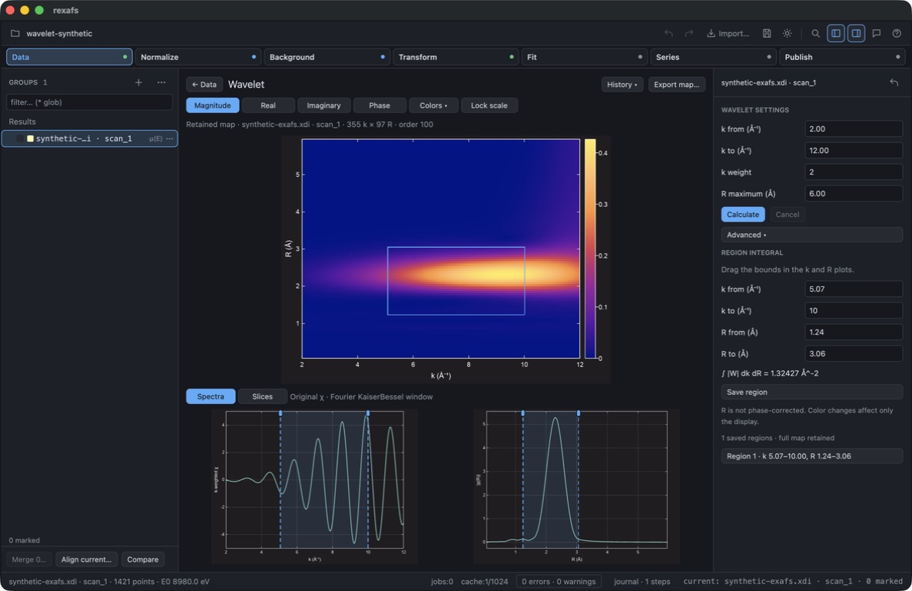
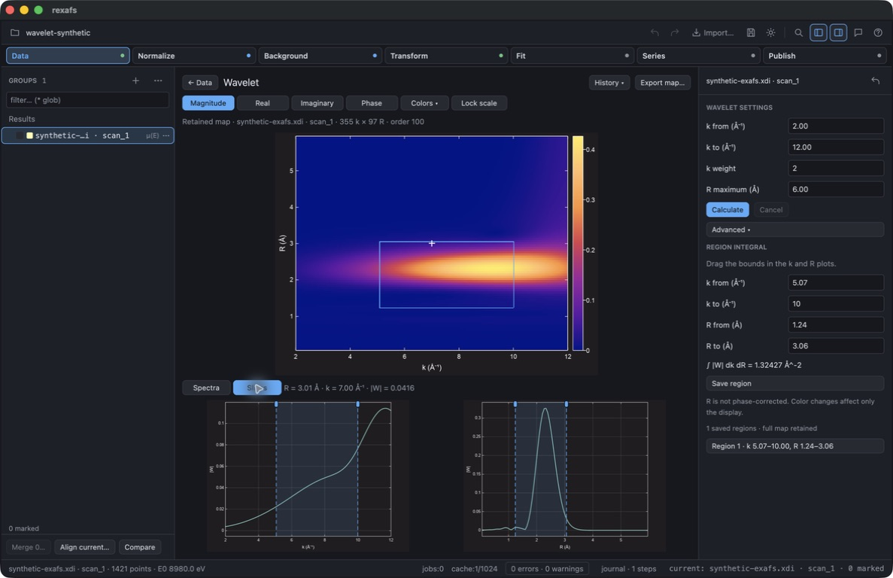
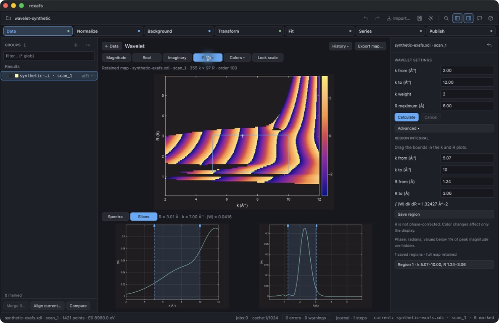

# GUI follow-up and visual progress — 17 September 2026

Checked source: `87cbbf3`, branch `feature/analysis-b-f`, optimized macOS Apple
Silicon build. Computer use controlled the isolated fluorescence QA application,
then opened the embedded synthetic wavelet project in that same executable.
No private measurements, personal windows or authenticated assistant content
appear in the captured images.

## Observed checks

- Fluorescence preview and the amplification plot worked. A zero incident angle
  showed a contextual error, retained the original curve and disabled adding the
  correction. Restoring 45 degrees recovered the valid preview.
- Advanced internal-normalization fields and calculation notes expanded without
  obscuring the central plot. The saved corrected group opened in Normalize;
  flattened and XANES-range views worked.
- Transform displayed the intended XANES-only notice. Correction history restored
  the original/corrected overlay and **Open original spectrum** selected its source.
- The embedded wavelet project opened in the latest executable. Calculation
  completed with zero errors/warnings in the status bar.
- Recalling the saved region restored k = 5.07–10 inverse angstroms and
  R = 1.24–3.06 angstroms. Its magnitude integral was approximately
  1.32427 inverse square angstroms at k-weight 2.
- Editing the lower k bound to 8 updated the rectangle and integral (approximately
  0.67527). Recalling the saved region restored the earlier value.
- Palette, phase and Spectra/Slices controls worked without shifting position.
  Phase masking remained visible. This follow-up edited bounds numerically;
  the earlier [wavelet check](../2026-09-17-wavelet/README.md) covers dragging.

## Fresh screenshots

These images were captured through computer use after the follow-up, with the
saved region restored. They show the same synthetic input documented in the
[wavelet validation record](../2026-09-17-wavelet/README.md).

The [private visual progress page](https://rexafs-analysis-progress.ameyanagi.chatgpt.site)
includes these three images and five retained captures from the earlier Live,
peak-fitting, MBACK and fluorescence checks. Each image is labeled as fresh or
retained evidence; the page includes the outstanding work for milestones B–F.

## Limits

This follow-up did not rerun the automated suites, certify the models' physical
accuracy, exercise native Windows/Linux, or implement Series/Live wavelet trends.
The recorded GUI suite remains 591 passed and six ignored before the final compact
layout changes, followed by the focused reruns documented in the
[fluorescence check](../2026-09-17-fluorescence/README.md). No full-milestone or
release-completion claim follows from these screenshots.
