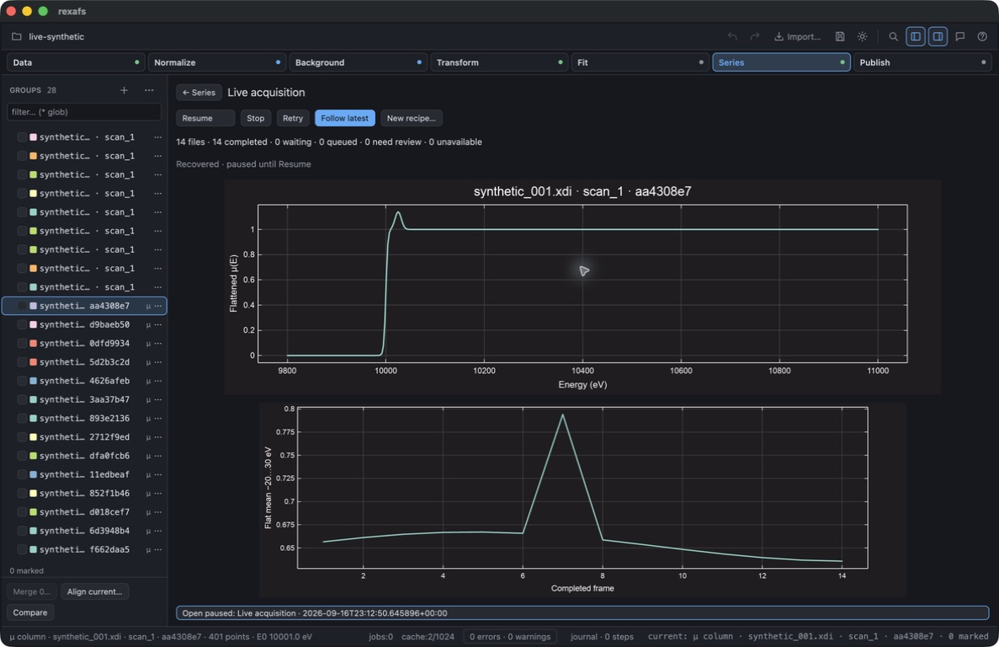
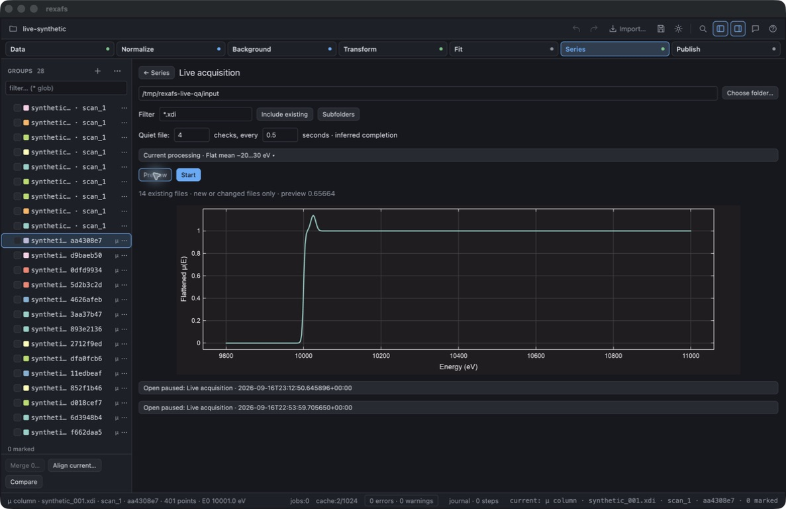

# Live acquisition development check — 2026-09-17

This macOS computer-use check used an isolated `rexafs Live QA.app`, a separate
settings/cache directory, and files from `scripts/generate-live-example.py`.
No private experimental measurements or unrelated analysis windows were used.

Observed through the GUI:

- Preview and Start accepted synthetic XDI sources with three quiet observations
  one second apart. The writer flushed an incomplete prefix before finishing.
- Nine completed frames stayed at nine while paused and three new files arrived.
  Resume reached 12; Follow latest off kept frame 1 selected as frames 13–14 arrived.
- Frame 7's deliberately larger synthetic peak appeared as a trend spike.
- Closing/reopening the application recovered 14 committed frames, paused.
  Resuming did not duplicate them.
- A second session used the revised converted-cache format with no fabricated
  XDI element/edge warning. The first session remained historical evidence.
- Saving both sessions as an embedded `.rxs` and reopening retained exactly 28
  groups. Original snapshots and converted cache files did not become extra groups.
- Recovery of a run already present in that project restored both its spectrum
  and trend plots, with 14 completed source files reported before Resume.
- The recipe selector opened as a menu. A fresh preview accepted a changed quiet
  policy of four observations at 0.5-second intervals.

The project contains two deliberately retained 14-frame test sessions (28 groups).
The displayed session and trend each contain 14 frames. The spike at frame 7 is
synthetic, not experimental evidence or a calibrated concentration.

The timing fields are editable; this preview uses four checks at 0.5-second
intervals. The shipping candidate default remains three checks at one second.

Automated validation:

- Full GUI suite: 572 passed, six ignored, before the final QD/artifact changes.
- Subsequent Live-focused suite: 26 passed, zero ignored. The filter also selects
  existing tests containing `live`; this is not a count of newly added tests.
- Project compatibility suite after the artifact fix: 31 passed, one ignored.
- Release builds and `cargo fmt --all` / `git diff --check` succeeded.

Tests cover exact byte retention, restarts, changed content/layouts, failed metric
rows, distinct paths with identical content, multi-scan sources, explicit mapping,
KEK observed-angle conversion, cancellation and bounded worker passes. Embedded
portability also has a test that removes the original source and recovery directory
before reloading into an independent temporary cache.

Native Windows/Linux, network shares, sustained large acquisitions and crash
fault-injection qualification are still outstanding. This record does not certify
producer completion under a quiet-file policy, or claim milestone B is released.
