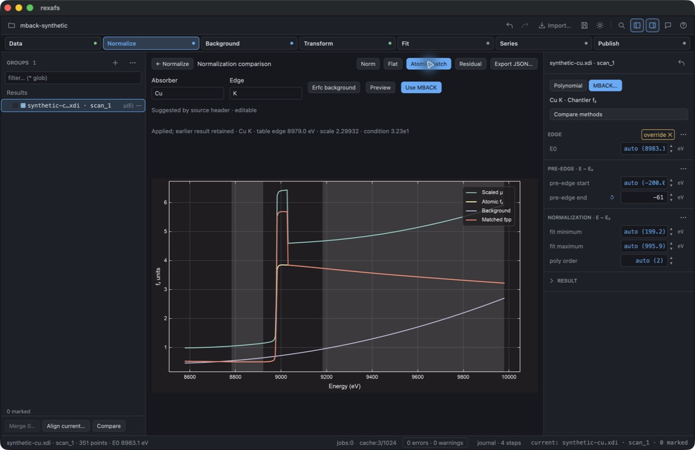
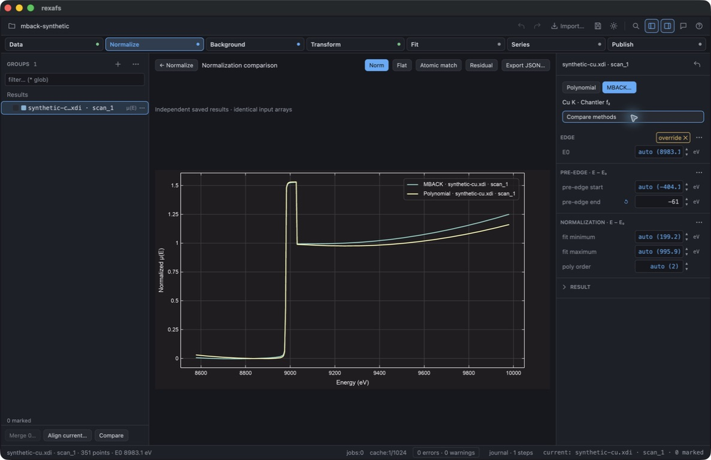

# MBACK desktop qualification — 17 September 2026

Development build: `feature/analysis-b-f`, unreleased 0.2.9 workspace, native
Apple Silicon macOS release profile. Computer use controlled an isolated
`rexafs MBACK QA.app` with private test settings; it did not operate the user's
experimental projects. Published screenshots contain synthetic data only.

## Inputs and observed workflow

The synthetic XDI contains the 351-point first case from the
[pinned MBACK reference fixture](../../../crates/rexafs/tests/fixtures/analysis/mback/larch-reference.json).
It was generated from tabulated Cu f₂ plus a known polynomial/background and
an excluded artificial near-edge feature; it is not an experimental Cu spectrum.
The fixture records its generator, Python package versions and upstream sources.

Computer use exercised these actions:

- Import through the ordinary spectrum preview, then open Normalize → MBACK.
- Enter Cu/K, preview, and apply with automatic intervals. The fitted scale was
  approximately 2.29988; the selected tabulated edge was 8979 eV. Measured E₀ was
  independently estimated as approximately 8983.1 eV.
- Inspect the atomic reference, scaled absorption, background, matched fpp and
  residual, with shaded fitting intervals. The artificial near-edge feature
  remains in the residual outside the fitted intervals.
- Drag the pre-edge upper boundary from approximately −80.8 to −61.0 eV.
  The numeric field changed to −61 and the ordinary processing plot refreshed.
- Compare independent polynomial and MBACK results in Norm and Flat.
- Export JSON: both results contain 351 points, identical original input arrays,
  requested settings and resolved normalization. MBACK retains XrayDB 9.2's
  actual data checksum and the changed −61.0 eV upper bound.
- Save an embedded project, close the app, move the original local result cache
  aside, and reopen. The project restored both curves and exactly one spectrum;
  normalization artifacts did not become additional imported groups.
- Import the repository's attributed 618-point `cu_150k.xmu` fixture and compare
  both methods, including Flat. MBACK completed with scale approximately 1.50977.
  This is a workflow comparison, not evidence that either normalization is
  universally more accurate. That measurement is not copied into this record.

The checks identified and corrected two GUI issues: universal-import XDI headers
were not available through the legacy header shortcut, and selection changes
could leave an earlier group's comparison open. Explicit XDI identity fields now
supply editable suggestions; contradictory declarations do not suggest an identity.
Changing the active group returns to its ordinary processing plot. A method-switch
check also retains the visible opposite bound when only one range endpoint has
been edited, so users do not have to reenter both endpoints. The rebuilt GUI
passed this last switch with a visible −200.0 to −61.0 eV pre-edge interval.

## Automated coverage and remaining qualification

Native tests cover equivalence among core, desktop, Series and Live preparation,
atomic-version mismatch rejection, cache fingerprints, resolved-range handles,
independent saved results, embedded project relocation, checksum failures and
shared bounded artifact storage. The settings-copy contract includes MBACK.
The exact final test counts are recorded in the [progress log](../../analysis-b-f-progress.md).

The release executable builds. Strict GUI Clippy is not green: it reports
pre-existing lint findings in areas including depth controls, plotting/test
layout and settings. Those unrelated cleanups are not hidden by a new allow-list.
The core's strict Clippy and installed binding checks are recorded in the prior
D2/D3 increments. This session does not qualify native Windows/Linux interaction,
network storage or general physical accuracy of the MBACK model.
