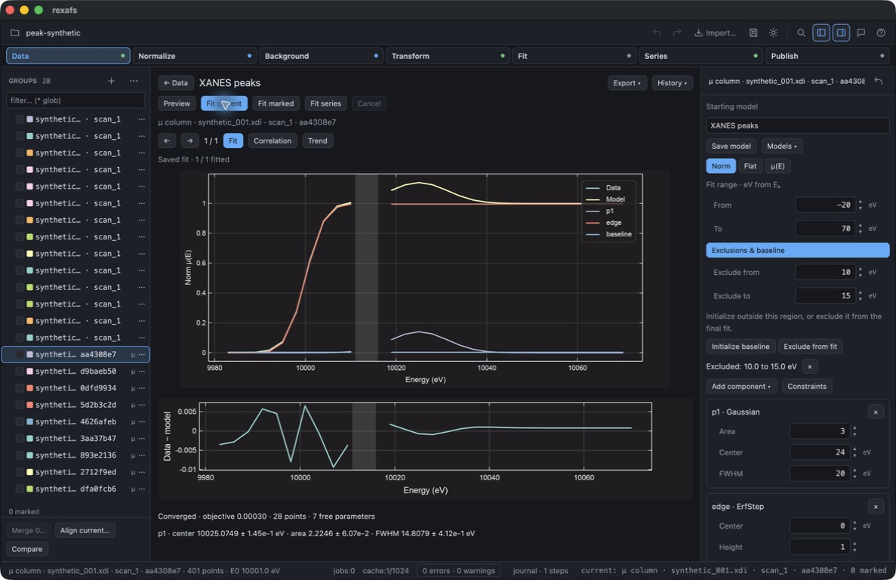
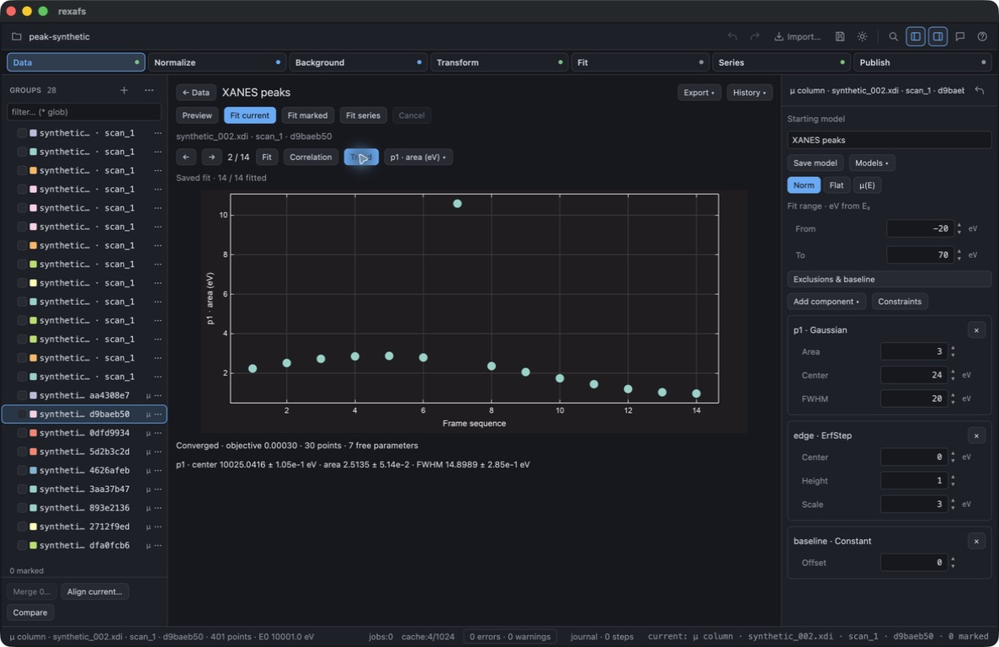

# Peak fitting development check — 2026-09-17

This macOS computer-use check used the isolated `rexafs Live QA.app` and synthetic
XDI frames from [`generate-live-example.py`](../../../scripts/generate-live-example.py).
The project retained two historical Live sessions, each with 14 frames. Peak
batch fitting selected one 14-frame series. No private experimental data was used.

The input has a logistic absorption edge near 10000 eV and a Gaussian feature
centered at 10025 eV; frame 7 has a deliberately larger area. The fit used Norm,
E₀ offsets −20 to +70 eV, one Gaussian, an error-function edge step and a constant
baseline. A logistic edge is not an error-function edge: this deliberate model
mismatch leaves small residuals. These results demonstrate the workflow, not
chemical interpretation or statistically calibrated experimental uncertainties.

Observed through the GUI:

- Loaded the saved starting model with center 24 eV, area 3 eV and FWHM 20 eV.
  The first frame fitted to center 10025.0466 eV, area 2.2349 eV and FWHM
  14.8890 eV. Its unweighted residual sum of squares was approximately 0.000298.
- Fitted all 14 frames independently from that starting definition. All converged;
  the area trend's largest value was at synthetic frame 7.
- Used **Initialize baseline** outside −5 to +70 eV, then added a final mask from
  +10 to +15 eV. The masked fit retained 28 native points, versus 30 without it.
  Both fitted curves and residuals visibly leave the masked gap unconnected.
- Dragged the lower range boundary from −20 to −13.2 eV. The field displayed
  −13.2 without floating-point noise, and the subsequent fit used 28 points.
- Inspected the 7 × 7 parameter-correlation matrix, with scale −1 to +1 and a
  numbered parameter key. Poor initial peak guesses also exposed zero-area
  active-bound warnings instead of fabricated covariance.
- Saved an embedded project with five historical runs and a named model,
  restarted the app and reopened it. The same 28 groups and historical curves
  remained; fit artifacts did not appear as additional spectra.
- Repeated Right three times moved from frame 1 to frame 4; Left twice returned
  to frame 2 without refocusing the graph. Arrow keys inside the Center field
  moved the editing cursor without changing the selected frame.
- Exported all-frame CSV through the native save dialog. It contained 14 successful
  rows, range −20…70, resolved origin 10001 eV, area units eV, and the captured
  series revision. No physical coordinate was fabricated for this series.

Automated validation:

- Core unit suite: 209 passed; independent lmfit-reference integration: two passed.
- Full desktop suite: 577 passed, six ignored, before the final keyboard and
  presentation adjustments. The subsequent peak-filtered suite passed six tests,
  including the keyboard predicate test, four retained-fit tests and an existing
  Series trend test. This is not a count of six new peak-fitting tests.
- Tests cover changed inputs, failed-row retention, cancellation, immutable model
  revisions, native masks, checksum rejection, embedded relocation after deleting
  the original source/cache, CSV units and physical-coordinate provenance.
- Strict core Clippy passed for all targets. Release builds succeeded. The final
  keyboard-focus fix was checked through the rebuilt desktop.

Live peak recipes, public bindings, native Windows/Linux checks, long-running
batch qualification and a documented public experimental example remain work.
This record does not claim the whole milestone or a release is complete.
