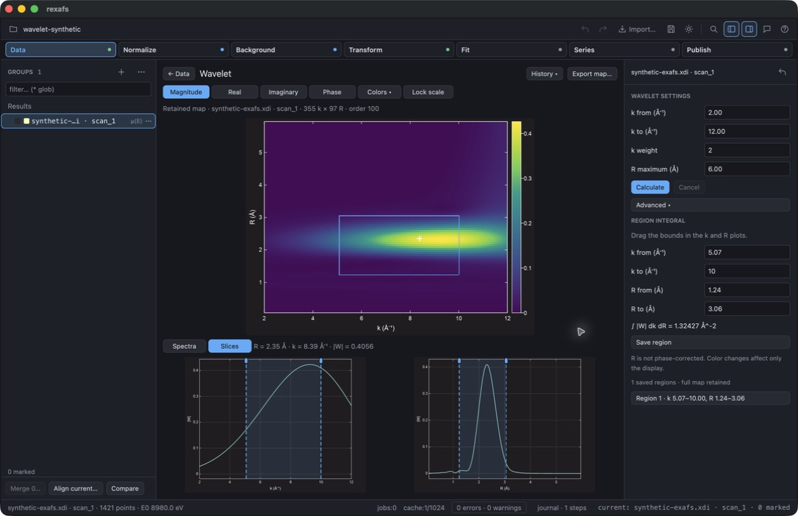

# Wavelet desktop validation — 2026-09-17

Unreleased source build on macOS Apple Silicon, branch `feature/analysis-b-f`.
This is a local desktop check, not Windows/Linux or release qualification.

The isolated `rexafs Wavelet QA` app used synthetic data only. The input has
1421 energy points from 8760 to 10180 eV, E₀=8980 eV, a logistic edge, and a damped
sin(4.6k) packet centered near k=8 Å⁻¹. The script below reproduces the input.
The expected wavelet localization is near R=2.3 Å, under the 2kR convention.
No unpublished measurements or authenticated assistant sessions were used.

```python
import math
from pathlib import Path
rows = ["# XDI/1.0 rexafs-synthetic/1.0", "# Element.symbol: Cu",
        "# Element.edge: K", "# Column.1: energy eV", "# Column.2: mu",
        "# ///", "# Synthetic EXAFS packet; no measured data", "# energy mu"]
for energy in range(8760, 10181):
    k = math.sqrt(max(0, energy - 8980) / 3.80998212)
    step = 1 / (1 + math.exp(-(energy - 8980) / 1.5))
    mu = (0.1 + 0.00003 * (energy - 8980)
          + step * (1 + 0.06 * math.sin(4.6*k) * math.exp(-((k-8)/4)**2)))
    rows.append(f"{energy} {mu:.12g}")
Path("synthetic-exafs.xdi").write_text("\n".join(rows) + "\n")
```

Computer-use observations:

- Imported the synthetic XDI, opened Wavelet and calculated with k=2–12 Å⁻¹,
  weight 2, order 100, R maximum 6 Å and default sampling/no taper.
- The map contains 355 k columns × 97 R rows (34,435 complex cells), with the
  packet concentrated around R=2.3 Å. All 355 original wavelet-input k/χ points,
  preparation metadata and linked Fourier arrays are retained.
- Dragged k start from 4 to 5.07 Å⁻¹ and R end from 4.77 to 3.06 Å. The selected
  rectangle [5.07,10] × [1.24,3.06] integrates to 1.324271008076652 Å⁻².
  The text fields, rectangle overlay and both lower plots agree.
- Clicking near k=8.39 Å⁻¹, R=2.35 Å changes both native magnitude slices and the
  physical readout. Switching to phase and choosing a blue–red palette preserves
  control positions and region values; low-amplitude areas are masked.
- Saved the region, exported JSON and inspected its complete arrays and bounds.
  Saved an embedded project, quit, moved the original map cache out of the way,
  reopened the project and restored the same saved region and integral.
- Recalculated a different R extent and checked History. Each stored result keeps
  its own definition. A new calculation resets plot bounds; incompatible settings
  reset the color lock.



Automated checks: 587 desktop tests passed and six were ignored in a serial full
suite (158.02 s). Three focused tests passed after subsequent UI changes: physical display
coordinates, typed-χ preparation/zero-amplitude phase masking, and embedded
map/region restoration. Tests use a nonuniform R grid to check physical
texture coordinates and verify that color/phase display work leaves the native
integral unchanged. Embedded round-trip tests remove the original cache and check
full array equality, map identity mismatch and checksum corruption detection.

Strict desktop Clippy still fails on 52 existing findings elsewhere (including
unused code and older style findings); no wavelet finding was reported. Release
builds complete with the existing 12 warnings. The separate core direct-DFT and
pinned Larch comparisons are described in the [wavelet guide](../../wavelet-analysis.md).
Full-series region tracking, Live integration and native Windows/Linux UI checks
are not qualified by this record.
