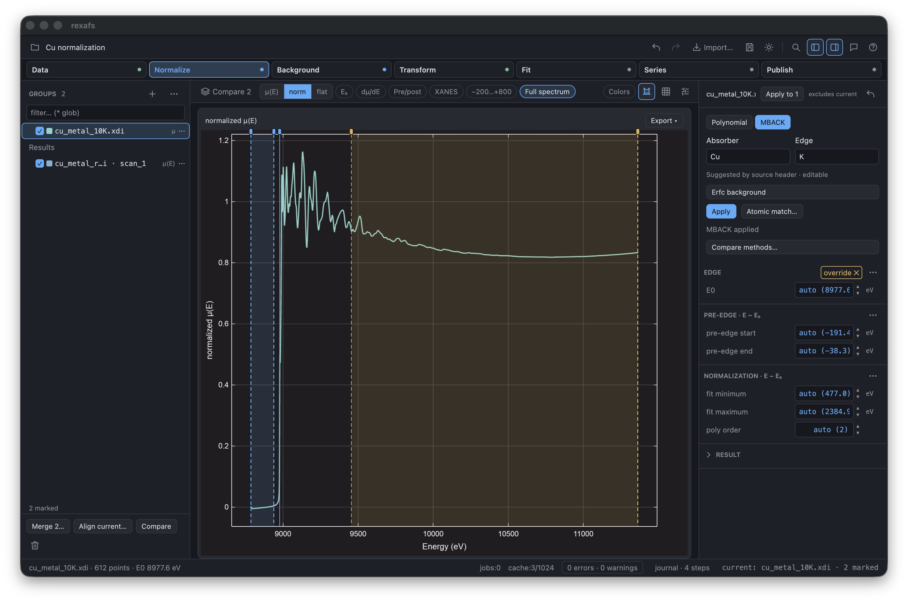
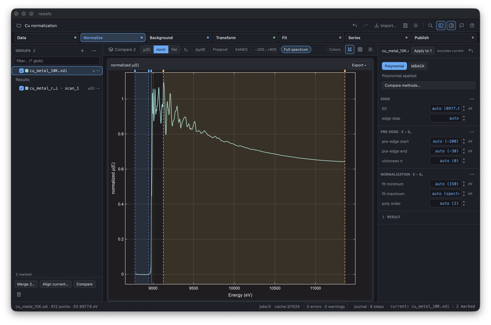
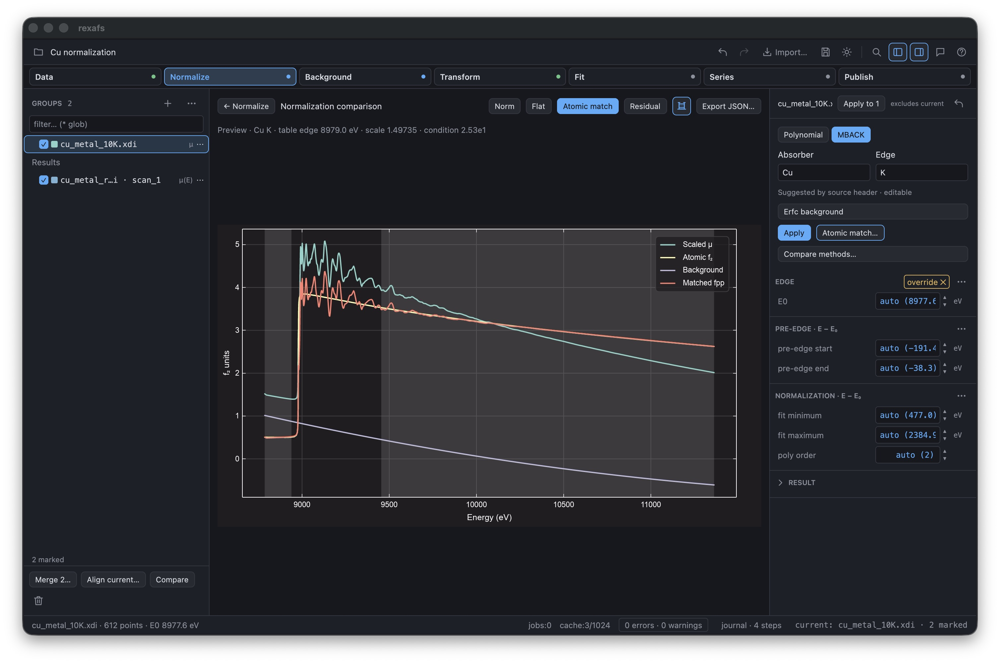
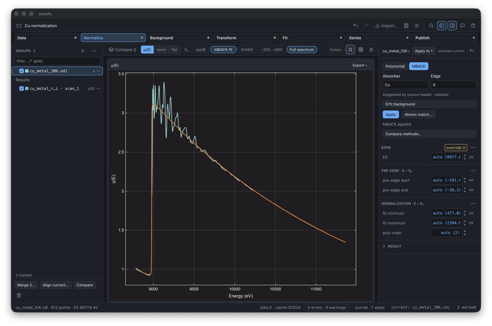

# MBACK in the Normalize sidebar — 18 September 2026

Development source: `feature/analysis-b-f`, after `87cbbf3`, unreleased after
0.2.9. Tested using the normal release profile on Apple Silicon macOS.

The computer-use connector could not initialize (`CUA_REPL_ENABLED_SURFACES is
required`). Native macOS accessibility controls and targeted keyboard events
operated an isolated `rexafs MBACK Normalize QA.app` instead. Screenshots capture
only that application window. No private experimental project was opened.

## Experimental input

The temporary project contains the repository's attributed room-temperature and
10 K Cu metal measurements. The screenshots show the 612-point 10 K spectrum.
See the [experimental reference manifest](../../../crates/rexafs/tests/fixtures/analysis/experimental-larch/README.md)
for original data, attribution and independent numerical comparison. These
screenshots qualify the workflow, not the physical accuracy of a normalization.

## Observed workflow

- Normalize initially shows Polynomial and its edge-step/Victoreen controls.
- Selecting MBACK keeps Normalize active and the ordinary plot visible. The
  sidebar shows Cu/K from the declared source header, calculates MBACK, and
  replaces the polynomial-only controls with the method-specific controls.
- Erfc background expands emission-line and width/amplitude fields in that
  sidebar. Closing it and applying the unchanged model keeps the standard plot.
- Atomic match opens the optional diagnostic plot, with scale approximately
  1.49735 and the independent tabulated edge at 8979 eV. The method editor stays
  in the sidebar. The regular measured E₀ is approximately 8977.6 eV.
- Selecting Polynomial from the diagnostic view returns to the ordinary plot
  and restores its controls. Undo restores MBACK and its settings. Redo and
  changing between the two Cu groups were also checked during the initial build;
  the active group's method controls remain independent.
- Compare methods still overlays independent retained Polynomial and MBACK
  results for identical original arrays. The final window was returned to the
  ordinary MBACK plot.

## Validation and limits

The final GUI suite passes 608 tests, with 6 existing tests ignored. A regression
covers editor synchronization on group changes and Undo/Redo, including
invalidation of a worker belonging to an earlier draft. The release build passes.
See the [complete review record](../2026-09-18-pr-review/README.md) for the core,
binding, packaging and documentation checks.

Native Windows/Linux interactions and this revised layout's save/reopen flow
were not retested here. Existing automated project-history round trips pass;
the earlier [MBACK qualification](../2026-09-17-mback/README.md) retains the
historical separate-editor screenshots and its save/reopen observations.

## Method-specific fitted-line toggle

A follow-up release build was checked with the same experimental Cu project.
The existing toolbar control now follows the applied normalization method:

- In Polynomial mode, **Pre/post** shows the two dashed baselines.
- In MBACK mode, **MBACK fit** shows one orange fitted curve,
  [f₂(E) + B(E)]/s in the original μ(E) units. It includes the tabulated atomic
  edge and the fitted background; MBACK's auxiliary pre/post curves are hidden.
- Enabling the toggle from Norm selects μ(E). Disabling it hides the fit;
  re-enabling it restores the fit. Switching methods replaces the appropriate
  overlay without moving the following toolbar controls.
- The range-visibility icon remains independent. It is off in the screenshot
  below so the fitted line can be inspected clearly.

All 12 plotting tests pass. The new regression checks the complete fitted
model, input units, active comparison trace, waterfall offset, toggle-off
behavior, and replacement by polynomial baselines. The optimized release build
passes. This follow-up changes only display behavior, not the MBACK calculation.
The subsequent complete desktop suite passes **609 tests, with 6 ignored**,
including both Cu/Ni fitting backends.
