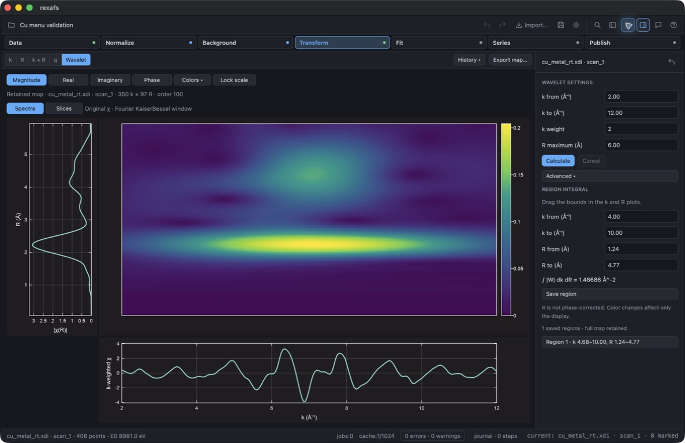

# Aligned wavelet panels — 18 September 2026

Unreleased desktop change on `feature/analysis-b-f`, after `87cbbf3`. Checked
through native computer use on macOS ARM64 with an optimized build and the
published ruviz/ruviz-gpui 0.14.2 packages. This is not native Windows/Linux
qualification.

The input was the public, CC0 APS 13-ID-C `cu_metal_rt.xdi` retained in the
[experimental reference set](../../../crates/rexafs/tests/fixtures/analysis/experimental-larch/README.md).
A temporary project copy contained the retained native map (k = 2–12 Å⁻¹,
weight 2, Cauchy order 100, R maximum 6 Å). No unpublished data were used.

## Layout and interactions

The map is above the k plot and to the right of the rotated R plot. The R
amplitude decreases toward zero at the map side. Matching margins align the
physical plotting areas. The k and R view ranges are shared; amplitude ranges
remain independent. The layout, session subscriptions and R-boundary hit testing
are in [`wavelet/layout.rs`](../../../crates/rexafs-gui/src/app/shell/wavelet/layout.rs).
Plot construction is in [`wavelet/plots.rs`](../../../crates/rexafs-gui/src/app/shell/wavelet/plots.rs).

Native computer use verified:

- Panning and scrolling over the map changed both shared axes in the neighboring
  spectra. Panning the bottom plot changed only the shared k range; panning the
  left plot changed only the shared R range.
- Zoom survived changing Magnitude to Real, hiding the groups panel, and
  switching Spectra to Slices. The plotting areas stayed aligned after the
  workspace width changed.
- Dragging the horizontal upper R boundary downward changed the field from
  4.77 to 4.47 Å and the displayed integral from 1.48686 to 1.36112 Å⁻².
  The map rectangle followed the new bound. Restoring 4.77 Å restored the
  original integral.
- The map context menu rendered above the selection rectangle. Reset View
  restored both physical axes while preserving the selected integration region.
- Hiding range overlays left the retained map and integral unchanged. The app
  was left on Magnitude/Spectra with the clean view shown below.



## Automated checks

```sh
cargo test --locked -p rexafs-gui --bin rexafs app::shell::
cargo build --locked --release -p rexafs-gui --bin rexafs
cargo fmt --all -- --check
git diff --check
```

All 199 desktop shell tests passed. Four new tests cover bidirectional physical
axis links and independent amplitudes, disconnection of replaced sessions,
vertical R-boundary coordinates, and pixel alignment of actual rendered data
rectangles at two panel sizes. The optimized build passed with 12 existing
dead-code warnings. Scientific wavelet arrays and region integration are unchanged.

The preceding dependency update passed the full desktop suite (591 passed,
6 ignored) and the core optional plotting tests (23 passed). Those full-suite
counts precede the four new layout tests; the 199-test shell run above checks
the final layout changes.
