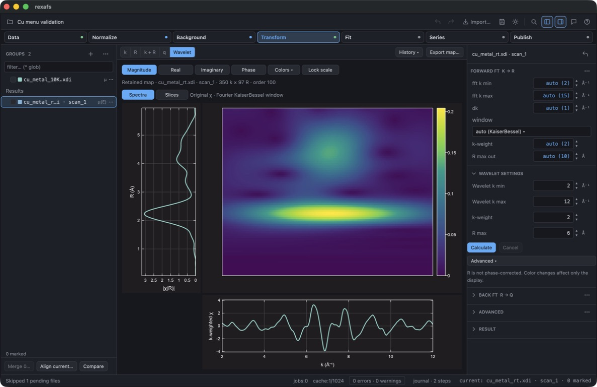
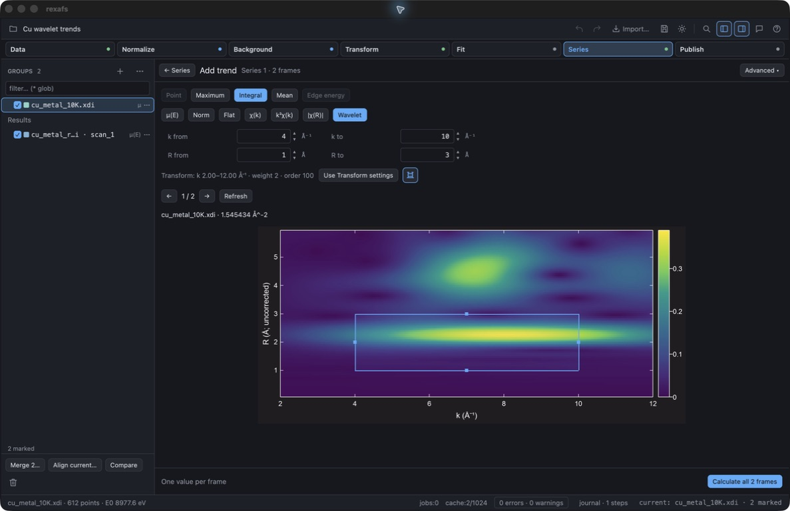
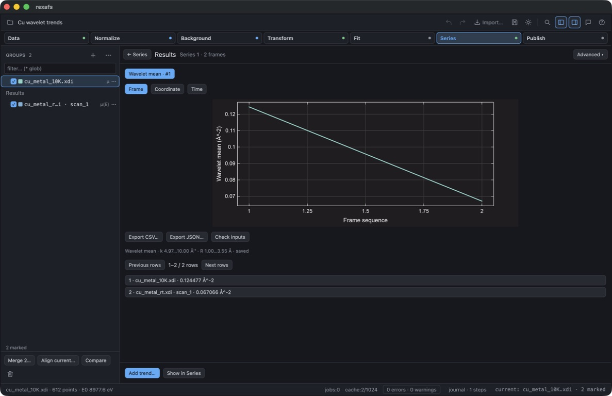

# Wavelet settings and Series regions — 18 September 2026

Unreleased source-checkout change on `feature/analysis-b-f`, after `87cbbf3`.
Native computer use exercised an optimized macOS ARM64 build with registry
ruviz/ruviz-gpui 0.14.2. This is not native Windows/Linux qualification.

The test app used separate settings and project files. Its two measurements were
the public, CC0 `cu_metal_rt.xdi` (APS 13-ID-C) and `cu_metal_10K.xdi` (NSLS X11A),
retained with attribution in the
[experimental reference set](../../../crates/rexafs/tests/fixtures/analysis/experimental-larch/README.md).
No unpublished ReGe data were copied into this record or the screenshots.

## Workflow checked with computer use

- Wavelet settings are collapsed initially, between Forward FT and Back FT.
  Choosing Wavelet opens the same section with the ordinary numeric fields.
  Forward and Back FT remain available; there is no region editor in Transform.
- The plot-range icon sits between Colors and Overview plots in the ordinary
  processing toolbar. Add trend has the same icon beside its preview controls.
- Series → Add trend → Wavelet copies the Transform definition. Two k fields
  and two R fields define a rectangle over the magnitude map. Integral, Maximum
  and Mean update the native region value without recalculating the transform.
  Changing Transform weight from 2 to 1 left the current trend unchanged until
  Use Transform settings was clicked. That action updated the preview and units;
  the saved weight-two mean remained intact. The test restored weight 2 afterward.
- Dragging the left edge changed k minimum from 4 to 4.97 Å⁻¹. Dragging the top
  edge changed R maximum from 3 to 3.55 Å. The rectangle, numeric fields and
  scalar readout agreed. The same region persisted when moving to frame 2.
- For k = 4.97–10 Å⁻¹ and R = 1–3.55 Å, with weight 2, order 100 and the default
  automatic preparation, the displayed means were 0.124477 Å⁻² (10 K) and
  0.067066 Å⁻² (room temperature). These are software outputs from separately
  prepared measurements, not a calibrated temperature series or inferred
  structural quantities.
- Hiding the rectangle preserved the value and bounds. The context menu stayed
  above the map, with the rectangle suppressed while the menu was open.
- An R maximum of 100 Å produced an explicit range error. Correcting it restored
  the readout without losing the map. The final editor also rejects bounds
  outside the requested Transform extent before a run starts.
- Calculate all 2 frames retained two successful rows and added the trend to
  the ordinary Series overview. Its caption records both physical intervals.
  Saving and reopening the project in the final build restored both displayed
  values and the frozen k/R bounds. Selecting a result row reopened its map.

The window was moved when necessary to refresh native background-window captures;
this check does not measure interactive rendering throughput.







## Numerical and persistence checks

The core's analytic bilinear-surface test checks integral, area-weighted mean and
maximum with exact non-grid boundaries. The Series test uses the two experimental
Cu inputs for all three statistics, compares with the native map operation, and
checks revisions, recipe settings, serialized results, CSV provenance and failed
coverage. Legacy one-dimensional results and presets remain readable. Historical
Transform saved-region records remain in their original map artifacts.

Validation commands:

```sh
cargo test --locked -p rexafs --lib xafs::wavelet::
cargo test --locked -p rexafs-gui --bin rexafs
cargo test --locked -p rexafs-gui --bin rexafs series_measurements
cargo test --locked -p rexafs-gui --bin rexafs app::shell::measurements
cargo build --locked --release -p rexafs-gui --bin rexafs
cargo clippy --locked -p rexafs --lib -- -D warnings
npm --prefix js-rexafs run build
npm --prefix js-rexafs test
python -m unittest discover -s py-rexafs/tests -p test_wavelet.py
REXAFS_PYTHON=/path/to/installed/wheel/venv/bin/python npm --prefix js-rexafs run test:python-editor
npm --prefix website run test:generators
npm --prefix website run check
cargo fmt --all -- --check
git diff --check
```

The full desktop suite passed 596 tests with 6 pre-existing resource tests ignored.
The later focused checks passed 20 Series tests (1 existing resource test
ignored) and 6 editor tests, covering the final validation/layout refinements. Core wavelet tests passed 6/6. The built Python wheel passed 3
wavelet tests and its installed-package language-server checks. The built Node
and browser package passed all 38 runtime/editor tests. All 8 documentation-generator tests passed, and the website check passed
without errors or warnings. Strict core Clippy passed. The optimized desktop build retains 12 existing
dead-code warnings; no new numerical dependency is introduced.

Implementation: [region statistics](../../../crates/rexafs/src/xafs/wavelet/map.rs),
[Series definition](../../../crates/rexafs-gui/src/series_measurements/wavelet.rs),
[Series preview](../../../crates/rexafs-gui/src/app/shell/measurements/wavelet.rs),
and [Transform inspector](../../../crates/rexafs-gui/src/app/shell/inspector.rs).
