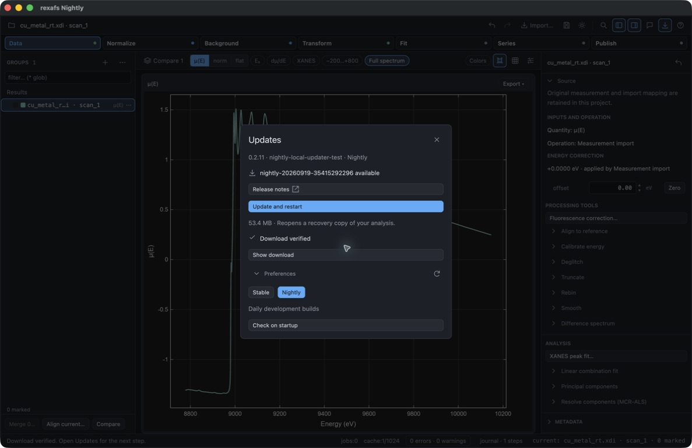
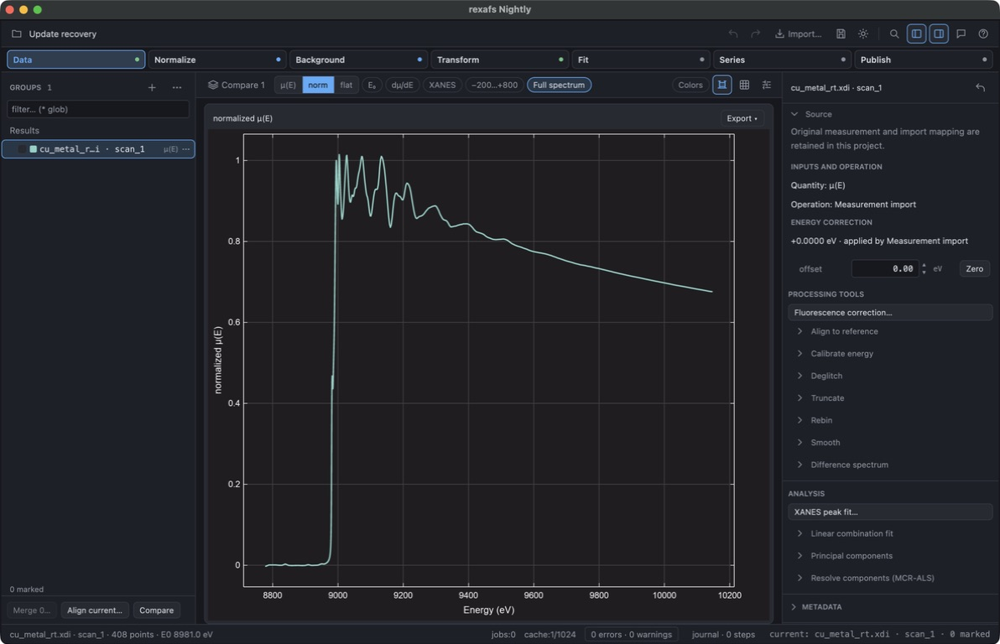

# In-app updater qualification

This record describes an **unreleased source correction** tested on 19 September
2026. It does not change the published 0.2.11 binaries or their recorded checks.

## Reproduced failure

Computer use opened a disposable copy of the signed 0.2.10 ARM64 app, imported
the public room-temperature Cu measurement, and selected **Help → Updates →
Update and restart** for 0.2.11. Downloading, verification and recovery saving
succeeded. The bare copied helper was killed with signal 9 before readiness;
`codesign --verify --strict` reported an invalid Info.plist. The old app stayed
open and unchanged. Copying the complete signed bundle preserved its signature
and allowed the same executable to run normally. The 0.2.11 source retains the
broken bare-executable layout, so its original signing checks were insufficient
to qualify in-app updating.

## Correction

The Mac updater copies the complete running app into a private `helper.app`,
verifies its signature and executable hash, and launches its existing internal
helper entry point. Its signed Info.plist and resources remain together. It
retains the application lock, parent-exit handoff, incoming Developer ID and
notarization checks, recovery project and rollback behavior. No signature or
platform protection is bypassed. Helper startup errors now include exit status.

Across macOS, Windows and Linux, **Update and restart** remains available after
the separate download-only action succeeds. Cached bytes are reverified through
the same installation path. Unsupported installation layouts and channel changes
show their reason; downloading another channel does not replace the current app.

The new `--self-check-updater` command copies and launches the helper from an
installed Mac bundle without replacing an app. Both final signed ZIP and
DMG-installed qualification run it. A native regression builds a small locally
signed test app: the old bare layout fails signature verification, the complete
copy launches, and modified bundle metadata is rejected.

## End-to-end computer-use check

An explicitly labeled local Nightly candidate with an ad hoc signature was
installed into a disposable folder. Its old local timestamp allowed normal
release discovery of official `nightly-20260919-35415292296`. The updater used
GitHub's real asset and digest, with no verification override. This isolates the
new source helper from the incoming, signed and notarized public app.

After **Preferences → Download**, the verified-download view retained **Update
and restart**. One click installed the official app and reopened the embedded
recovery project with all 408 Cu points. The transaction recorded successful
installation; the previous app and recovery file remained available. These are
local source-workflow checks, not evidence that the fix is already released.

The [capture manifest](capture.json) records identities, hashes and attribution.
Images are original, unedited computer-use captures. The unchanged public Cu
measurement is from the International X-ray Absorption Society's X-ray Absorption
Data Library and its credited contributors, under its CC0 data notice. No private
research data is included.

## Platform coverage and limitations

All 18 focused Rust updater tests, two Mac installer-tool tests and 27 Windows
installer-tool tests passed locally. The 0.2.11 release workflow previously passed
real Windows x64/ARM64 installer and portable update/recovery checks, and Linux
x64/ARM64 portable update/recovery checks. The Mac helper correction does not
change those platform helpers; cross-platform CI must still qualify the shared
UI changes. There was no local Windows or Linux GUI session in this check.

The optional strict whole-GUI Clippy run reported 43 existing findings in
unchanged files and none in the changed files. It is not recorded as passing;
this patch does not broaden into unrelated GUI cleanup.

An already-installed broken Mac updater cannot replace its own failed helper
through the normal update path. Existing affected installations need the first
corrected app installed once; subsequent updates use the repaired in-app path.
