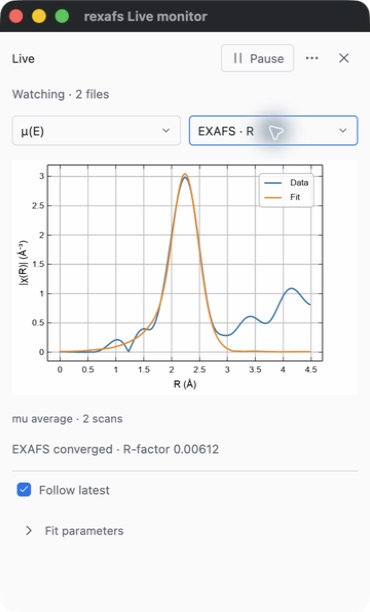
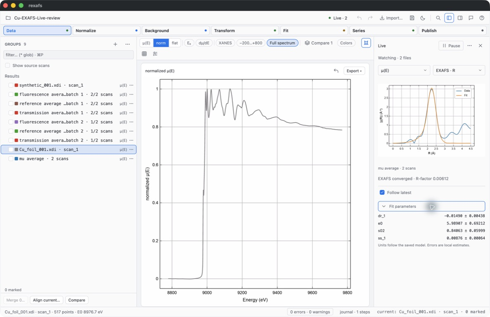
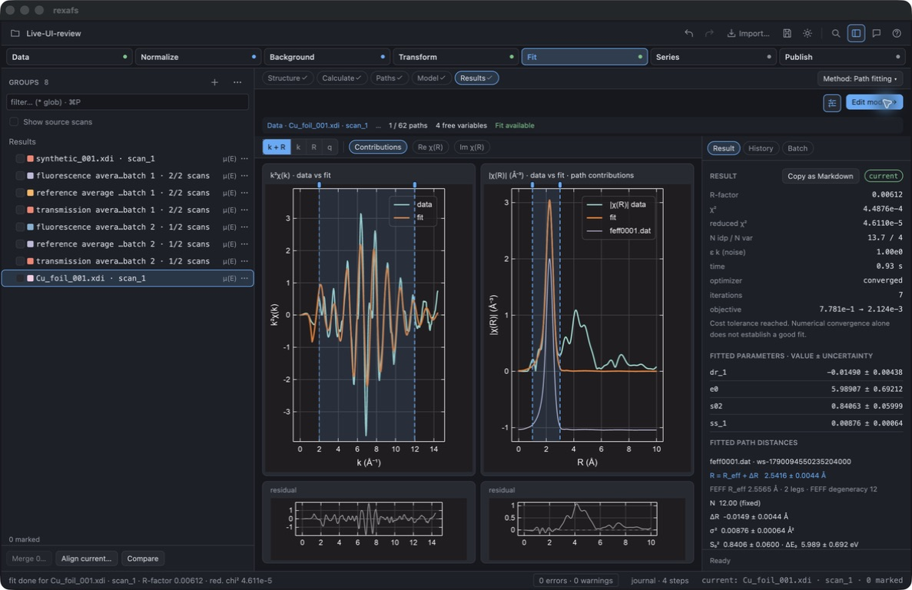
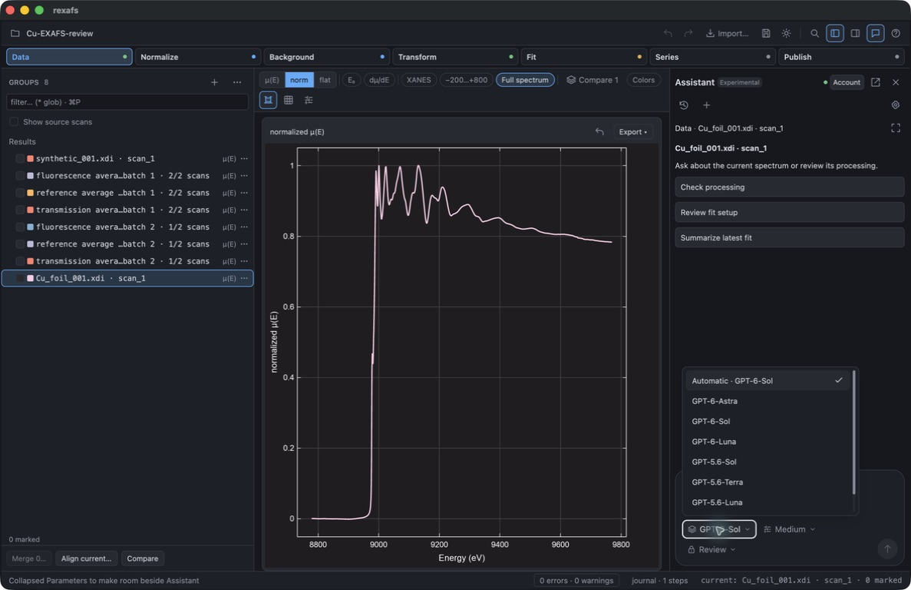

# Live monitor and Cu EXAFS review

This is an unreleased source-checkout review on macOS, following the
[earlier workflow findings](../2026-09-23-live-workflow/README.md).
The changes were exercised with native computer-use clicks, keyboard input,
window switching and screenshots in a separate development application.
The installed application and the user's original Cu series were retained.
Version, platform and fixture hashes are in [environment.json](environment.json).

## Analyst workflow

Setup now uses aligned fields, actual checkboxes and compact dropdowns. Preview
is the primary action until a compatible sample has been checked; Start appears
afterwards. EXAFS fitting and XANES peak fitting have separate, explicit labels.
Output can be individual scans, running averages, or a new average every N scans.
Transmission, fluorescence and reference remain independent outputs.

The monitor can occupy a separate small window or a sidebar. Its normal controls
are Pause/Resume, Signal, View and Follow latest. Less frequent actions are in
one menu. Fitted values expand on demand. The toolbar's Live indicator opens the
monitor without requiring the analyst to leave their current processing stage.
Hiding a monitor does not stop its watcher. The application must remain open.

[](live-monitor-light.jpg)

[](live-sidebar-final.jpg)

## Cu foil EXAFS check

The input is the repository's prepared Cu foil absorption standard from
[`cu-mixtures`](../../../crates/rexafs/tests/fixtures/analysis/cu-mixtures/README.md).
It derives from measured data and retains that fixture's attribution and
preparation history. Two byte-identical copies were replayed as incoming files;
they are not independent measurements and do not establish noise reduction.

Using the GUI, the Cu structure was selected, ReFEFF paths were calculated for an
8 Å cluster, and the first Cu–Cu path was fitted. The fit used k = 2–12 Å⁻¹,
k-weight 2, R = 1–3 Å, and four varying parameters. The R-space fit converged
in seven iterations, with R-factor **0.006120046566325119**. These are observed
software results, not a validation of the physical adequacy of a one-shell model.

| Parameter | Fitted value | Local standard-error estimate | Unit |
| --- | ---: | ---: | --- |
| Distance change, `dr_1` | −0.01490 | 0.00438 | Å |
| Edge-energy shift, `e0` | 5.98907 | 0.69212 | eV |
| Amplitude factor, `s02` | 0.84063 | 0.05999 | Dimensionless |
| Mean-square relative displacement, `ss_1` | 0.00876 | 0.00064 | Ų |

The same saved model was selected in Live. Preview and both published running
averages gave the same R-factor. Live uses the saved initial variables and frozen
FEFF path bytes for each fit. It does not silently switch to a XANES peak model.
The k and R views show data and model together; uncorrected Fourier peaks in the
R view are not bond lengths. See [fitting statistics](../../fitting-statistics.md)
and the [Live guide](../../live-acquisition.md) for assumptions and limitations.

[](cu-manual-exafs.jpg)

## Recovery and interaction checks

- Pausing with one accepted file kept the ledger at one after the second file
  arrived. Resume accepted the second file once. Holding the first average kept
  its fit visible while the second average was processed; Follow caught up.
- Three-channel synthetic replay exercised separate running averages and fixed
  batches of two scans. Three input scans produced three completed batch-one
  outputs and three partial batch-two outputs.
- Final recovery and Resume retained two input records and reused existing fit
  indexes without changing their hashes or modification times. Evidence is in
  [recovery.json](recovery.json). Testing found and fixed a macOS path-alias issue
  between `/tmp` and `/private/tmp`; the earlier diagnostic artifact is retained.
- Keyboard selection with Down and Enter was checked in both the main window
  and the native monitor. Enter closes the menu and restores focus. Escape also
  closes it. The implementation waits for key release to avoid reopening it.
- Portable-project reopening retains named average outputs and fit artifacts.
  Recovery reconnects embedded result locators to the active output. Internal
  cache filenames are hidden from the normal Groups view.
  [The recovered-project capture](portable-recovery.jpg) shows the retained fit
  before Resume.
- Light and dark plots, the native window, the sidebar, and the expandable fit
  parameters were inspected. Theme changes rebuild the Live plot presentation.
  [The theme-switch capture](live-theme-refresh.jpg) shows the same fit in light
  colors after switching from dark.

[The held-average capture](held-average-during-arrival.jpg) records the earlier
replay step; its old singular label was subsequently corrected.
[The keyboard capture](live-exafs-k.jpg) shows the closed menu after selection.

## Assistant default

Automatic now prefers `gpt-6-sol` when the connected Codex catalog advertises it.
Available explicit choices take priority; otherwise selection falls back to the
first available catalog entry. The real local catalog advertised GPT-6 Sol and
GPT-6 Luna. The rebuilt GUI showed Automatic → GPT-6 Sol and retained Luna in the
picker. This check did not submit a model turn. The user's machine preference
was also saved as `gpt-6-sol`; an already open installed Assistant may retain its
in-memory selection until reopened.

[](assistant-sol-default.jpg)

## Automated checks and retained artifacts

The focused Live tests passed: 19 tests covering committed-file publication,
multi-channel atomicity, cancellation, revision replacement, batching, frozen
energy offsets, Cu EXAFS retention and portable projects. The Cu test also opens
recovery storage through a symlink and checks the original fit identity.
The Assistant selection/protocol tests passed: 11 tests.

The broader GUI regression command is:

```sh
cargo test --locked -p rexafs-gui -- --test-threads=4 --skip feff --skip rmc
```

The final run passed **632 tests**, with 0 failures, 7 ignored and 30 filtered
out, in 64.65 seconds. The filtered run excludes tests whose names contain
`feff` or `rmc`; it is not a claim that every optional integration test ran.

Build, format and normal Clippy checks were run. Clippy reports existing project
warnings; this is not a warning-free qualification. Logs and the portable
`Cu-EXAFS-Live-review.rxs` project are retained locally under
`/tmp/rexafs-live-workflow-20260923/`. Screenshots here are unedited captures.

This review covers local macOS file replay. It does not qualify physical
beamline acquisition, network filesystems, Linux/Windows window behavior,
automatic signal-to-noise stopping, or scientific adequacy of fits on arbitrary
transmission, fluorescence and reference channels.
