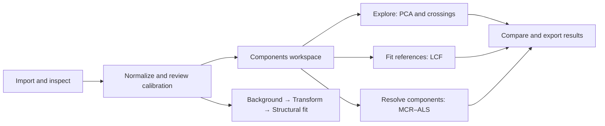

# XANES component analysis: research and integration proposal

Status: proposal for review, 14 September 2026. No new solver, binding or GUI
behavior is implemented by this document. The source audit uses rexafs
`6a63f758451a96b77cf9f6b54a6df854bd1c0b92`, which includes the 0.2.6 release.
The research branch is `research/xanes-components`.

## Recommendation

Add a **Components** workspace for analysis of multiple normalized spectra.
It should contain **Explore**, **Fit references** and **Resolve components**
views. These cover principal component analysis (PCA), linear combination
fitting (LCF), and multivariate curve resolution by alternating least squares
(MCR–ALS), respectively. Explore also provides an isosbestic-point diagnostic.

Components is an optional branch after normalization, alongside the EXAFS
background/transform/structural-fitting path. It is not another compulsory
processing step. A single spectrum's inspector cannot adequately represent a
training collection, reference library, multiple solutions and their provenance.
Keep Series as a way to view results against time or another recorded coordinate;
unordered collections must work equally well.



LCF can be run directly when suitable standards are known. PCA is useful
evidence about spectral dimensionality, but it must not become a required gate
or an automatic declaration of the number of chemical species.

## What already exists

| Area | Current implementation | Work needed |
| --- | --- | --- |
| Rust LCF | [`analysis/lcf.rs`](../crates/rexafs/src/xafs/analysis/lcf.rs) solves bounded least squares, optionally with weights summing to one and independent reference shifts. | Reuse the constrained solver; add shared data preparation, explicit termination status, collection results and stronger recovery tests. |
| Rust PCA | [`analysis/pca.rs`](../crates/rexafs/src/xafs/analysis/pca.rs) uses singular value decomposition (SVD), defaults to no mean subtraction, and includes target projection and a rank indicator. | Expose centering clearly, validate matrix-shape/rank edge cases and separate spectral rank from chemical interpretation. |
| Shared grid | [`analysis/mod.rs`](../crates/rexafs/src/xafs/analysis/mod.rs) uses the unknown's grid for LCF and the first spectrum's grid for PCA. Other spectra's endpoint values are held beyond measured coverage. | A new preparation API must restrict analysis to common measured coverage and reject extrapolation. |
| Desktop | [`shell/tools.rs`](../crates/rexafs-gui/src/app/shell/tools.rs) has Data-stage LCF/PCA, transient global result state, and implicit current/marked group roles. | A collection workspace with explicit unknown/reference roles, persistent analyses and independent view settings. |
| Series | [`app.rs`](../crates/rexafs-gui/src/app.rs), `run_series_lcf`, already provides background jobs, cancellation, progress and stale-result checks. | Reuse this execution pattern for all collection analyses. |
| Project storage | [`ProjectFile`](../crates/rexafs-gui/src/project.rs) stores spectra and structural fits but has no dedicated component-analysis record. | Add versioned analysis records without rewriting historical fixture bytes. |
| Python and TypeScript | The released bindings expose processing and measurement reading; they do not expose these LCF/PCA operations. | Thin wrappers around the same Rust implementation, including runtime and editor-visible documentation. |

The existing LCF defaults are normalized absorption, a range of E₀ − 20 to
E₀ + 30 eV, coefficient bounds 0–1, a sum of one and no fitted shifts. Its
optional shift optimizer currently discards the termination report. Its weight
errors are conditional on fitted shifts, and its quantity named `chi_square`
is an unweighted sum of squared residuals. Preserve old API behavior while
documenting these limits; new result types should name the quantity **SSE**.

The current PCA indicator treats missing tail eigenvalues as zero when spectra
outnumber energy points. Do not surface its minimum as a trustworthy automatic
component count. Validate its scaling and domain against the primary method
before revising it, or omit that suggestion in unsupported matrix shapes.

## Athena, Larch and pyMCR references

Athena provides a useful interaction model: an unknown spectrum, a table of
standards, an adjustable fit interval, coefficient constraints, optional energy
shifts, a residual plot and batch/combinatorial fits. Its historical manual also
explains why unweighted XANES fit statistics cannot establish absolute goodness
of fit. Its documented clipping of the dependent final coefficient can violate
the sum-of-one condition; rexafs should retain an actual constrained solution.
See the [Athena LCF manual](https://bruceravel.github.io/demeter/documents/Athena/analysis/lcf.html).

Source comparisons must specify versions and preprocessing, rather than simply
claiming “Athena-compatible” or “Larch-compatible”:

- Larch 2026.3.1, commit
  [`860d8a690c81eefb0e61dee4ca3703ef4b67e93d`](https://github.com/xraypy/xraylarch/tree/860d8a690c81eefb0e61dee4ca3703ef4b67e93d):
  [`lincombo_fitting.py`](https://github.com/xraypy/xraylarch/blob/860d8a690c81eefb0e61dee4ca3703ef4b67e93d/larch/math/lincombo_fitting.py)
  defaults to cubic interpolation, an exact dependent coefficient for closure,
  unbounded coefficients unless bounds are supplied, and no energy shift. Its
  optional shift applies to the unknown globally. This differs from rexafs's
  default bounds, linear interpolation and per-reference shifts.
- Larch's public
  [`pca_train`](https://github.com/xraypy/xraylarch/blob/860d8a690c81eefb0e61dee4ca3703ef4b67e93d/larch/math/pca.py)
  subtracts the mean spectrum, then centers and standardizes each residual
  spectrum. Its separate `pca_train_sklearn` uses ordinary mean-centered PCA.
  `pca_fit` additionally permits rescaling by default. The
  [XANES guide](https://xraypy.github.io/xraylarch/xafs_xanes.html) gives the
  workflow, but these source distinctions control numerical comparisons.
- Demeter commit
  [`06afc8da08a5a7d5a26ee14992170fcf5dc67406`](https://github.com/bruceravel/demeter/tree/06afc8da08a5a7d5a26ee14992170fcf5dc67406):
  [`PCA.pm`](https://github.com/bruceravel/demeter/blob/06afc8da08a5a7d5a26ee14992170fcf5dc67406/lib/Demeter/PCA.pm)
  calls PDL with `CORR => 1`. This is not evidence of an identical uncentered
  SVD convention. Its online PCA chapter is historical and incomplete.
- pyMCR 0.5.1, audited commit
  [`ad49381573c27a1e3502589f62f1817c988dcb13`](https://github.com/usnistgov/pyMCR/tree/ad49381573c27a1e3502589f62f1817c988dcb13),
  provides alternating regression, constraints, fixed factors and termination
  criteria. Its [documentation](https://pages.nist.gov/pyMCR/) and
  [NIST paper, DOI 10.6028/jres.124.018](https://nvlpubs.nist.gov/nistpubs/jres/124/jres.124.018.pdf)
  provide a reference for MCR behavior and comparisons, not a component-count
  oracle. The public documentation's version banner differs from the audited
  package; record the package and source pin in comparison outputs.

Use these projects as references and independent test oracles. Larch's MIT
notice, Demeter's Perl/Artistic terms, and pyMCR's NIST notice have different
requirements. Implement the Rust algorithms independently; preserve the exact
upstream notices and attribution if code is later incorporated.

## Scientific model and interpretation

Prepare a matrix D with n spectra as rows and p energy samples as columns.
Each entry is dimensionless, edge-step-normalized absorption at an energy in
eV. For r components, the mixture model is

```text
D = C Sᵀ + R
```

C is n × r, with dimensionless component coefficients. S is p × r, with one
component spectrum per column in the same absorption units as D. R is the
n × p residual matrix. LCF supplies S from measured references and solves C.
MCR–ALS estimates C and S alternately; each subproblem minimizes the squared
residual subject to the selected constraints. This follows the bilinear model
described in the NIST paper above. Matrix orientation and the following
defaults are rexafs design choices.

Coefficients may approximate fractions of absorbing atoms when the standards
have compatible normalization, measurements obey a linear absorption model,
and relevant components are represented. They are not automatically mass
fractions. Self-absorption, baseline errors, different instrumental broadening,
missing standards and sample changes can invalidate that interpretation.

For LCF, recommend nonnegative coefficients summing to one for compatible
normalized spectra. Allow the user to disable closure and inspect the sum.
Keep fitted energy shifts off initially; introduce a bounded common instrumental
shift before exposing independent reference shifts as an advanced option.
Independent shifts can compensate for genuine chemical differences.

PCA decomposes D, or D minus its mean spectrum, into orthogonal directions.
Its signed components are mathematical directions, not necessarily physical
spectra. Three linearly independent pure spectra can give uncentered rank three.
If their mixture fractions sum to one, mean subtraction leaves rank at most
two: the coefficient deviations sum to zero. This is a direct consequence of
the mixture equation, not an empirical species-counting rule. A restricted
composition trajectory or similar standards can lower rank; noise and drift
can raise numerical rank.

An isosbestic crossing is evidence to inspect, not proof of exactly two chemical
species. IUPAC explicitly allows either apparent component to be an invariant
mixture of several species; see its
[definition](https://iupac.qmul.ac.uk/gtpoc/I.html). In the ideal closed mixture
model, any energy where all participating component spectra have the same value
is a crossing regardless of their number. Two components also need not cross
inside the observed interval.

MCR has scale, permutation and rotational ambiguities. Different factors can
reconstruct the same matrix. Nonnegativity and closure restrict solutions but
do not generally identify unique chemistry. Report residuals, constraints,
initialization and variation across starts, and permit fixed measured spectra
or known pure-sample coefficients when experimentally justified. This follows
the constrained factorization discussion in the NIST paper; such anchors must
be explicit input, never inferred merely because a pure-looking row exists.

## Shared data preparation and defaults

1. Select unknowns and references explicitly, preserving their group identities.
   A PCA training collection consists of the chosen unknowns by default; it
   does not silently include standards or exclude the highlighted group.
2. Require the selected processed arrays, offering normalization as a visible
   prerequisite in the GUI. Keep core analysis free of hidden preprocessing.
   Show each source's normalization settings and its selected representation.
3. Preserve genuine chemical edge shifts between Cu, Cu₂O and CuO. Correct
   instrumental drift from a common reference foil or independently justified
   calibration, rather than aligning all chemical edges to one E₀.
4. Use one recorded absolute energy interval in eV. Initially propose the
   existing E₀ − 20 to E₀ + 30 eV interval around a designated anchor, clipped to
   common coverage only with the resulting interval shown. An explicit range
   beyond any required input's coverage is an error. Show why a range changed.
5. Interpolate linearly once onto a recorded common grid. Default to the anchor
   unknown's samples in that interval. Reject non-finite values, unordered or
   duplicate energy coordinates, insufficient overlap and empty inputs. Never
   invent endpoint tails, average duplicates or smooth without a requested step.
6. Preserve a copy of prepared arrays and source/parameter fingerprints. Results
   own their arrays. Later input changes mark results stale and never silently
   replace them. Interpolated points are correlated; denser sampling is not
   additional independent evidence.

Use mean-centered PCA as the new workspace's exploratory default, with a clear
**Subtract mean** control and an uncentered option for mixture-rank inspection.
Leave the existing `PcaConfig` default unchanged. Label the displayed fraction
as explained variation when centered and squared-signal fraction otherwise.
Do not standardize every spectrum or energy column automatically.

For MCR, require the user to select r; suggest a range to examine using PCA and
residual structure. Recommend nonnegative C. Closure can default on only for the
normalized-fraction model described above. Nonnegative S is optional because
pre-edge subtraction and measurement noise may produce negative values. Do not
silently clip input spectra. Unimodality or smooth concentration profiles require
a meaningful sample order and should be opt-in advanced constraints.

Use genuinely constrained least-squares subproblems for the supported bounds
and closure, not unconstrained fits followed by coefficient normalization.
Record the objective at each complete iteration, the best feasible solution,
maximum iteration limit and termination reason. Reject non-finite iterates;
distinguish convergence, stalling, cancellation and an exhausted limit.
Offer reproducible seeded starts and explicit initial/fixed spectra. Final
iteration tolerances and the default number of starts should be selected from
the validation experiment below, not presented as universal constants now.

Show SSE = Σ Rᵢⱼ² and the relative discrepancy Σ Rᵢⱼ² / Σ Dᵢⱼ², defining their
scope per spectrum or collection. For normalized data both are dimensionless;
neither is a probability or noise-calibrated chi-square. A zero data norm needs
an explicit undefined result. Statistical intervals require a declared noise
model and treatment of correlations; optimizer convergence alone is inadequate.

## UI and API shape

Open Components from a workspace selector and from **Analyze selected spectra…**.
Retain the existing processing-stage strip. Inside Components, use a short
collection header with spectrum/reference counts, representation and energy
range. Keep a large plot visible during input review and result inspection.

| View | Primary interaction | Result plots |
| --- | --- | --- |
| Explore | Choose the collection and component count; inspect crossings. | Spectral overlay, singular-value plot, scores, reconstruction and residual. |
| Fit references | Assign standards, inspect their formulas/bounds, then Fit. | Data/fit overlay, residual, coefficient table and trends. |
| Resolve components | Choose count, constraints and initialization, then Resolve. | Recovered spectra, coefficient profiles, residual map and convergence. |

Keep one primary action per view, a Cancel action during work, and progressive
disclosure for constraints and diagnostics. Put scientific explanations in
brief hover help and the guide, rather than filling the screen with paragraphs.
Data-source headers remain available from source details. A reference can be
included in a library without becoming an unknown to fit.

Report candidate crossings through an overlay and local between-spectrum spread,
with the energy interval and sensitivity settings recorded. Reject flat
pre-edge regions as automatic crossing claims; indicate low information and
allow inspection. Do not display a derived chemical-species count.

The following is a proposed API shape, not runnable released code:

```text
Rust:
  data = XanesData::prepare(&unknowns, &references, &prepare_options)?
  fit = data.lcf(&LcfOptions::default())?
  model = data.pca(&PcaOptions { center: true, ..Default::default() })?
  resolved = data.mcr(&McrOptions::new(3))?

Python:
  data = XanesData.from_spectra(unknowns, references=references,
                               energy_range=(start_ev, end_ev))
  fit = data.lcf()
  model = data.pca(center=True)
  resolved = data.mcr(components=3, seed=0)

TypeScript:
  data = XanesData.fromSpectra(unknowns, {
    references, energyRange: [startEv, endEv]
  })
  fit = data.lcf()
  model = data.pca({ center: true })
  resolved = data.mcr({ components: 3, seed: 0 })
```

Preparation accepts no references for PCA or blind MCR. Calling LCF without a
reference produces a descriptive error. Inputs are borrowed/copied into owned
prepared data; calls do not mutate Spectrum objects. Bindings must expose the
same matrix orientation, constraints, labels, convergence states and errors as
Rust. Python releases the GIL during computation. Browser GUIs run expensive
jobs in a worker and desktop jobs run off the UI thread; cancellation and
progress should wrap the shared core rather than duplicate scientific code.

Save each analysis as a named project record containing source identities,
preparation settings, algorithm/version, options, seed, constraints, results
and diagnostics. Let users compare multiple runs and export CSV/JSON plus figures.
Derived fit spectra or residual spectra are created only through an explicit
action, with provenance. Series displays coefficients using recorded time or
scan coordinates; unordered data uses sample labels.

## Synthetic experiment and test organization

Build two distinct test layers. Small analytic mixtures establish numerical
truth without relying on external data licenses. A copper example tests the
real import/normalization/analysis workflow. Existing retained measurements
should be referenced through their canonical manifest paths, not duplicated.

Candidate real standards already in the fixture manifest are:

| Standard | Retained source | Reuse status |
| --- | --- | --- |
| Cu | `samples/desy-doris/unspecified/parseq-xas/Cu_lnt1.fio` | ParSeq-XAS repository MIT notice, pinned source and checksum already recorded. |
| CuO | `samples/desy-doris/unspecified/parseq-xas/CuO_lnt.fio` | Same ParSeq-XAS provenance; retain original bytes and notice. |
| Cu₂O | `candidates/refxas/elettra/xafs/xafsdb-webserver/Cu2O Cu K Elettra.txt` | Existing academic-use candidate with a review-required RefXAS notice. Do not relabel as permissively licensed or publish a derived teaching bundle without resolving that scope. |

See the [canonical manifest](../crates/rexafs/tests/fixtures/xas/manifest.json).
ParSeq-XAS sources are pinned at
[`a47a7999572ba1e45e5fa059fff54232a0a6faa1`](https://github.com/kklmn/ParSeq-XAS/tree/a47a7999572ba1e45e5fa059fff54232a0a6faa1).
The Cu/CuO tables contain stored absorption in zero-based column 1 and energy
in column 0; duplicate labels require index-based selection. The Cu₂O candidate
requires explicit sample detector mapping. Review calibration and normalization
before generating mixtures. These mixed-source references test software
recovery, not an experimentally validated reaction mechanism.

For reproducibility, record the generator version and PRNG, seed, source hashes,
mapping, normalization parameters, actual overlap and energy grid. Generate
100 ternary weight vectors from a Dirichlet(1,1,1) distribution, which samples
the three-component fraction simplex uniformly, plus pure anchors and binary
mixtures. Form each spectrum as the weighted sum of the prepared standards.
Keep pure anchors separate from blind-method assumptions.

| Test family | Required evidence |
| --- | --- |
| Clean LCF | Recover known weights for well-conditioned analytic mixtures; verify nonnegativity, exact closure to numerical tolerance, pure and binary boundaries, and single-reference fits. |
| Preparation | Different grids, partial overlap, duplicate coordinates, missing arrays, NaN/Inf, inadequate range and input immutability. Preserve source labels and output dimensions. |
| Robustness | Repeat with additive Gaussian noise of 10⁻⁴, 10⁻³ and 10⁻² edge-step units, instrumental drift, baseline distortion, correlated references and missing references. Report bias and residuals; do not require exact noisy recovery. |
| PCA | Recover the correct subspace for analytic rank-three data; test centered rank at most two under closure, both n < p and n > p matrix shapes, zero/constant data, sign ambiguity and nearly dependent components. Compare subspaces and reconstructions rather than raw vector signs. |
| Isosbestic diagnostic | Analytic two-component crossing, no crossing in the chosen interval, three-component common crossing, fixed-ratio mixtures of species, flat regions, noise and drift. Never infer species count from one crossing. |
| MCR with fixed spectra | Match LCF on the same prepared data and constraints. Test feasibility, fixed-factor preservation, cancellation and every termination state. |
| Blind MCR | Check reconstruction, constraint satisfaction, subspace and stability across seeded starts. Compare factors after permutation/scaling only where meaningful; do not require unique true spectra from an ambiguous problem. |
| Bindings and GUI | The same small numeric cases through Rust, Python and TypeScript; runtime types, hover help and signature checks; preview, role selection, cancellation, stale results, save/reopen and export through computer use. |

The noiseless analytic suite should set tolerances from conditioning and floating
point error. Determine copper example tolerances from a recorded pilot rather
than changing thresholds to conceal failures. For Larch and pyMCR comparisons,
supply identical prepared arrays, interpolation, centering, coefficient bounds,
closure, shift settings and initial factors. Avoid comparing a standardized
PCA result to an uncentered decomposition and calling the difference a regression.

Place solver unit tests beside their modules, shared public-contract tests under
`crates/rexafs/tests/`, and real-data workflow tests in a separate integration
target using the existing fixture helpers. Keep generation recipes and compact
expected coefficients separate from raw measurements. Run offline in CI.
Maintain package exclusions for all beamline/session corpora and check the actual
Cargo, Python and npm archive inventories after adding any new integration target.

No recovery metrics or synthetic experiments are reported as completed here.
The environment and retained reference columns were inspected; the experiment
above is the implementation acceptance plan.

## Delivery sequence

1. Review this workspace and scientific contract. Prototype the Components
   layout with plotted data and short controls before changing navigation.
2. Implement shared preparation and result/provenance types in Rust. Strengthen
   LCF termination and recovery tests while keeping existing APIs compatible.
3. Add explicit PCA options and dimensionality diagnostics, then the crossing
   diagnostic. Validate the rank conventions and comparison fixtures.
4. Add constrained MCR–ALS, fixed factors, reproducible starts and cancellation.
   Run the analytic and copper experiments; publish their settings and limits.
5. Expose the same APIs through Python and TypeScript, with runtime/editor tests
   and a small cross-language example. Keep external Python analysis libraries
   as test references, not runtime dependencies of rexafs.
6. Integrate the Components workspace, persistent analyses, result comparison,
   Series trends and exports. Verify desktop and browser workflows through
   computer use, including small-window layouts and long-running jobs.
7. Update the user guide, API help, method citations and versioned screenshots.
   Promote feature PRs to `dev` for nightly review; release through a reviewed
   `dev` → `main` PR as described in [the branch workflow](development-branches.md).

The first implementation milestone is reliable preparation plus LCF across all
three APIs with reproducible tests. PCA and MCR then share that foundation,
instead of each building a different import, grid and preprocessing workflow.
